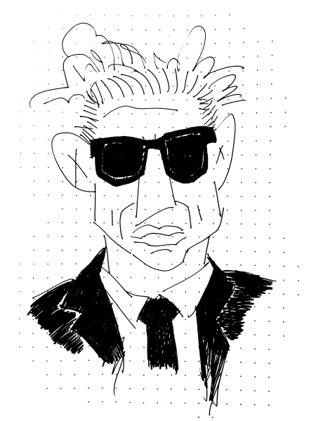

Casey Neistat.

That guy is cool. So cool in fact that I wanted nothing to do with him cause, well, reasons?

A friend of mine used to watch his videos at work while designing. Curious - given my wholly unearned lack of respect for Casey Neistat and wholly earned respect for said friend - I asked what was so interesting about the guy. He's so wierd looking... He wears sunglasses inside... No way that studio is for real...

He didn't have a great answer.

So I continued to not watch any of his videos for years.

A couple months ago in one of my late night alcohol fueled Youtube binges a Neistat video showed up in my recommended list. C'mon Youtube - this guy is too cool for school. I don't want this.

But caught in a moment of trying to expand my horizons I decided I should try and grow beyond my middle school self.

It was time I stopped disliking things for... reasons?

So I gave it a go. Figured I should at least be able to articulate why I didn't care for the guy.

And I quickly figured it out.

I was jealous.

This guy is seriously talented. Seriously disiplined. Lives in NYC. Came from nothing. And that studio is totally real.

Fuck.

What am I doing with my life?

Getting drunk late at night and watching youtube by myself. That's what.

So I turned it off halfway through. Too painful. I needed to reminisce about how productive and talented I used to be. Dust off the old comics and artifacts of productivity I made in times of yore.

_I'm_ talented. _I'm_ disciplined... who was I kidding? I was drunk for the who knows how many nights in a row. I wasn't over the last year and all the bullshit that that was and I was setting a shit example for my kids as a highly functional alcoholic.

This is not the life I want for my kids.

This is not the life I want.

This is not my beautiful house.

How did I get here?

Slowly.

And ever so slowly I have begun digging myself back out.

Neistat's videos are badass because they embody flow. That magical creative place we go to when all the pieces just click. When it feels easier than it is. When you look at the clock and realize you skipped lunch and are now 3 pages ahead.

_**And fucking starving.**_

There is a feeling to his videos that I miss.

That feeling is all about being scrappy. It's about working your ass off. It's about using your resources. It's about being a net creator.

He's scrappy.

He works his ass off.

He has earned it all.

Kudos.

Time to stop reminiscing.

Time to get back on that horse and ride.

Giddyup.

