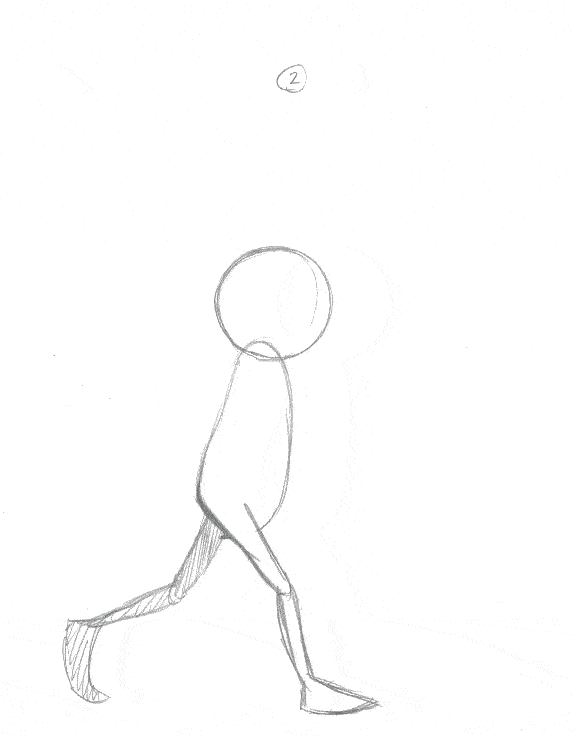
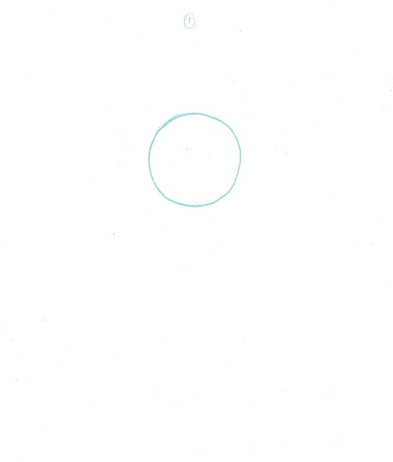
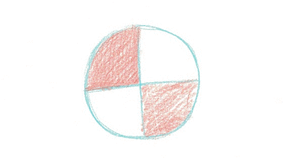
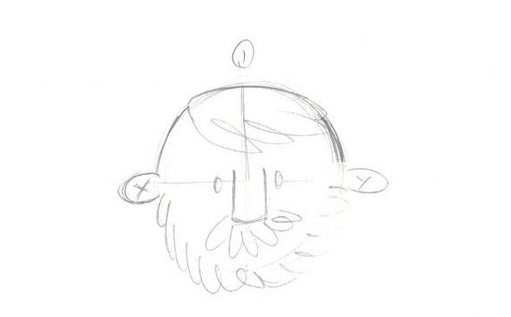
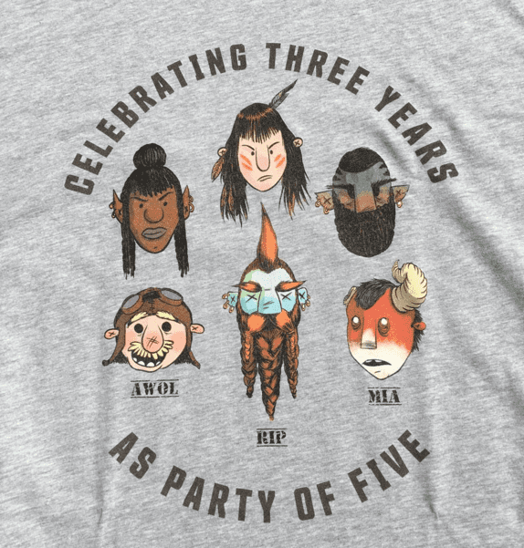

So this week I spent a few mornings dusting off the old animation chops. Got a walk cycle, a bouncing ball, a spinning ball, and a double take. Really just seeing how it feels to bang some of this stuff out again. No fancy equipment, just printer paper and a cheap light table I've had for over a decade. Fancy will only come if I find myself getting serious about any of this.

D&D party t-shirts! These are characters I did a long time ago for the PCs in my group - but the shirts came in this week so here they are. Turned out way better than expected. Couldn't be happier with them! Can't believe the campaign is over 3 years old now...

