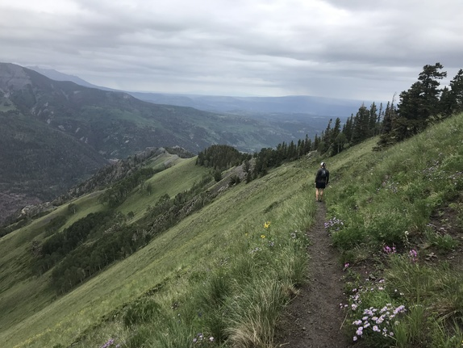

There's not a lot to show this week. I was in CO on vacation with my brother running (ok, hiking) trails in Ouray CO. It was a great chance to spend some time with family and really experience what real trails feel like. The Texas heat is rough and our rocky terrain is no joke but 800ft per mile for 5 miles straight up is bananas. The views were incredible and I can't wait to do it again.

As far as artistic output - I spent some time tracking dialogue on x-sheets for an animation I've been messing with. I put in some work on Aglet again - got the [hunter gatherer app](http://aglet.io/tools/hunter-gatherer/) embedded at a POC level but it's still on a branch. Not a lot else.

Watched the last season of Stranger Things (3) yesterday and Holy Cow! Way better than expected. And **strangely** motivating...

Beyond that, I dunno - just trying to stay consistent.

Runs on Strava:

- [Old Horsethief to glacier](https://www.strava.com/activities/2610876707)
- [Houray Ouray](https://www.strava.com/activities/2608066250)
