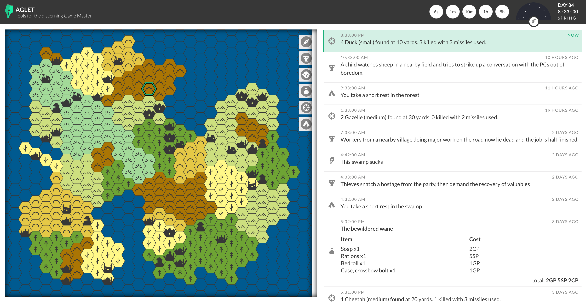

Last checkin I was on page 178 of the red journal. I officially finished and archived that book last night and am now on page 7 of the orange journal. 76 pages in 19 days. 4 pages a day.

Sometimes life is hard. Sometimes it's just Tuesday.

I've been running. More on trails lately. Which is wonderful but makes it harder to get back on the road. I need a nice mix. Should try and get back on the road again soon.

Aglet is coming along. Finally got the Dogfood Alpha Milestone completed. All the tabs in the gazetteer work - albeit in a primitive form of MVP. Pointy-top hex math has been added. This paves the way for subhexes allowing for zoom in. I say this a lot but it's actually getting close to a thing that may be useful soon.

Got a table saw and router. The shop is stocked and after I get an outfeed table built for the table saw I'll be able to get building stuff in earnest. Looking forward to it.

I have a lot of hobbies. Doesn't feel like enough time in the day. Been going to bed around 8:30 and getting up 3:30 to 4am. Sounds early but it's still around 7 hours of sleep which is more than I used to get. And it's more restful now that my liver isn't pulling the night shift every day.

It's been a week since our last drink. My brain is slowly turning the lights back on. Cancer is a mind fuck. Getting over it has been harder than fighting it ever was. But I think we may finally be getting our lives back.

Every 7 years your body refreshes all it's cells. You are a new person. My life has been going through massive swings at a faster clip than that. Maybe I should try riding the waves instead of fighting them. Or at least accepting it as a part of life and seeing what I can do to harness their power.

"Don't give up. Don't give in. No quarter."
