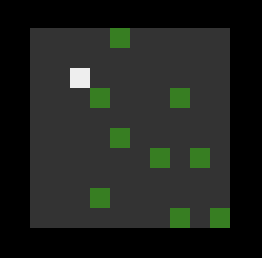
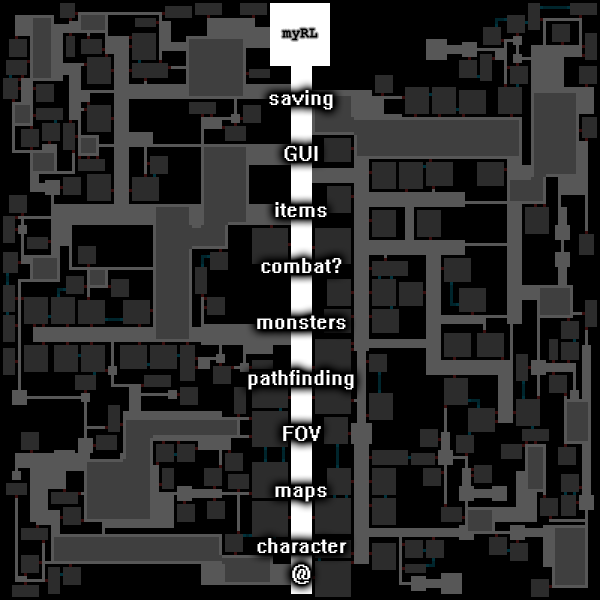
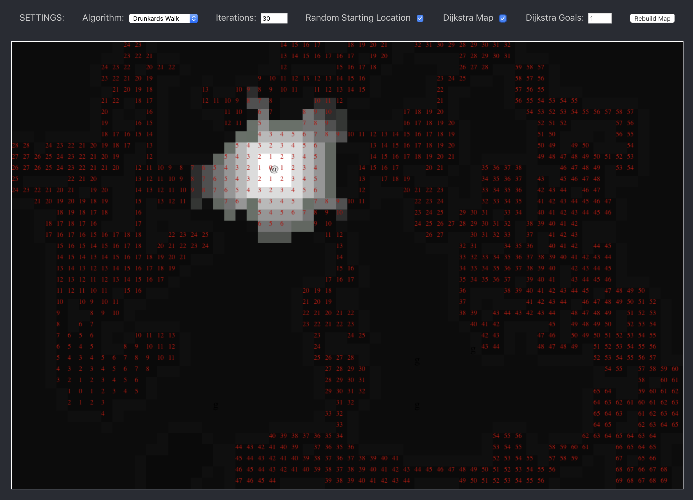
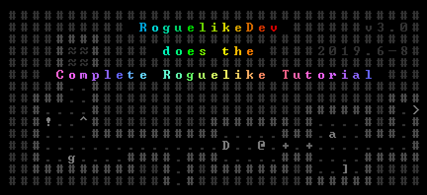
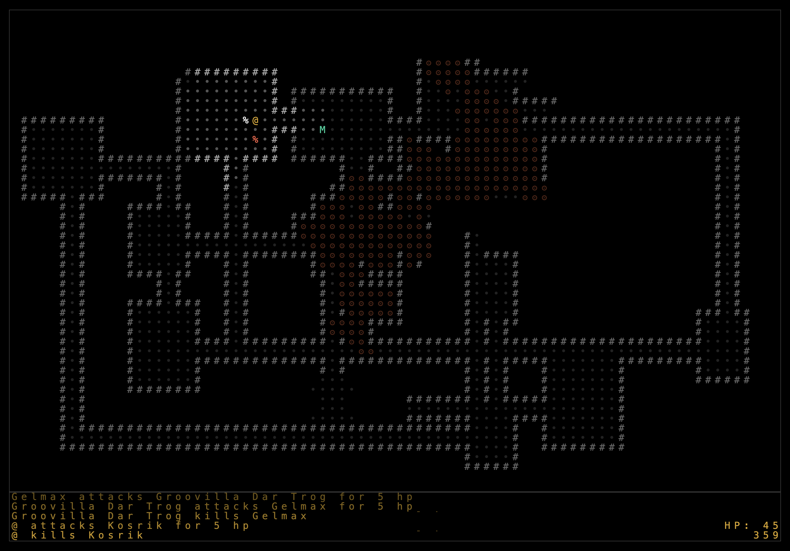

Last checkin I was on page 7 of the orange journal. That's been archived and I am now on 204 of the yellow journal. 449 pages in 76 days. 5.9 pages a day. The pace has quickened.

Last update I was working on Aglet. I haven't really touched it since then. I was thinking recently about how I used to make a lot comics. About how so much of my energy was spent convincing myself it was worth the effort. Comics always just felt like so much work. This isn't to say that making comics wasn't worth the effort just recognizing that some part of me deep down always fought it.

Programming is something that rarely feels like work. This is probably why I like my job. Aglet has recently started to feel like work. So much infrastructure and planning just to get to the fun procedural generation parts.

That's when it hit me. There is an entire genre of video games that focuses almost exclusively on the very things I find the most satisfying about Aglet.

And so began my deep dive in search of yet another lost amulet...

# Snerv | <a href="https://luetkemj.github.io/snerv/">play</a> | <a href="https://github.com/luetkemj/snerv">source</a>

Initially I just sat down and wrote something. No planning. No research. Just to see what I could naively cobble together in a couple hours. One white square and a collection of green baddies to bump into later. The goal is to kill everything. I have never won. But I learned a lot. You gotta start somewhere, right?

# How to Make a Roguelike

At this point I knew I needed to start doing some proper reasearch and at least get a better understanding of how to attack a project like this. I've been around long enough to know there is no "right" way to do this sort of thing but I wanted to at least try and stay on some well worn paths. After some digging I found this great post from Josh Ge (Cogmind) convienently titled <a href="https://www.gamasutra.com/blogs/JoshGe/20181029/329512/How_to_Make_a_Roguelike.php">How To Make A Roguelike</a>. Exactly what I was looking for.

A map! A literal map for making a rogue like.

# Snail | <a href="https://luetkemj.github.io/snail/">play</a> | <a href="https://github.com/luetkemj/snail">source</a>

I quickly got through adding a character and switched from using DOM elements to canvas. Next I used an old mapping algorithm from Aglet (drunken walk) to get a basic level set up. I had never tackled field of vision before so I headed over to <a href="https://www.redblobgames.com/articles/visibility/">RedBlobGames</a> and brute forced something rather basic. Determined to add my own flair I spent some time creating lighting effects - reducing the intensity of the light based on distance from the player. Cool!

Somewhere in all this research and frantic code writing I learned about <a href="http://www.roguebasin.com/index.php?title=Dijkstra_Maps_Visualized">Dijkstra maps</a> and their applications to Roguelikes. Immediately intrigued I managed to write my own implementation and rendered the movement scores in Snail. Super excited I quickly added monsters only to realize I had punted on turns. How in the world was I going to implement turns? I tried some ideas with little success and decided I needed to take a step back, swallow my pride and finally follow a tutorial.

# The "Complete" Roguelike Tutorial

I tried libtcod but couldn't get past the setup. I didn't really want to learn Python and the map for building roguelikes said I could use any language I want dammit! So I looked around for a JS version and found a wonderful <a href="https://github.com/maetl/roguelike-tutorial">follow along</a> written by Mark Rickerby.

I spent the weekend working through each step - and learned a ton. The best nugget was how and why to use a gameloop (turns!). I ran into a few bugs along the way that were really only speed bumps - or better yet, opportunities for learning. Overall it was a very well written and positive experience. A bit bummed it stopped at step 6 but really that was probably just enough to get me on my way.

After an honest attempt at adopting the OOP style used in the tutorial I decided I would be better off struggling to implement game mechanics instead of learning a whole different coding paradigm.

Back to the drawing board!

# Snail2 | <a href="https://luetkemj.github.io/snail2/">play</a> | <a href="https://github.com/luetkemj/snail2">source</a>

Having come up in javascript via React/Redux I'm more comfortable with a functional style of programming as opposed to OOP. I got lost very quickly once I strayed from the tutorial. Sprinkling mutable application state through out a collection of class instances goes against everything I know about writing applications. I certainly wouldn't argue that it's the wrong approach, just not the right one for me.

Taking this opinion to it's ultimate end I decided to use Redux for my state management. If you're familiar with Redux you know that in that world you never mutate state but instead make a copy of your entire state object with the intended modifications and return that. This has many advantages in the world of front end application development. None of which help in this style of game development. It didn't take long for the UI to get painfully slow in development (Redux uses numerous development only libraries to help with debugging) and slightly laggy in production. There was no way this would scale.

I have since removed Redux entirely and replaced state management with a single state object that I mutate through a series of getter and setter functions. So far so good!

Finally able to struggle with the challenges inherant in game development in general and roguelikes specifically instead of fighting with the language, progress lay ahead. I eventually made my back through the tutorial steps (mostly) and am now balancing the fun things I want to build with the less exciting but still fun things I need to build to have a functional game.

# Up Next

Roguelike development appears to be a very rich and very deep mine. The community has been extremely welcoming and generous right out of the gate. I'm excited to see how far I can take this. How many more times I will scratch this game to start over with fresh knowledge. And where exactly I will go from here.

# PCGDGNS | <a href="https://luetkemj.github.io/pcgdgns/">play</a> | <a href="https://github.com/luetkemj/pcgdgns">source</a>

Not interested in refactoring the last feature I added to Snail2 this morning, I built a quick little dev tool to help with procedural map generation. I've seen a lot of tutorials that animate each step along the way of building out a dungeon. Being able to see what the computer is doing is immensely helpful and I'm really excited to try another map algorithm or just expand on this one using this tool. So far I've only implemented a simple boxes and passages approach with a drunken walk excavation at the end but like all things in this world, the possibilities are endless!

