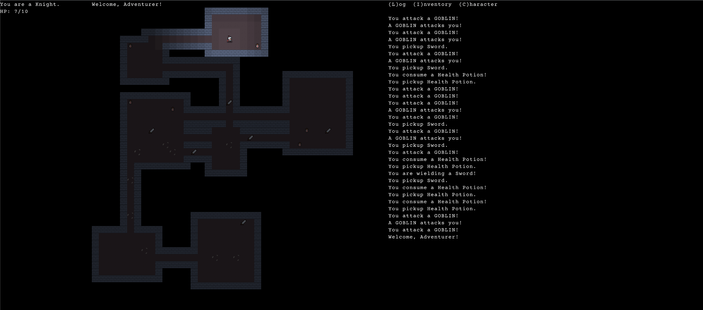
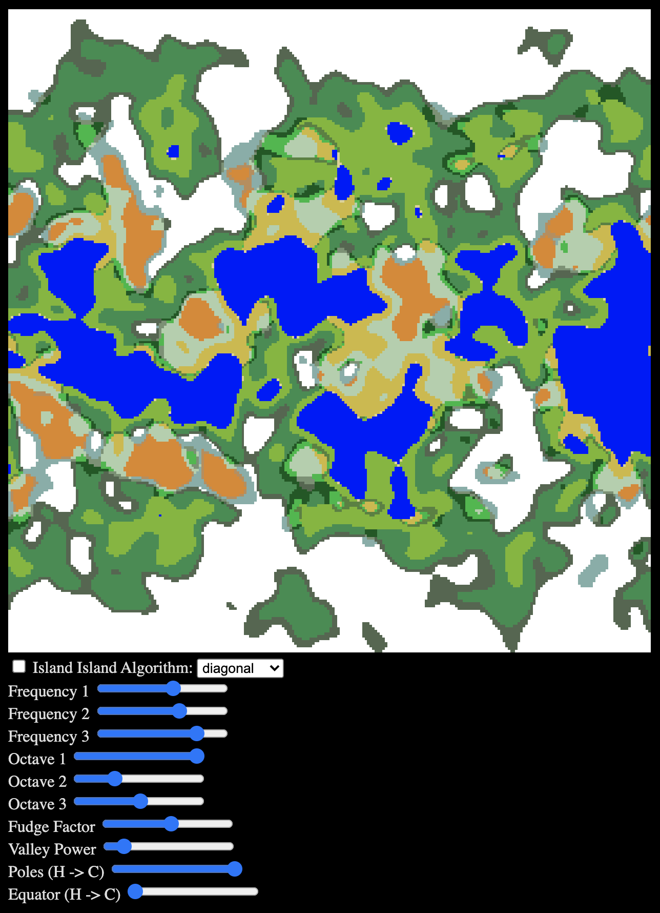

Busy week at work. So most of the following was done last weekend.

Work this week started with a complete redesign of the game layout. Pretty much all of my other games copied the general layout of Brogue. Now that my font is using half tiles, all of the sudden I have a lot more options. My first inclination was just to increase the visible map size. But planned support for a scrollable map makes that less important. So instead I'm experimenting with always open menus. For now the layout now has a HUD, Ambient log, map, and menu tabs.

Next up was removing the concept of a hero from the game. Initially I had tossed together some dirty code just to get a feel for Bitecs and Pixi. This led to a lot references to the hero entity sprinkled throughout the codebase. The logic often had to take seperate paths for the hero as opposed to everything else. This would only get worse as the game grew. So I added a new PC component that is added to the hero instead. This is useful as the hero is now an entity just like every thing else. And I can even put the PC component on a goblin and play as one instead!

Finally, I started experimenting with world map generation. I mostly followed the "Making maps with noise functions" article on [redblobgames](https://www.redblobgames.com/maps/terrain-from-noise/). I put together a quick generator following the examples but quickly realized that editing the parameters in the code and rerendering was very inefficient and difficult to reason about the actual changes to the map. I added some "knobs" that rerender the map from a static seed giving me a chance to really tweak the options and play around with the math. I definitely don't understand the formulas enough to just work directly in the code.

A lot of experimentation this week. Building blocks for moving forward.
