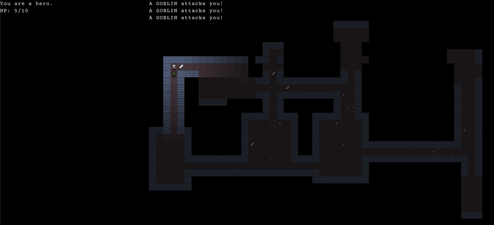

So I started tinkering with game development again over the last month or so. I stumbled on a different ECS library - [bitECS](https://github.com/NateTheGreatt/bitECS) - and for whatever reason it sparked the fires again. I decided to really switch things up and replaced both the ECS engine and the renderer opting this time for [Pixi.js](https://pixijs.com/) insead of my own custom implentation.

At the start of this gamedev journey I attempted to write my own ECS library with marginal success. [Snail4](https://github.com/luetkemj/snail4) got pretty dang far with an entire health system built around limb damage and blood loss. But it being my first attempt eventually collapsed under it's own weight and naiveté.

Then I found [geotic](https://github.com/ddmills/geotic) and made a flurry of new games and experiements. It was inspired by some of [Brian Bucklew's talks](https://www.youtube.com/watch?v=4uxN5GqXcaA) from some years ago. I made good progress on some games and even nearly completed an [entire javascript rewrite of the Complete Roguelike Tutorial series](https://github.com/luetkemj/jsrlt). With all that work under my belt I began one last doomed project. A multiplayer ASCII virtual table top.

Then I took a very long break.

Over the past couple of weeks I've been hacking my way throught the Roguelike Tutorial steps again. What started as an experiment is quickly becoming my new project.

This past week I spent time working on a very basic interface - just an adventure log and player health. Not much but enough to work through some of the boilerplate problems and utility functions I'll need to expand it.

I thought for a minute about using React or some other DOM library like Svelte but in the end opted for sprites. I like the consistency you can get when the entire game interface uses the same grid and renderer. This time around I have a sprite sheet for my font and am experimenting with halfwidth letters to reduce line length and increase readability. Hopefully I'll be able to pack more information on the screen too :)

Beyond the interface work there's the addition of swords and health potions that can be found on the map. Only the player can pick them up and they are automatically quaffed or equipped. No interface yet to manage those actions.

I seem to have forgotten how much work these games are. But then again that's sort of the point isn't it?
