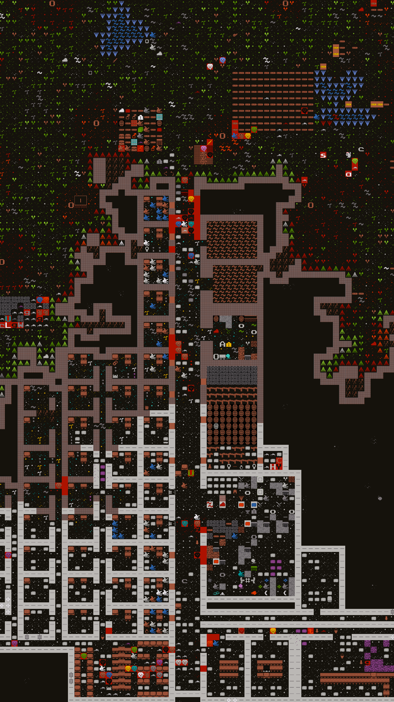

Everything was going great until it wasn't. Duthaldumat, "Worthy Roughness" in the common tongue, a once promising dwarven fortress now lay in ruin.

Sure I had had a few dwarves lose their minds in the midst of a Strange Mood. One retired to his room and refused food or drink. RIP Lokum Mogshumtekkud. Sorry we didn't have the materials needed to satisfy your creative needs. Aton and Thakut, y'all need to chill your guffins and try not going apeshit on your fellow dwarves next time. Also, maybe don't rise from the dead and haunt the cafeteria like that? Not cool.

Despite a few hiccups things were chugging along quite smoothly. Even the fogotton beast down in the caverns below didn't seem to pose much of a problem for us. Two years in, 120+ dwarves, babies out the wazoo, a thriving little trade depot... good times.

I suppose it was the trade depot that eventually did us in. Nearly the entire fortress hauling goods to and fro. Under the blue sky. Exposed.

<h1 class="duthaldumat">
The Wereelephant Doto Kadieslik has come! A very large elephant twisted into humanoid form. It is crazed for blood and flesh. Its eyes glow golden yellow. Its brown hair is very curly. Now you will know why you fear the night.
</h1>

Nearly a dozen dwarves fell in the ensuing slaughter. A half dozen more were wounded and in dire need of medical attention. Dazed and in various stages of shock survivors rushed the injured to a poorly stocked hospital. The dead where carried in their pieces past the mangled corpse of Doto Kadieslik to be prepared for burial.

This was a fortress changing event. But with the threat dispatched and the entirety of our citizens working to stock the hospital and bury the dead, we were ready to come out the other side stronger and more prepared than ever. The worst was behind us after all.

Not. Even. Close.

The full moon rose once again. The dwarves who had sacrificed their bodies to bring down the horror that was Doto Kadieslik found their bodies once again violently forced into the unnatural. Half a dozen newly turned wereelephants deep within the fortress ripped and tore until it was done. 10, 20, 30 dead... 40! No, 80! Is there anyone left alive?

At this point the wereelephants were either dead or gone. But the vast majority of the fortress lay in pieces. The halls, drenched in blood. The stench of miasma, brewing.

Beyond feeling, the half dozen survivors slowly began to mop up the blood and... parts. The dead must be laid to rest after all, lest they haunt these very halls.

But then, hope! Sweet hope!

Migrants! Bright eyed and energetic, excited to help bring Duthaldumat back to some shade of it's former glory. They stepped across the threshhold as if in slow motion, beards fluttering in an unseen breeze.

Only to be welcomed by yet another "survivor" turned wereelephant and slaughtered before they could take another step.

---

Those poor few, who had already witnessed so much, made one last grasp for honor and legend. They threw their bodies once more at this threat in a suicidal last ditch effort to rid the fortress of evil. What initially seemed like a surprising victory turned into anything but.

A miasma grows.

A wereelephant lumbers slowly off into the wilderness.

These dark halls echo only with the ghoulish wails of a restless dead.

