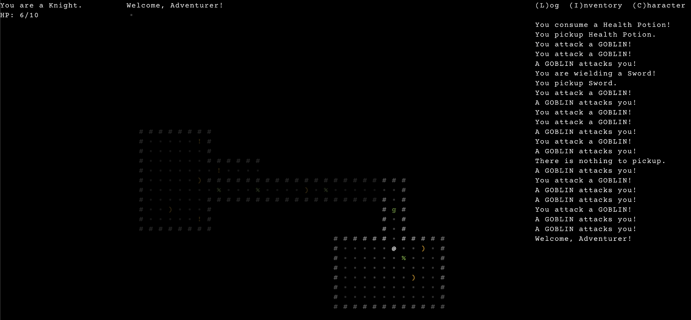

Dev "Weekly" is a bit of a misnomer. I don't talk about my professional work in these reports and I don't work on my personal project much if at all during the week. So these are mostly my weekend game dev reports. Also I skipped a weekend due to Ragnar so I'm not sure if keeping a count in the title makes sense either. Am I counting the weekend or the number of reports?

In the interest of not getting bogged down in meaningless details... moving on!

Stuff I did over the weekend:

- Added z-index
- Back to Ascii
- FOV bug fixing
- FPS counter
- Color
- FOV Range component

Also trying to decide what it is I actually want to build. If I'm being honest, I want to make the adventure mode from Dwarf Fortress, but fun. Which is of course a ridiculous thing to say. Having started and eventually bailed on close to 10 rogulikes over the last couple of years, I feel like I've learned enough to try and stick with one. Pretty sure at this point I can avoid any truly game ending pitfalls. It's just gonna take some determination to work through any upcoming issues.

The basic plan? Angband style town with a dungeon. I figure if I can get through that it's just a few steps to repeating that setup around a larger world map. Yes, that's a gross over simplification but this is all about steps towards a goal and making compromises along the way. Not letting perfection be the enemy of good and all that.

Look, a screenshot!

