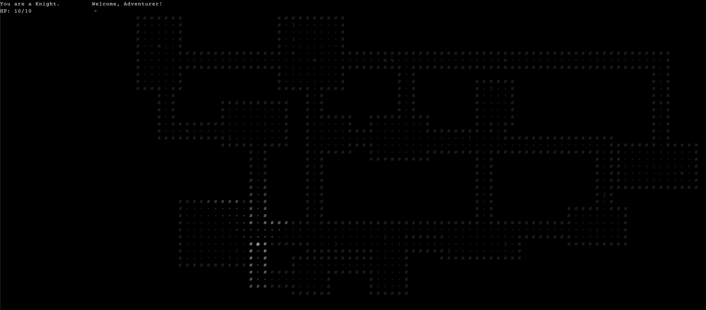
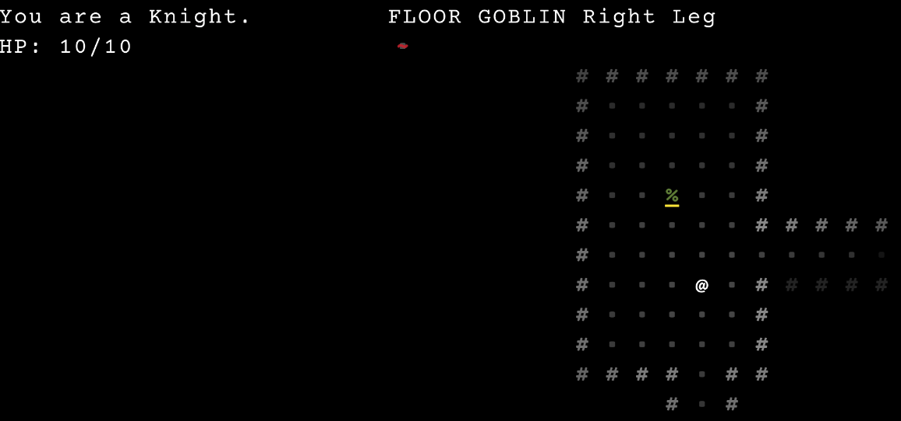
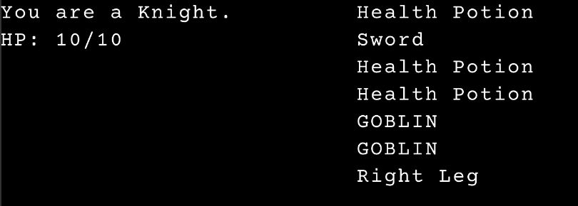
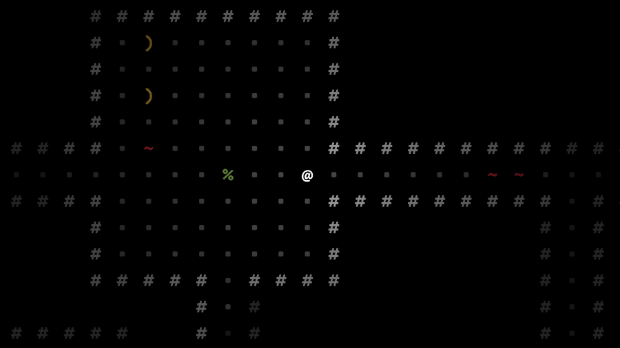

## Adjusting the game layout again

This could very well become a regular feature around here. I didn't like the tiny space alotted to the map and after some very lackluster attempts at scrolling and chunking I just went with a big map and big menus. Focus on one thing at a time. For now. This will continue to evolve as the game progresses.

## Refactored Game/Menu states to share a global MODE

To better support the big menus, big map, one focus ethos I refactored menu and game states. Previously game state was tracked seperately from menu state, making things like pausing and contextual control schemes very difficult. Combining all things into one MODE tracked on the world object simplifies a lot of logic.

## Look command and UI

After moving away from pixel graphics in favor of ascii, the alure of key commands became too great. Mouse support will have to come later if at all. The game now supports looking with the key command `k`. Pressing `k` automatically pauses the game and adds an overlay with a yellow underscore. You can then move the underscore with arrows to "look" at each entity on the current cell. Currently the read out goes to the ambiant log and is VERY crude. I need to add descriptions and better templates to render meaningful sentances. Also would like to add the ability to "examine" or see details of a selected item you're looking at.

## Pickupable and Wieldable goblins!

You can now pickup dead goblins and wield them like a weapon. Nothing quite like beating a nasty goblin to death with a nasty goblin corpse you found on the ground.

## Heirarchical anatomy

I'm most excited about this feature. The goal was to be able to lop off the arm of a goblin, pick up the arm, and continue to beat the goblin to death with it. Entities can now have a `Body` component which behaves like an `Inventory`. Humanoid bodies container a `Torso` entity that has a `Body` that contains a `Left Arm`, `Right Arm`, `Left Leg`, `Right Leg`. Each of the limbs have a `Body` that contains their respective hands and feet. It's bodies all the way down!

This architecture is extremely useful for amputating limbs. Removing a `Left Arm` will take the `Left Hand` with it. The body parts are already entities so giving it a position and putting it on the ground as a pickupable and wieldable item is trivial! Adding parent entity ids to each part will make future "Fetch me the head of [SOME_ENTITY]" quests possible. Bone, muscle, and organs can be added as nested parts with an eye towards a proper butchering system down the line. Chef in town needs three troll livers for an upcoming festival stew? Find and kill any three trolls, try not to damage the livers during combat, butcher and return with the three specimans. Voila! Quest complete. No more farming creatures and hoping for the random drop you actually need.

