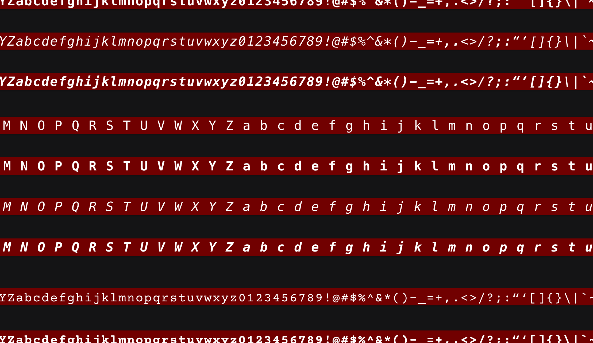
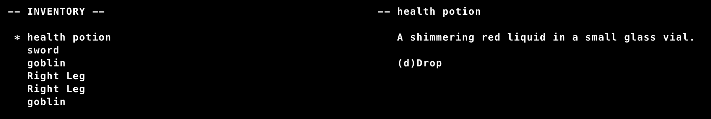
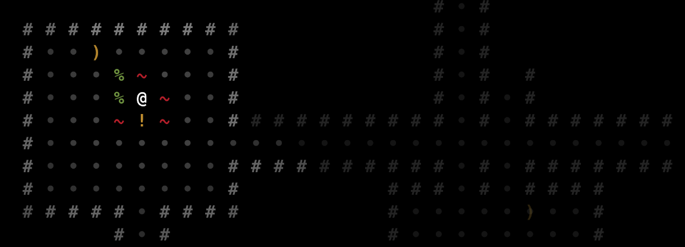

## Update fonts

Switched from courier to menlo. I got sick of looking at courier after moving away from graphical sprites. The letters aren't as nice yet as they look in Covered In Blood. Not sure if the number of tiles on screen make them smaller or if the composition on the tile is different. Still some work to do to get them looking really nice. But it's a big improvement.

Just looked at the sprite sheets - def could make the letters larger. Will need some experimentation to get a good balance between size, line height, spacing, etc.

## Inventory UI

Finally got to put some more effort into the Inventory UI. It's on the way to actually being useful. Now includes a selectable list, descriptions, and the ability to drop things! Dropped items are placed on open tiles adjacent to the player. Planning to implement an InReach UI for getting things in adjacent tiles as well. That behavior will be able to support other actions too - unlock, disarm, pickpocket, etc. One step at a time thought. I think I need to handle containers first. That will create the foundation for suits of armor and butchering.

I think the best way to do armor with the body parts system is to give armor body parts too. The suit becomes a container with "body parts" inside it the can match to actual body parts on the wearer. Should be able to support peicemeal armor this way and also amputations.

I'm excited about this bit. Lots of potential and it's going fairly smooth so far.

## Get/Drop Render Bug

Ran into an interesting bug with dropping items from inventory. The sort that had me considering starting over the game - even thought that would have done nothing to prevent me from running into it again in the future. But taking a cue from the great Tarn Adams I accepted my fate and sat down to solve it. The rest of the game would have to wait. Took a couple days of bug hunting sessions but the root cause was discovered and exterminated!

It presented in this odd way where items dropped from inventory would appear at the dropped location as expected, BUT if the new location was out of FOV they would appear ghosted in their original locations as well. You couldn't interact with them and they didn't show up in the debugger. But there they were...

Turns out I wasn't setting Position in a consistant way across the render system and they were stuck in some wierd limbo between canvas and pixi cache. That's vague I know. OK, so the actual true root cause isn't fully understood. But I got it enough to squish the bug. Not sure it's worth digging any deeper at the moment. Pixi is such a light layer in this game, I don't think I need to understand all of it's complexities just yet.

Lesson: utility functions are a good thing.

