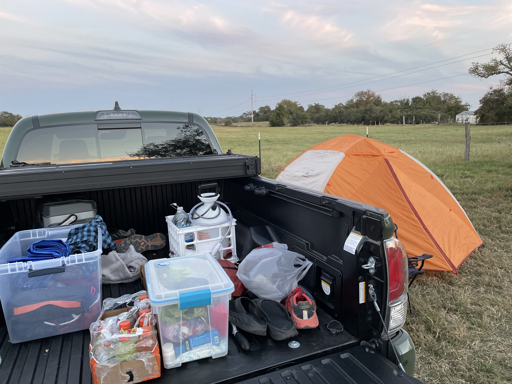
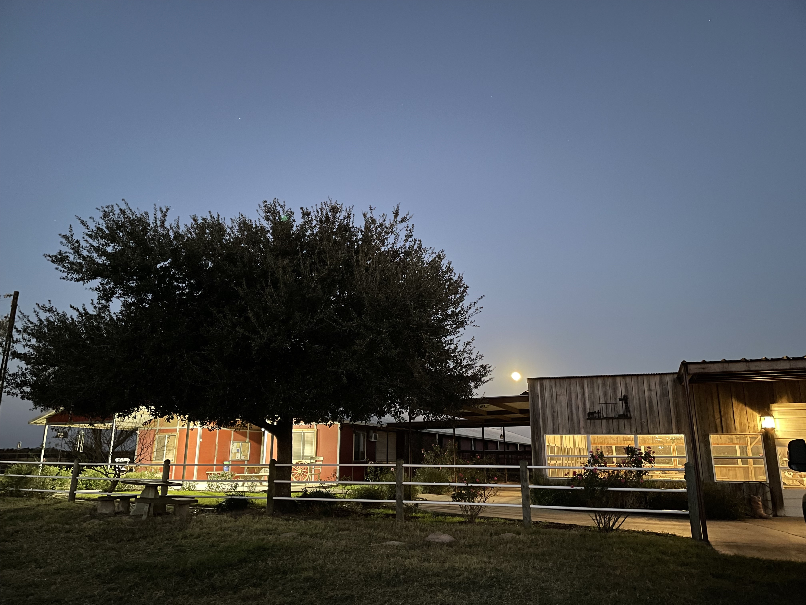
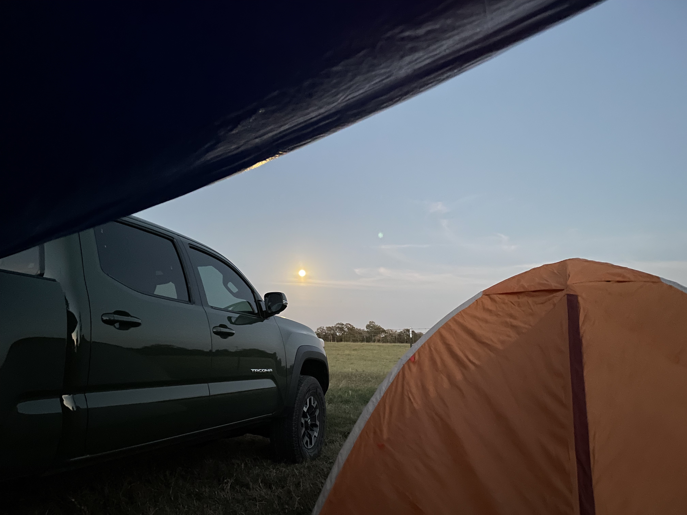
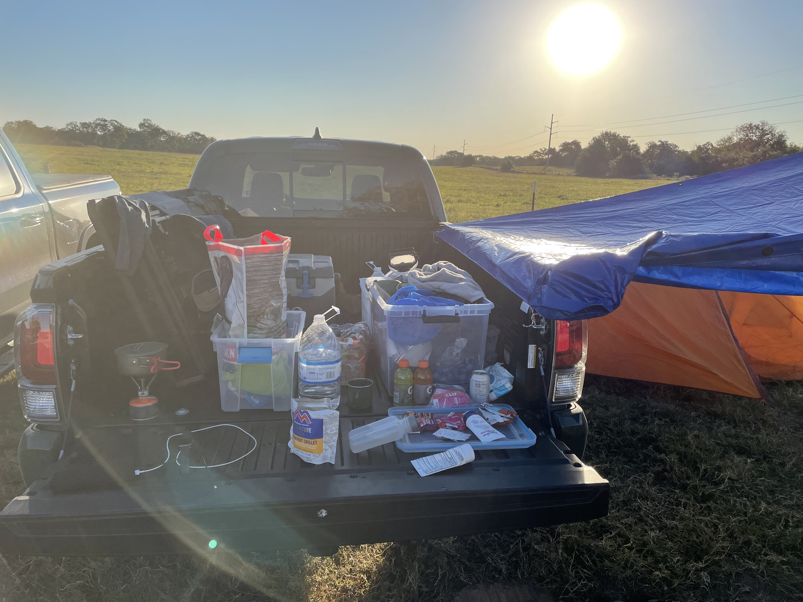
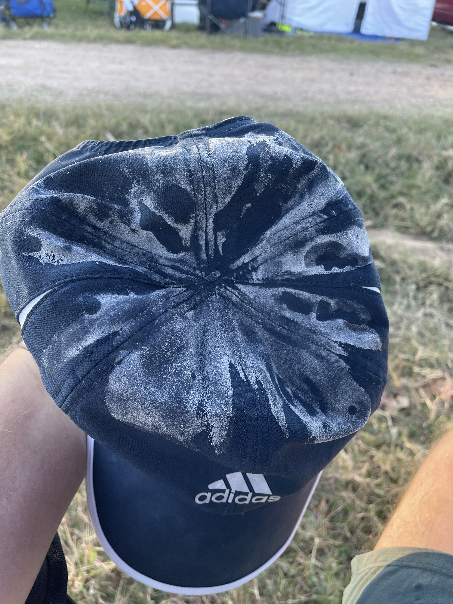
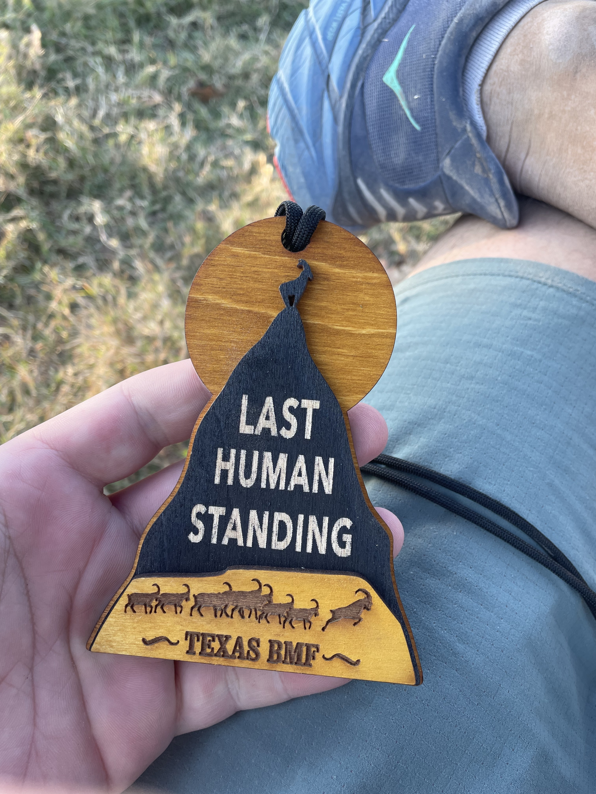

I can run four miles in an hour. That's easy!

> The backyard ultra is a form of ultramarathon race where competitors must consecutively run the distance of 6,706 meters (4.167 miles) in less than one hour. When each lap is completed, the remaining time within the hour is typically used to recover for the next hour's race.
>
> The race ends when the last runner or runners either concede or fail to finish the distance within the allotted time frame.
>
> ~ [wikipedia](https://en.wikipedia.org/wiki/Backyard_ultra)

I've been intrigued with the backyard format for years. I got wind of it 5 or 6 years ago. Sometime after Guillaume Calmettes won at Big's Backyard. On the surface it sounds so easy - just 4 miles every hour on the hour. Of course, theory and practice and two very different things. I had to find out for myself just how hard this really was and when I saw Trail Racing Over Texas was putting on a backyard ultra I signed up immediately.

## 7IL

This was my first time at the 7IL Ranch, a "Premier Equestrian, Running, and Wedding Destination". I arrived late in the afternoon the day before the race, nervously unpacked, and began to setup camp.

Short line for packet pickup the night before.

I met a friendly little kittybunn outside packet pickup.

Solo camping under a chilly sky for a 7am start.

## The Race

At 6:45am the RD went over the rules and explained the whistles. 3 tweets with 3 minutes to go before the start of the lap. 2 at 2 minutes and 1 final a minute before. If you weren't in the corral at lap start you were out. No exceptions.

It was cold and sun was just rising.

3 tweets of the whistle. 2 tweets. 1 tweet. Go time.

I did my best to take it easy. I knew my training hadn't been very focused leading up to the race. That was OK. I came with a plane. Hold it together nutritionally and bring it mentally.

Things fell into an hourly rhythm pretty quickly. I recorded each lap seperately on my watch and it wasn't long before I had forgotten what lap we were on or how many miles we had actually run. Twenty came and went before I knew it, literally!

I was eating surprisingly well! Real food even! The routine was rhythmic. The recovery time adequate. The company of others pleasant. I was really enjoying myself and the format of this race.

We passed the marathon distance. The field winnowed. I felt good, like I could keep going forever! Perhaps I was feeling a bit too good...

---

Nutrition early on had gone well, but I didn't really have much of a nutrition plan. How many calories was I trying to eat an hour anyway? 🤷‍♀️ In the end it was my stomach that would do me in. I had had no interest in gels all day and probably wasn't taking in enough salts considering how much I was losing. I had made the assumption that I wouldn't sweat much considering the cool weather and easy effort. But alas, it seems my maniacal sweating knows no limits.

Not long after 50k my stomach turned sour. I was struggling to eat, struggling to drink. My gut felt like a rock. I don't think I was absorbing much of whatever I managed to force down. In any other ultra I could have slowed down, taken some time to reassess. Maybe just slow walked for a few miles.

Not possible in the backyard ultra. This is where that simple idea of running 4 miles in an hour met with the reality of doing it every hour on the hour. Having to be back at the start line for each lap removes the ability to slow walk it. 14 minutes per mile may not sound fast - and it isn't - but it's not a slow walk either. And the longer you take to finish a lap the less time you have to prepare for the next one.

I had recorded a couple 47 minute laps leaving me with only about 10 minutes of actual prep time. Then a 53 minute lap. Less than 5 minutes before the whistles started. I was beginning to dread the whistles.

I did some delerious math in my head and felt reasonably sure this was the 40 mile lap. I could bail early and still chalk it up as a birthday run. I only needed 39 miles for that. Now I just had to figure out where to bail and still hit 39...

## DNF

And that was it. My nutrition game was way off target and I had just lost the mental game. I didn't have a strong block of training to rely on physically or to use as a mental bargaining chip with myself. I hated the course at this point. I dreaded the whistles. It was getting cold again. The sun was going down. The whistles... the whistles...

To do well in an ultra you absolutely must stay positive. I was deeply negative at this point.

I called it.

## Aftermath

In the end, after totalling it all up with a calculator (not my delerious brain) I found I had only run 38.8 miles. I didn't even get an official birthday run.

Looking back I think there were ways to recover physically. At least for a few more laps. I could've pushed through - gotten to 50 miles. But on the day I chose not to. I had had enough.

I learned a lot from this experience. About running. About myself. About a seemingly simple task...

I knew it wouldn't be easy but I didn't know it would this hard.

---

That's not true. I knew it would super tough - just didn't know where and when and how I would start to fall apart. Now that I know? Already looking to sign up for the next one.
