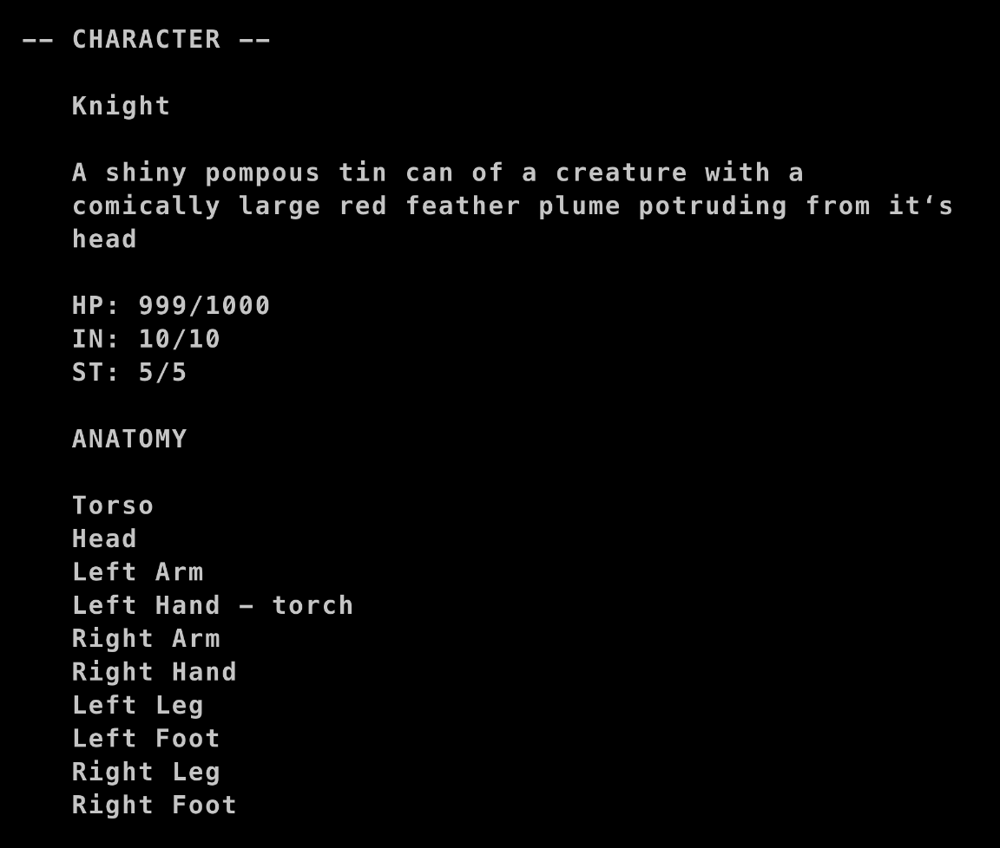
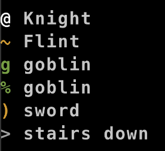
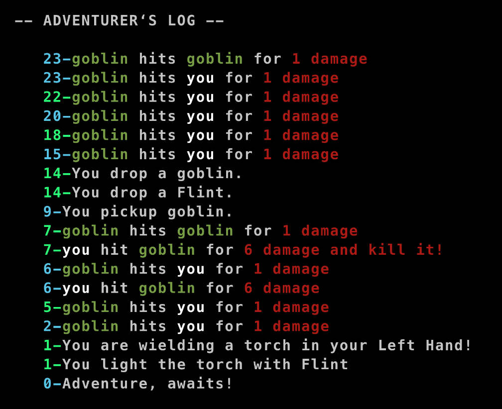
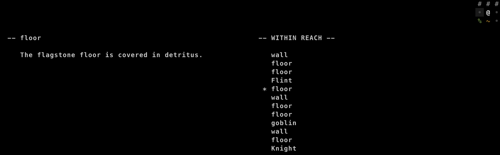
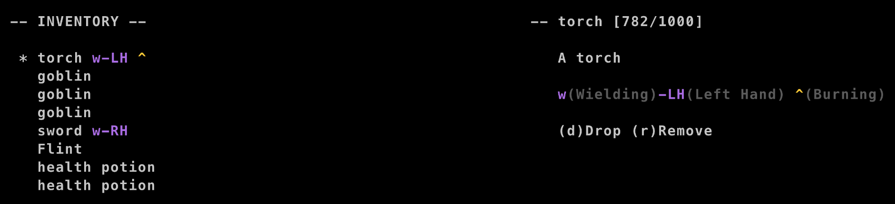
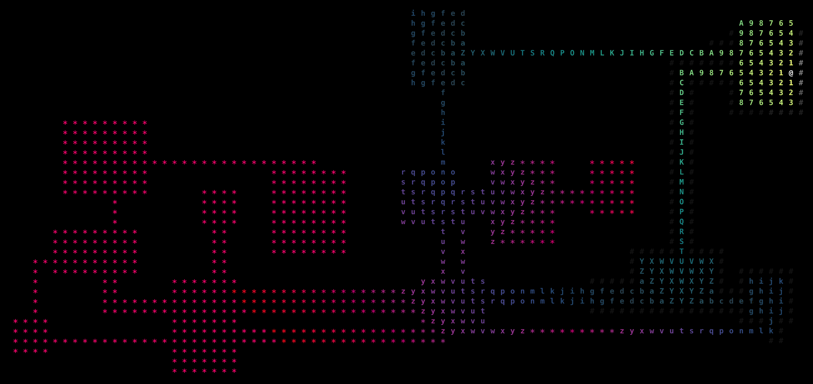
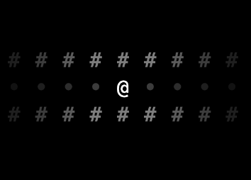

This update has been a long time coming. First the updates to the game. Then a brief discussion on why it has all been a big waste of time. (Not really)

To make this a bit easier to digest, I'm going to group features together logically as opposed to presenting them in order of development.

## Deploys!

Finally got reliable deploys working. I got fed up with all the issues I was having with so called "no config" config solutions. When it comes down to it, as soon as you get past the most basic tutorial project, you do actually have to write some configuration. All the no config solutions tend to be black-boxy, whereas webpack for all it's complexity is an open book. At the expense of longer dev-server compile times, I get reliable deploys that I actually understand! 🚀

## A Focus On UI

At this stage in the game, nearly every new feature requires extensive UI work. The goal of course is to get to a robust enough UI that additional features can plug into the existing interface with little to no effort.

- **Character Menu**

Built mostly as a means to more easily debug anotomy and wielding. Doesn't get a lot of use or love at the moment. But it does exist.

- **Dynamic Legend**

This is a feature borrowed from Brogue that I consider essential. Basic in it's current form, lacking health bars and status effects, the utility of having a quickly accessible key for ascii graphics is immense.

This legend shows each "legendable" entity within your field of vision and updates every turn.

- **Log Improvements**

The adventure log is better than it was but I'm definitely not satisfied with it's current state. Multiple logs can occur on the same turn, so they are now grouped accordingly. Multiple colors can also be used on a single line via a templating system I ported from an earlier game. Again, this is better, but still not great.

- **Within Reach**

The within reach menu was a bit of a rabbit hole that I went down. I got sick of going into my inventory to do this or that only to forget the exact layout of the map. That frustration only grew as I began to consider other ways of interacting with the environment beyond just getting and dropping. Pick pocketing, lock picking, drawing in dust, directional interactions - all made much easier, at least from a UI perspective, with a clear view on what exactly is within reach at all times.

The 3x3 grid in the top right is a dynamic view of your location on the map. The center list is populated with all entities within reach regardless of their current order in the render stack. The description renders for the currently selected entity and it's grid location highlights in the top right to give you the clearest indication of the identity and location of each.

## Actions: Wield, Remove, and Quaff

Additional actions were implemented for (w)Wield, (r)Remove, (q)Quaff. Nothing too remarkable here - you can wield weapons, remove weapons, and drink liquids. Available actions are listed below the description of items in your inventory and the within reach menu.

Additionally, in the UI there is now an inventory key. It's important to know what is being wielded, in which hand, and what if anything is on fire. Symbols are added to the list with a long form explanation in the description of each item.

## Dungeon Delving

Stairs themselves are nothing new but this go round has brought some significant learnings (and bugs). My previous games have mostly used geotic for an ecs library. With that brought a relatively simple pattern of serializing and storing each floor in some sort of database. Navigating stairs was as simple as creating/loading floors as needed. That pattern ran into some issues with bitecs - the new ecs I've been trying out. There's an outstanding bug in the serialization path in bitecs so saving and loading floors is off the table for now. Simply ignoring the issue and just delving deeper anyways, relying on the systems in place to just do the right thing only got me so far. Enemy AI quickly got mixed up across floors or just got bogged down trying to run for every enemy ever created.

The solution was to create an "onCurrentMap" component. Moving floors requires a complex dance of removing the "onCurrentMap" component from everything, collecting every entity attached to any entity traversing floors, generating or loading the next floor, and then attaching the "onCurrentMap" component to all of those entities. In addition, every query requires the "onCurrentMap" component. This keeps the systems running against only the entities on the current map which not only prevents AI from getting confused accross floors but also keeps the general memory and computation requirements to a relatively even level.

Unfortunately there is another outstanding bug in bitecs that causes it to crash after reaching the default maximum number of entities in a world. There is an api to expand that default, but again, bug. The serialization bug is preventing me from storing each level as it's own world, and the maximium entities bug is preventing me from working around it much longer. At the moment, I can delve to ~25 levels before crashing the game.

The developer of bitecs has been super responsive in the past and is currently in the process of a total rewrite, so I expect these issues to be ironed out eventually. But for now, there is no eta.

## Dijkstra

Enemy ai relied entirely on aStar and was running into endless issues. It was slow and didn't work across floors. I'm sure the problems were how I was using it, not the algorithm itself, but in the moment I just decided to switch to dijkstra and move on. Dijkstra is far more useful overall and can do so much more than just pathing. Eventually I would like to combine the two algorithms like I have in the past. Dijkstra for basic ai and pathing to the general vacinity of a goal, and aStar for finishing the job.

A new addition this time is a visualizer for debugging.

---

## Torches

How hard could it be to add a torch?

Hoo-boy, was this ever a rabbit hole! The first requirement I set for myself in this journey was multiple light sources. A torch is an item, and items can be picked up and dropped. A torch on the ground should emit light. Thus multiple light sources were required.

Torches don't just glow - they burn! So we needed a burning system. Things that burn turn to ash so I experimented with entropy, damage, and resistance systems. And of course something has to actually light the torch on fire. Why not flint?

Adding flint to light the torch required the concept of applying one item to another. And this is where things began to really got out of hand. I had hoped to reuse concepts from an effects system I had previously written using geotic. Unfortunately that system relies on strings stored in components. Bitecs doesn't store strings on components for perf reasons - which I totally get. But I'm not hitting perf issues and don't expect to anytime soon. Create a comparable effects/apply system requires a total reengineering, so once again I kicked the can down the road. Not to mention all the UI work torches created - status keys in item descriptions to show what was burning as well as the entire within reach preview. And after solving all of that it's still not something I would consider done.

Torches are going to be left as a humble mvp that technically does the thing. There are bugs and incomplete edges that for the most part I feel pretty good about. I learned a ton. It's just that it took about a month to add torches. Torches that provide light for the player. The player that could already see just fine...

Before torches:

After torches:

Worth it!

## Why I'm gonna start over. Again.

I know. I commited to this one. It's been going on for months. Across the years even! But this ecs lib is too dogmatic for me. I miss events and storing strings in components and simple serialization that can be stored as JSON. When you get down to it, it's solving for problems I don't have.

I've learned a TON with this one. Pixijs is faster and less buggy than my own implementation of canvas. Using a tile sheet of ascii characters is nicer than relying on web fonts.

This was only supposed to be a pixi test and the test is over.
