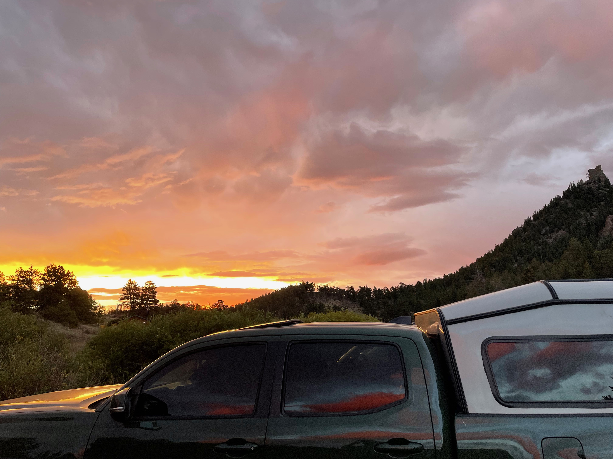
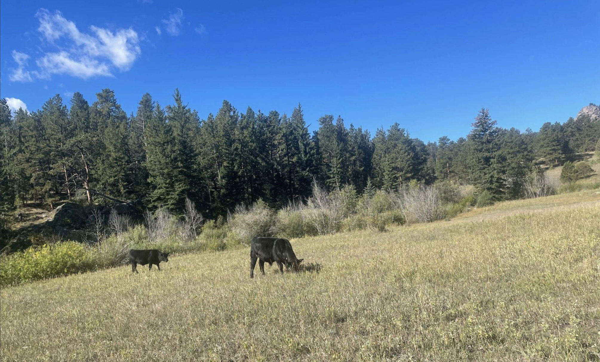
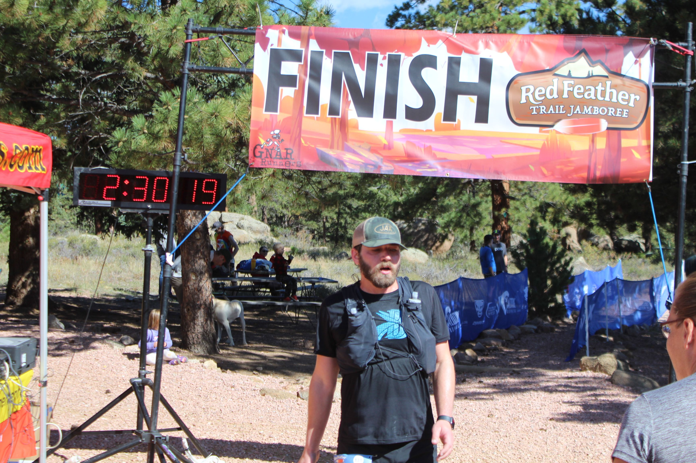
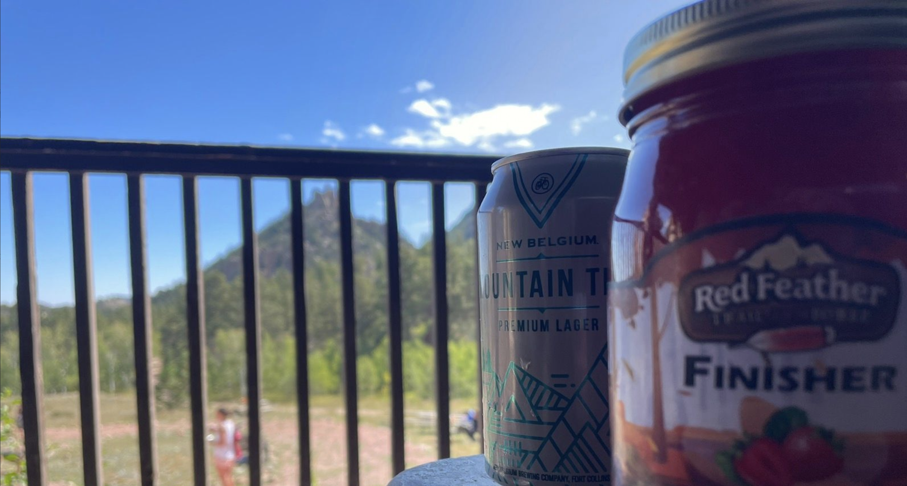

I moved to Fort Collins in May of this year. Running in the mountains, while not
the only reason for the move, was definitely a primary motivator. After taking 4
months off that began with an injury in early February it was time to get back at it.

## The Training

My training since moving to CO has been consistantly minimal. On average I've run about 13 miles a week.
I've done some cross training with family hikes, mountain biking, and just tooling around town on an old fixed gear.
In short - it's been ok. Enough to get to the finish line but not enough to
actually race or expect any sort of spectactular day.

## The Preamble

The start line near Red Feather Lakes is about an hour from my house. I could have left the
morning of but I've been itching to try out my camper shell on the
truck so instead I packed up the day before and headed out after work.

I'm still getting used to how beautiful it is out here. Maybe 20 minutes or so across and
out of town and suddenly I'm surrounded by huge skies, vaulted ridges, and a
sneaking suspicion I took a wrong turn and ended up in Wyoming.

I made it to the Scout Ranch shortly before sunset. The volunteer at the gate
welcomed me to the Jamboree and gave me quick directions to mess hall for packet
pickup.

The dirt road up to the mess hall is steep - I don't think I would have
made it in the Prius. Thankful to have the truck so I didn't have to worry about
getting stuck. That said, when it came to parking, definitely missed the Prius. I got it
done but it wasn't pretty.

Packet pickup was far easier than parking a big dumb truck on a narrow dirt road.
I received my bib and race swag without much of a wait and was quickly on my
way.

There is a small parking lot at the start line and there were few other runners already parked and settling in for the night. I
set up a little nest in the bed of the truck and slept easy until around 5am
when the things started to get busy. A line of early arrivals soon appeared as
they queued up to enter the proper parking lot. I followed suit to avoid the start
line ruckus. Time for some truck coffee, breakfast, and a relaxed wait until race start at 8am.

## The Race

The half marathon started an hour after the 50k at about 7500 feet. This was the low point of the course. It would be all uphill (and downhill) from
here for a total change of about 1800 feet.

The first two miles to the Elkhorn aid station consisted of a super smooth dirt
road and the first few hundred feet of climbing. My plan going into the race was to take
it easy, hike the climbs, run the flats and downs, have a good day, and DON'T
BLOW UP.

I ran through the first aid station without stopping. At just 2 miles in and only
11 left there wasn't much of a point. I may not have hiked any of the inital
climbs like I planned, but I was definitely taking it easy.

So far so good.

The next four to five miles contained the bulk of the elevation for the
remainder of the race. I knew that if I could keep it under control until we
made it over the hump I could push it on the back half. On the first hike I was passed by a few
runners chewing up the climbs with a steady gait only to bomb past them on the
downs. We played leapfrog for the next hour until about mile 7.

Topping out at about 8500 feet it was finally time to head back down. I offered
final trail greetings to some familar faces I had been trading places with and
happily opened up my stride for some sustained downhill running.

The trail dropped about 500 feet over the next 2 miles to Lady Moon aid at mile 8.5.
It was there that I tagged a gate, refilled my water bottles and turned around
to execute the only out and back on the course.

The next mile and half included yet another climb, nothing major but at this point I
was really hoping for more sustained descents. Mile 11 was just what I was
looking for! ~300 feet loss on smooth downhill single track! My first and only sub 8
minute mile of the day. I passed a few more folks here and settled in for what I
thought would be a smooth cruise to the finish line at the bottom of a big hill.

After a mile or so of fast (for me) running the Elkhorn aid came into view
again. With only a couple miles to go I again ran through the aid station
without stopping. The shouts of encouragement from volunteers did not go
unnoticed!

I was looking forward to more downhill - this time on a flat dirt road.
Unfortunately I seem to have had forgotten that there were also climbs on that
road. Again, nothing major but I was running low on steam and chose to do some
more hiking.

The turn to finish line was finally in sight. I was looking forward to cheers,
maybe some cowbells, anything to pull me that last little bit to the end. It was
oddly quiet. When the trail turned, there was no finish line, no cowbells, no
cheers. Just more course markings.

They moved the finish line to mess hall! Just one more push up a few hundred
feet of stairs... nothing to do but power through.

## The End

Finally, after 13.8 miles and bit a more elevation than advertised I made it
across the finish line. It took just over 2 and a half hours. I had decided beforehand
that anything under 3 would feel like a success - really didn't expect to land
it this fast with as much hiking as I did. I may not look it but I really couldn't be happier with the result.

The Red Feather Jamboree was a fantastic event. It was very well organized, had perfect weather, and felt like a great intro to Colorado trail racing. Oh! and instead of yet another finishers medal we got our pick from an array of specially bottled jams! I waffled between rhubarb, peach, and strawberry before settling on strawberry.

10 out of 10 would race again.

---

6.91
5.88
13.7
10.3
15.65
15.30
10.15
23.27
13.01
25.97
0.4
10.64
14.63
21.91
12.10
12.18
24.94
25.61
