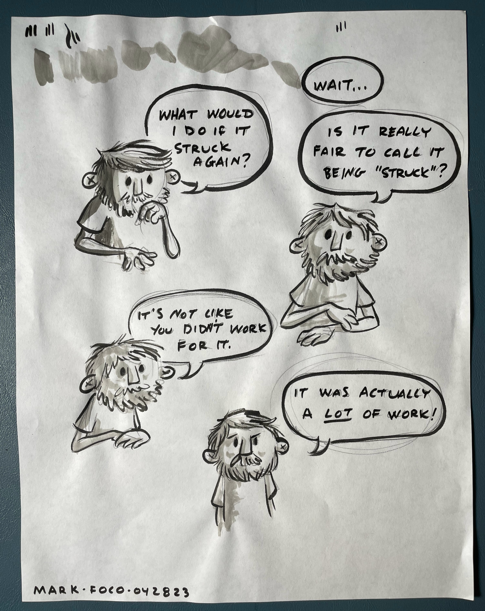
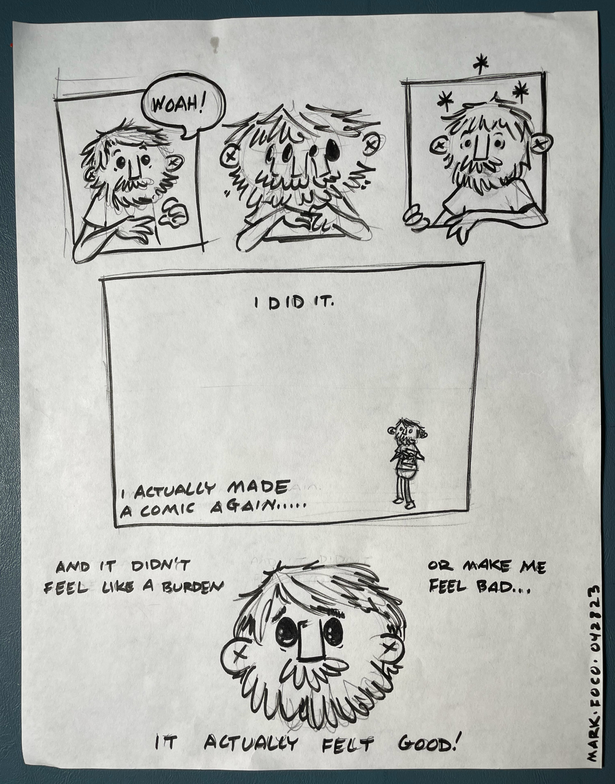
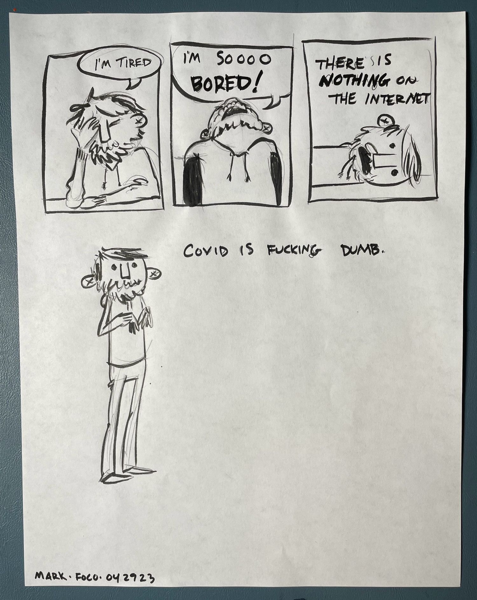
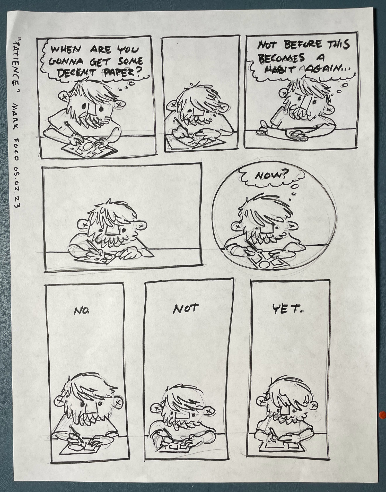

Being a cartoonist used to be a core part of my identity. I was either actively making comics or feeling guilty for not. My relationship with work wasn’t exactly healthy and it lead to an inevitable and pretty massive burnout.

All of my attempts to reignite the creative spark sputtered out. Making comics had became an awful, anxiety inducing slog. Eventually I gave up on my crispy fried dreams and more or less forgot about them.

For nearly a decade I considered myself to be a recovering cartoonist. As if my abstinence has been part of some multistep program. It is therefore with great pride that I announce I have officially fallen off the wagon.

The fact that I’m writing anything that even resembles comics again is as big a surprise to me as anyone. Please enjoy this reemergence as I do my best to work at a measured and sustainable pace.

During my first dance with covid, I recently found myself in quarantine with 5 days of sick leave. I did not spend the entire time reading or being productive like I had hoped. I spent it on the internet because your brain doesn’t work with covid and I didn’t have energy for anything else.

I have a bad habit of getting excited about things and immediately going out to spend a bunch of money on stuff I think I might need but never use. It’s almost a proxy for doing the work itself. To avoid this pitfall I’ve been forcing myself to use what I have on hand instead.

