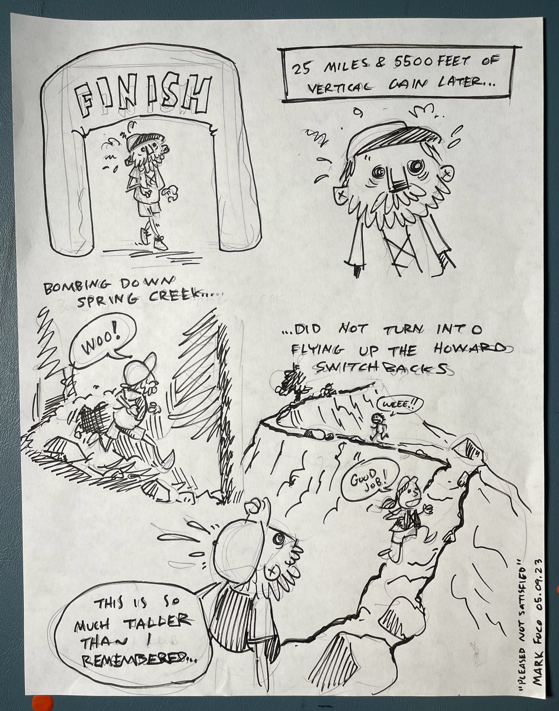
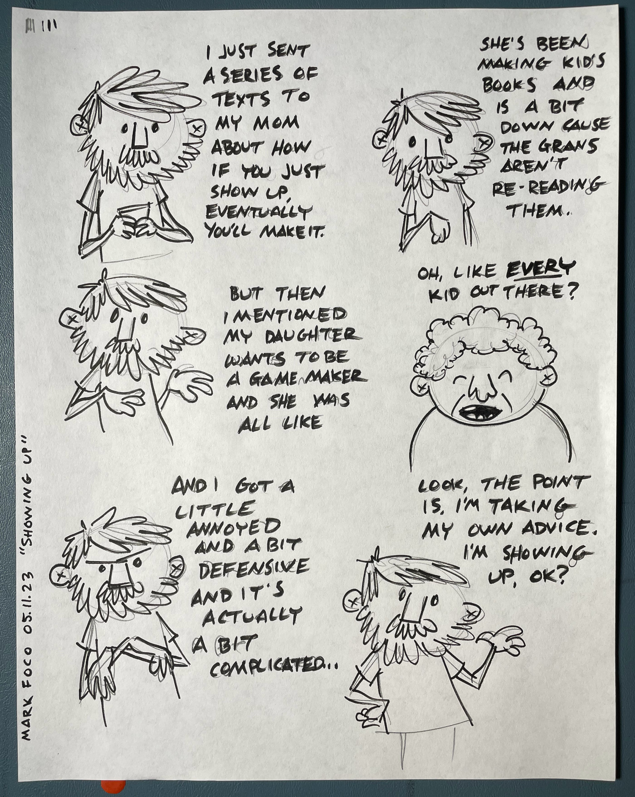
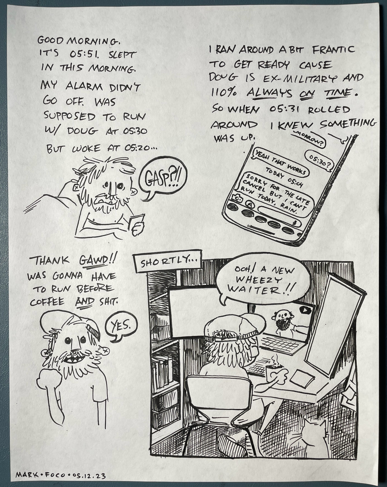

Long before we made the decision to move, before the move was a goal or even an inkling, I had my eye on Quad Rock. Of course back then I wanted to do the 50. Now that we live here and I can run on the course whenever want, it became apparent that maybe the 25 was a good first step.

I showed up and put in the miles for over 6 months to prepare for this race. I felt ready.

I guess sometimes showing up isn’t enough to get you there. Or maybe it is and its just that the there isn’t where you thought it would be. Sometimes there is just another 1500 foot climb.

Showing up to do your thing is a pretty good recipe for getting it done,

That said, sometimes it’s nice to just faff off instead.

