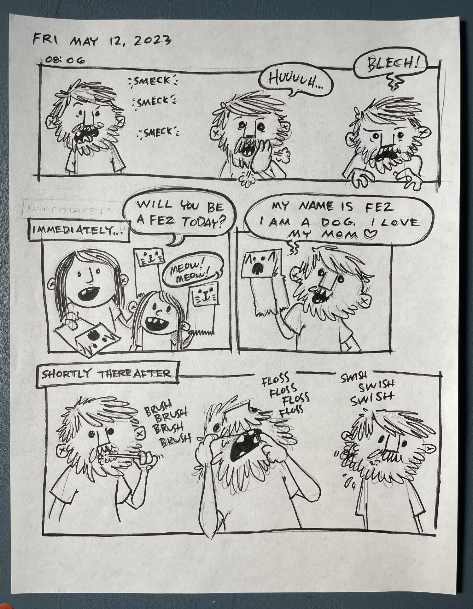
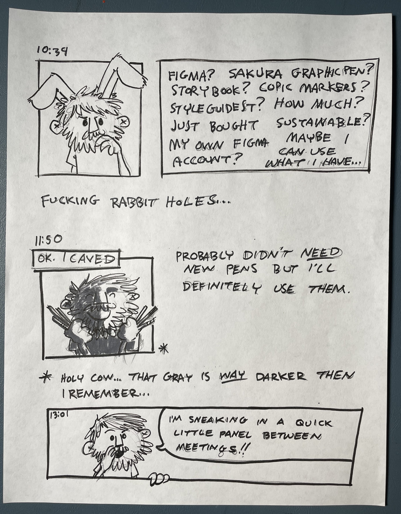
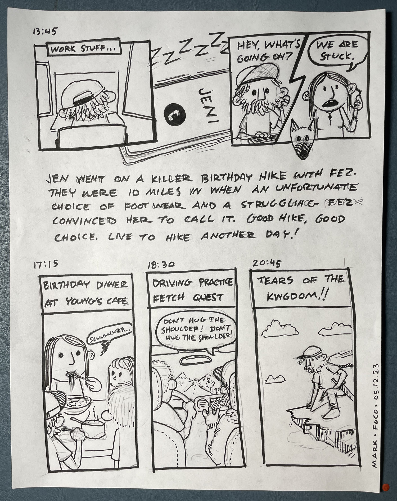

There’s this thing cartoonists do called hourly comic day. They draw a comic for every hour they’re awake. The official day for this event is February 1. I’ve never remembered to start on time or at all really. Same with Inktober where they draw and presumably ink something everyday for the month of October. I did do 24 hour comic day a couple times. That’s where you draw a 24 page comic in 24 hours.

This isn’t any of those things. This is a series of dispatches from May 12, 2023. Beginning with the wee hours.

Sometimes it can be hard to focus when you’re researching things for work. I fell down multiple rabbit holes, both professional and personal.

For the record, this was not Jen’s birthday. Nor was this mother’s day. But they both fell on the same weekend and she had to work through both of them. So we made the best of it and mixed multiple celebrations in where we could.

