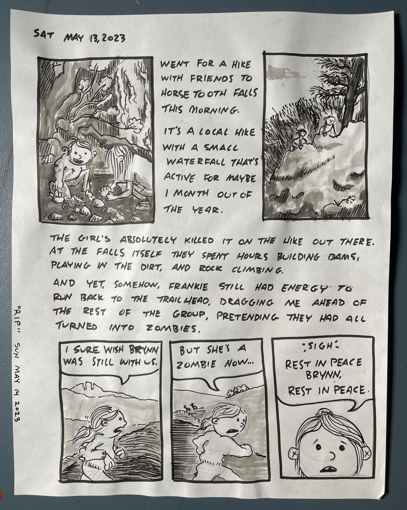
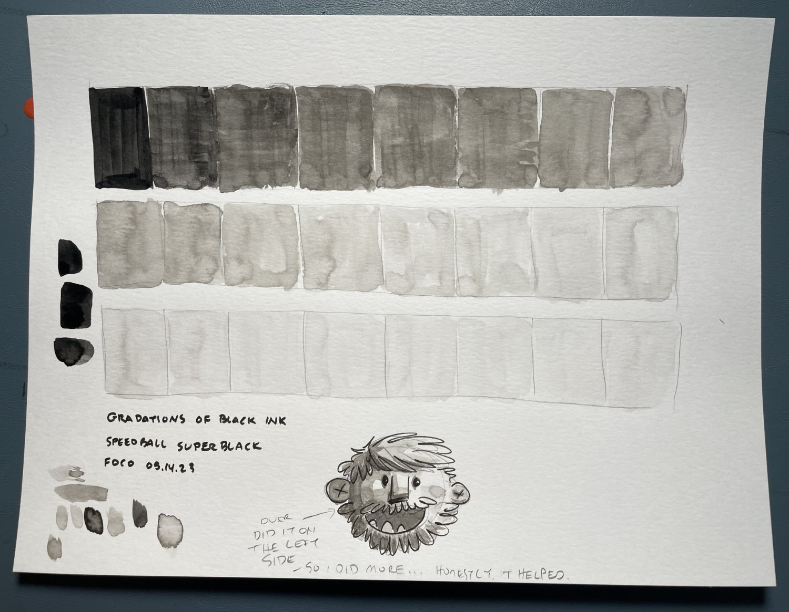
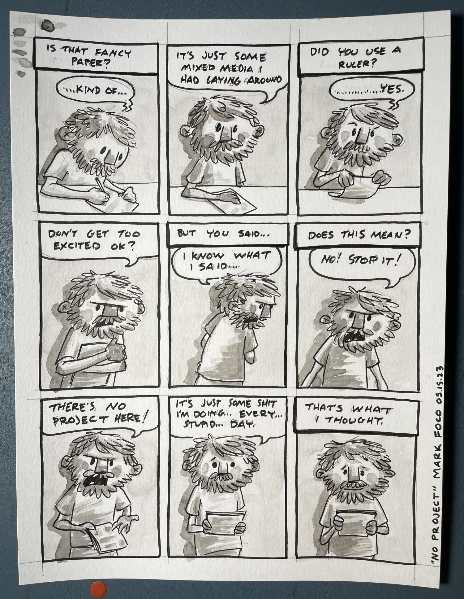
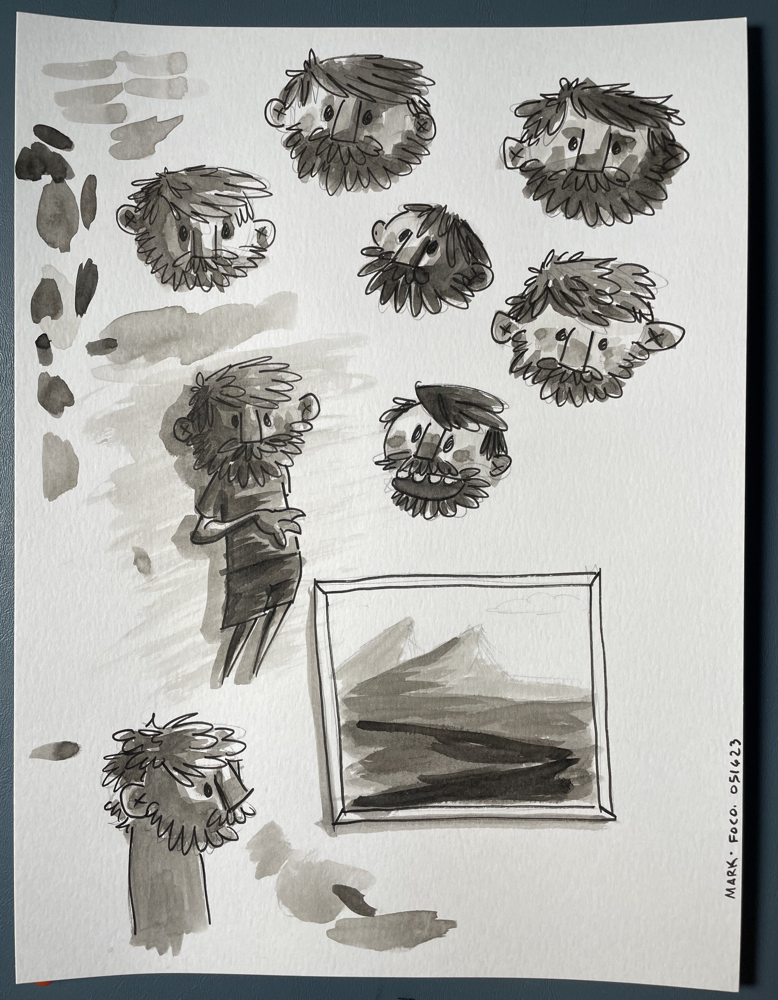
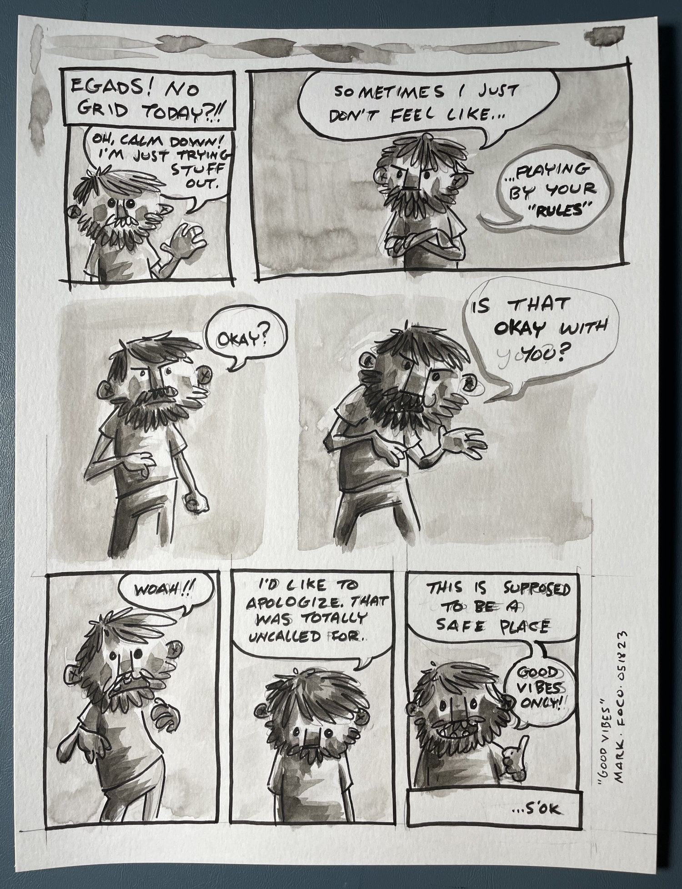

That girl is gonna be a trail runner! Or could if she wants to. Who knows where her whims will take her. But at least for now, any hint of competition provides a boost of energy powerful enough to get her over any challenge we throw at her. This one, with the zombies, and running 2 miles back to the trailhead? That challenge was all her own.

Speaking of challenges, spent some time trying to wrap my head around ink washes again. In the past I did a lot of water color washes - not so much ink. Pretty similar but if it’s like riding a bike, I don’t think I’ve ridden this one before. Will take some time to get the look and feel I’m after again.

Moved to some nicer paper I happened to have lying around. If you can’t tell, I’m a little self conscience about it…

I’ve false started on getting this comics thing going again so many times. Usually I get some grand idea or vision, work on it for a day or two and lose interest. My strategy this time has been to remove as much pressure as possible. Fancy paper can lead to expectations, expectations can lead to pressure, and pressure can lead to failure.

Please excuse me while I continue to try and ignore the fancy paper beneath my fancy brush filled with fancy ink…

I did a short series called Inner Dialogue in the past. It was usually just two caricatures of myself having a fairly negative argument. I often mocked my own abilities, wants, and needs. I can pretty easily get lost in my own head, and it’s not always the nicest place.

It’s important for me to feel confident and be in a safe place especially while I’m ramping things back up. So once this one started to veer off into that negative space I did my best to cut it off at the pass. Good vibes only!

