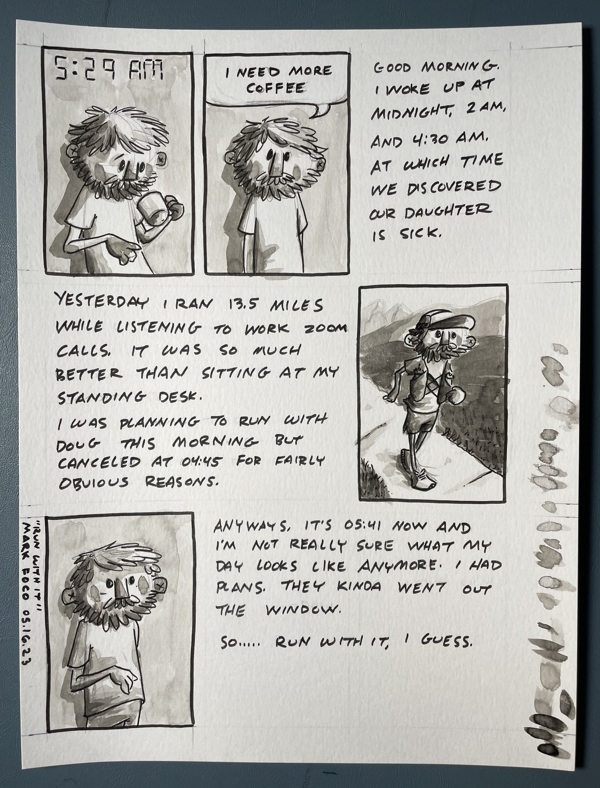

What a weird morning! Kiddo was sick all night, but just fine the next day. She stayed home from school but clearly could have gone. Are you sick or not? Pick a side!

If you find your life is a bit too structured, try having a kid. Little chaos factories that do a great job of always keeping you on your toes.

I’ve been trying to read more this year. Or rather, read at all. The internet and all of its fleeting little joys have decimated my attention span. Getting rid of my phone feels like it would help but I do actually have to have it for work. Wish I could live without the internet sometimes, but again, it’s also a tool I deeply rely on. Guess I just have to rely on good ol’ fashion self control… ugh.

It’s not uncommon for a cat to hop up on my desk, swipe everything off for no apparent reason, and then stretch out like my workspace is a chaise lounge in the afternoon sun.

If you don’t have or want kids and still feel like your life is too structured, a cat will do just fine. We have two. Lil harbingers of chaos. Sometimes you don’t need kids or cats at all to do the job. Life will just saunter on up and slap you in the face anyways.

