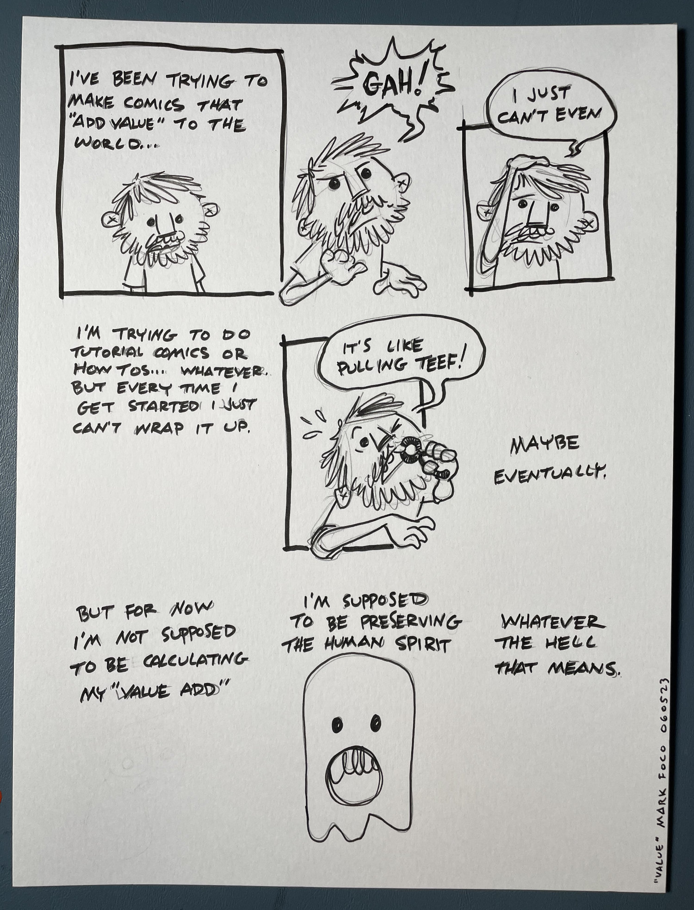
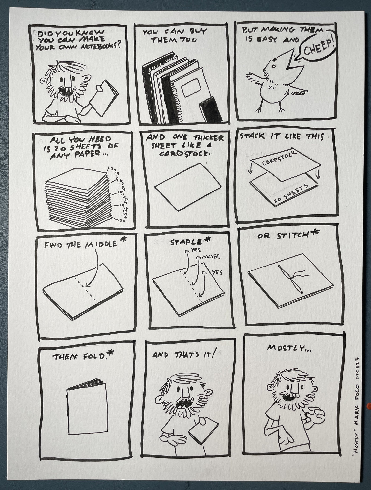
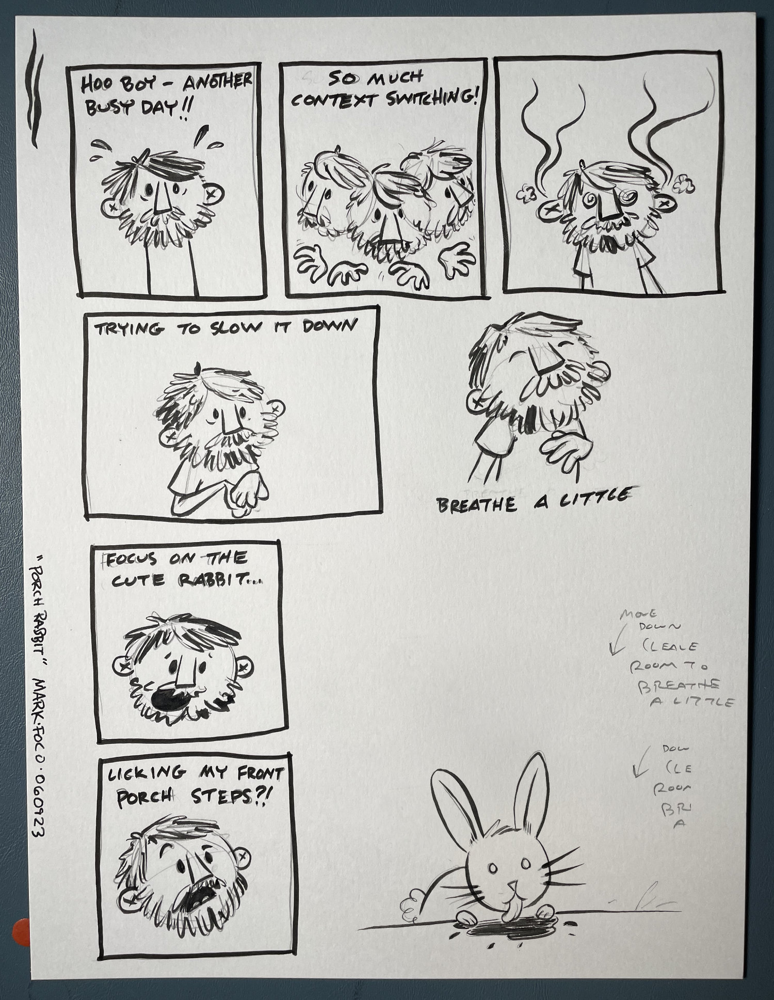

There’s definitely a bit of a struggle to figure out exactly what this project is. There’s the general thesis that this is in some way an effort to “Preserve Human Spirit”. But what does that even mean?

There’s this opposing push/pull of putting things on the internet where one is supposed to add value in some way. Does everything need to add value? How many tutorials does the world need anyway?

DoPHS is a reader-supported publication. To receive new posts and support my work, consider becoming a free or paid subscriber.

Not to mention how these pages are written and drawn months in advance. I have no idea if there will even be an audience for any of this. Who am I even talking to? Does it even matter?

Here, I managed to pull that tooth and finish a “tutorial” comic. You tell me. Does it add some value? It is cheaper to make your own dang notebooks but I get if it’s not your thing.

Switching context! Moving on! Breathe a little!

We have a ton of rabbits in our neighborhood. It’s not uncommon to count a dozen or more on a short walk. There’s almost always at least one in the front yard and there really was a rabbit licking my front porch steps. I don’t know what it was after or why. But it was a pleasant if puzzling distraction on a busy day.

---

What a discombobulated ramble this one has been. I suppose spirit isn’t exactly an orderly affair. Till next time 👋
