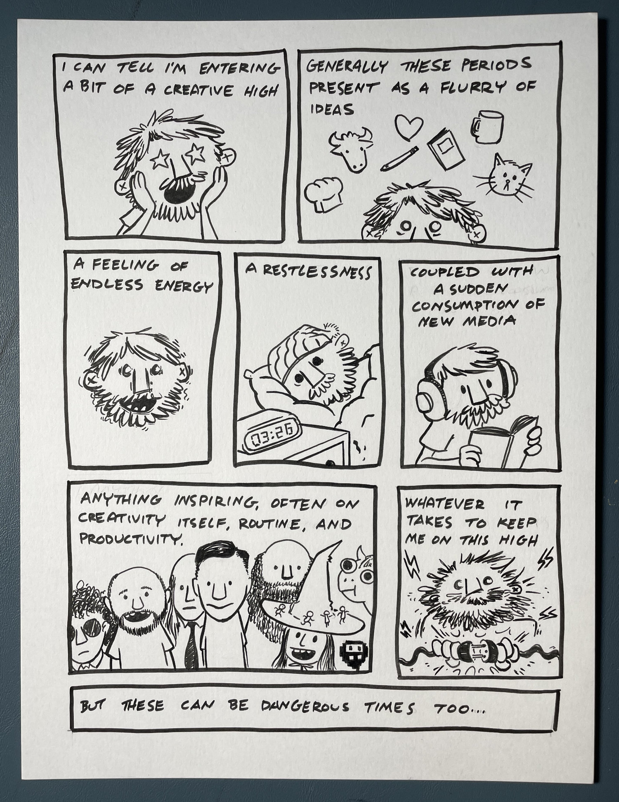
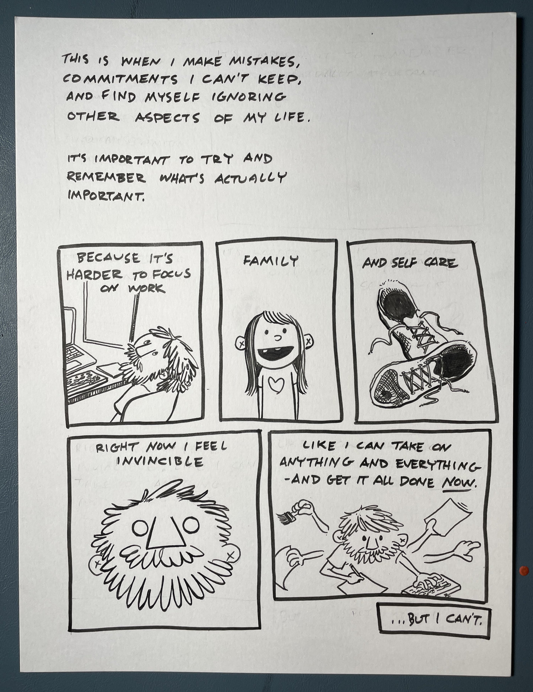
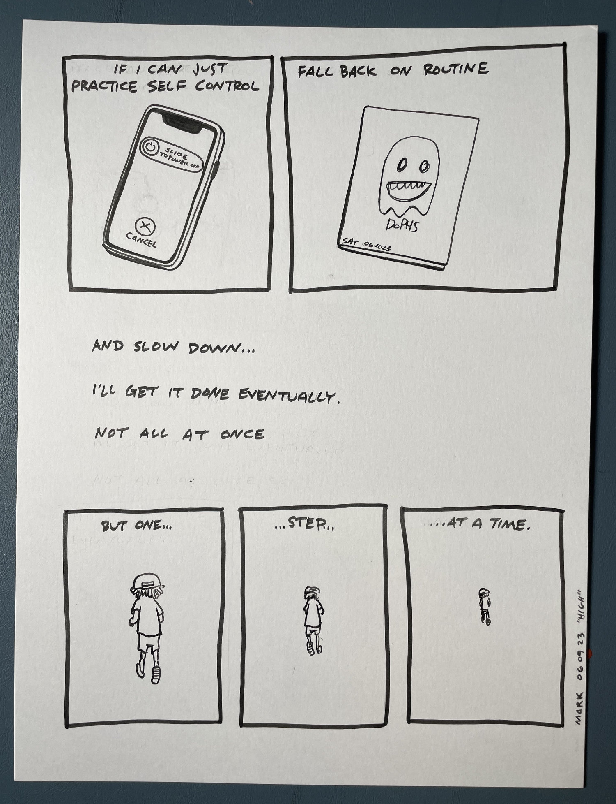

I’ve always ridden the waves of a moderately manic personality. It’s nothing serious, and certainly not on par with those diagnosed with actual manic personality disorders. But I definitely find myself surfing high on creativity from time to time. Unfortunately the crest of every wave is balanced out by a trough of equal and opposite magnitude and if I let myself climb too high I risk a catastrophic wipe out.

As I’ve gotten older I’ve learned a bit about how these things tend to go. Tons of energy, a flood of ideas, the feeling I can do it all, and all of it right now!

Self control, routine, and pacing seem to keep me from riding too high or low. A steady state of patient creation yields more and better results in the long run than infrequent flurries of manic activity.

I _can_ do it all, not all at once but one step at a time.
