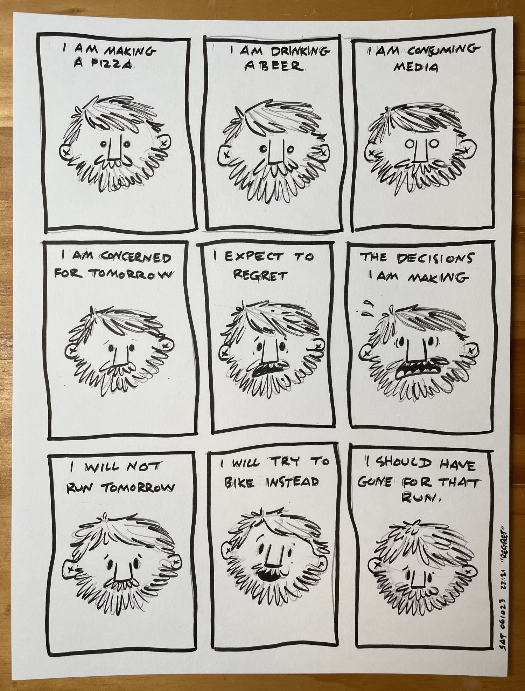
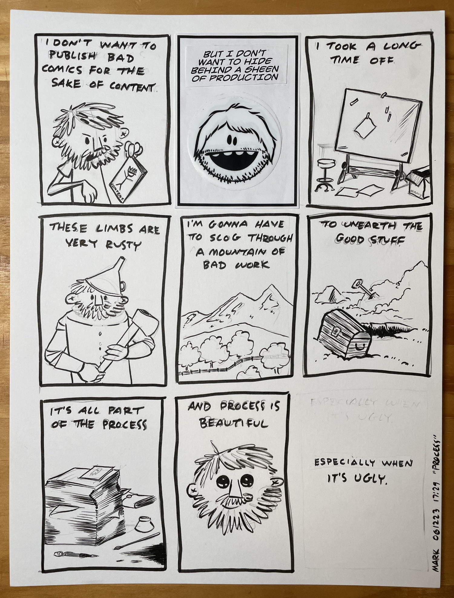

We all have our vices right?

A few beers, an entire frozen pizza, and a couple hours of completely pointless youtube videos is pretty high up there on my list.

In the end it’s all a balance and I can’t expect to be “good” all the time. Maybe I shouldn’t give myself so many guffins. Regret’s probably not the healthiest thing either.

---

I love process. My favorite Disney movie is “The Many Adventures of Winnie the Pooh”. The way the narrator breaks the fourth wall and the characters play with the typography and letters within the book is spellbinding. But the best part of all is how you can spot the pencils in many of the animations. I don’t know why but that peek into the process is just so dang beautiful.
