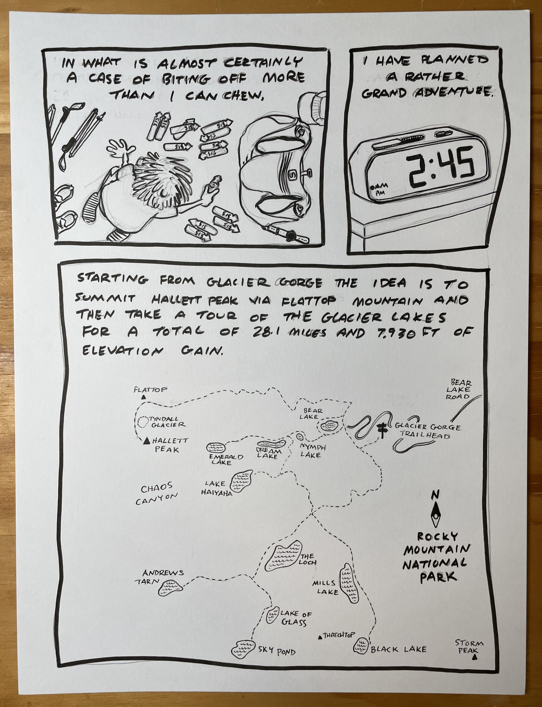
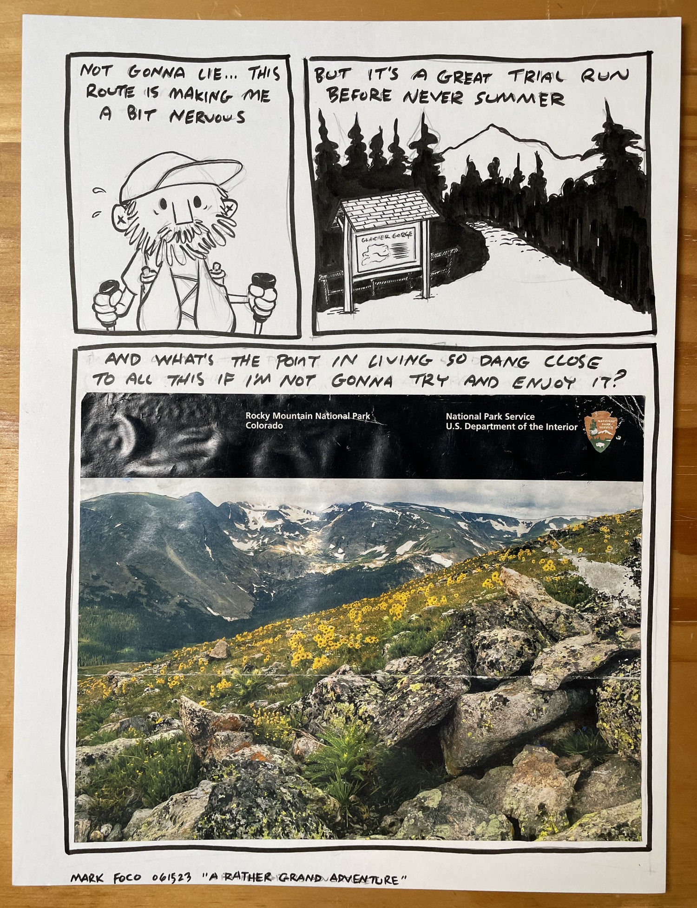
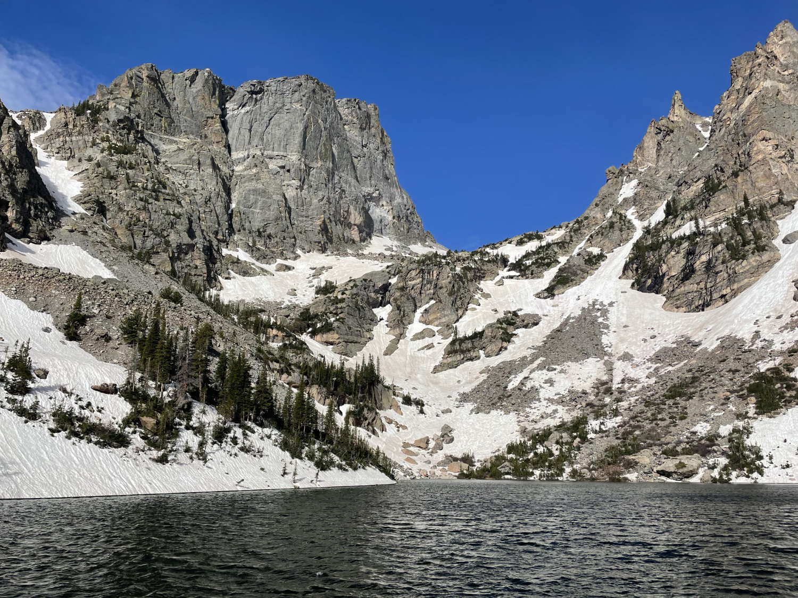

So, this went about as well as expected if not quite as planned. The route from Bear Lake to Flattop had way more snow than I was prepared for. I made it to Flattop but opted to turn back before Hallett. I’m not experienced enough traveling alone in the high country and wasn’t wearing the right gear (shorts?!) to be traversing an icy rock field in blowing snow.

After an amazing time on Flattop I headed back down and started the lakes tour. I managed to hit Bear, Nymph, Dream, Emerald, and Lake Haiyaha before a mismanagement of nutrition left me feeling pretty wrecked. The fun had been had and it didn’t make much sense to just suffer for the next 10-12 miles.

It was an amazing day and I learned a lot in the 16ish miles I was out there. Perhaps I even left with a bit of unfinished business…

Emerald Lake, Rocky Mountain National Park, June 18, 2023
