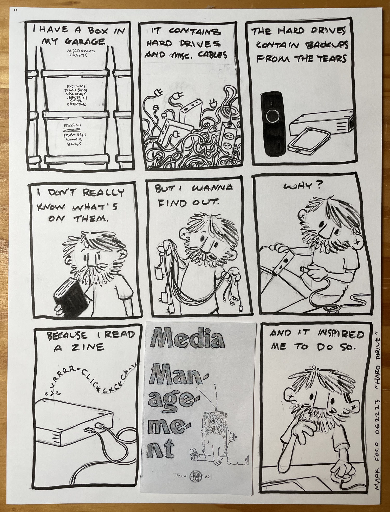
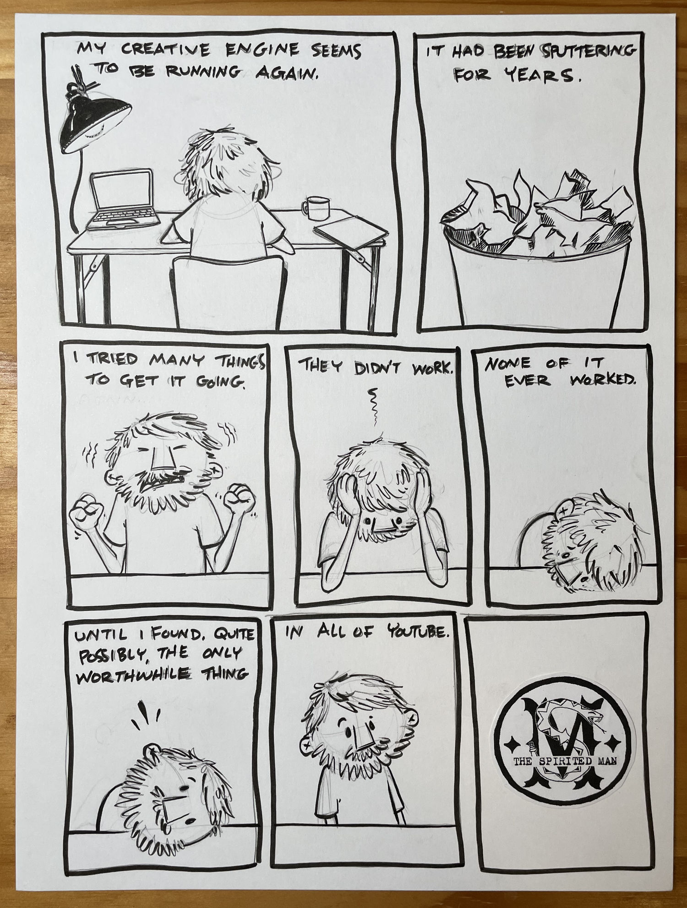
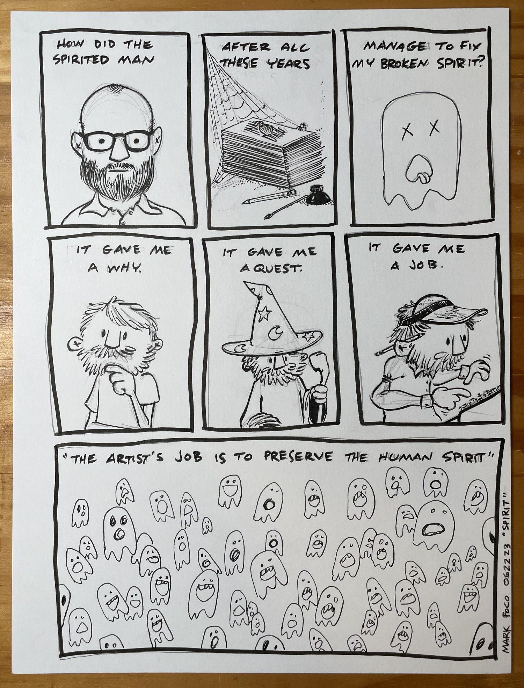

I’ve been a bit reluctant to share these. Something about revealing my inspirations leaves me feeling a bit exposed. I’m not really sure why.

Why did I rearrange the stacks of boxes in the garage so I could reach the heaviest on the bottom? Why did I spend all night sorting through cables to find the matching adapters from a bygone era to spin up hard drives from 15 years ago? Why did I think I needed yet another hard drive just because my creative crush who practices a completely different discipline uses them in a very particular way?

What in the world convinced me to make the audacious claim that this one video is the only worthwhile thing in all of youtube? What could have possibly cracked a 10 year writer’s block?

The spirit isn’t a physical thing. It’s not an invisible, intangible, yet somehow real thing. It’s a feeling, a desire, a compulsion. It’s the reason I get up early, or stay up late, or climb that mountain, or experience that low, or wonder why I do any of this. It’s the searching, and it’s the finding.

And apparently, it’s my job to preserve it.

<iframe src="https://www.youtube.com/embed/XrgUKL1wDPw" title="Where Does Compulsion Come From?" frameborder="0" allow="accelerometer; autoplay; clipboard-write; encrypted-media; gyroscope; picture-in-picture; web-share" referrerpolicy="strict-origin-when-cross-origin" allowfullscreen></iframe>

