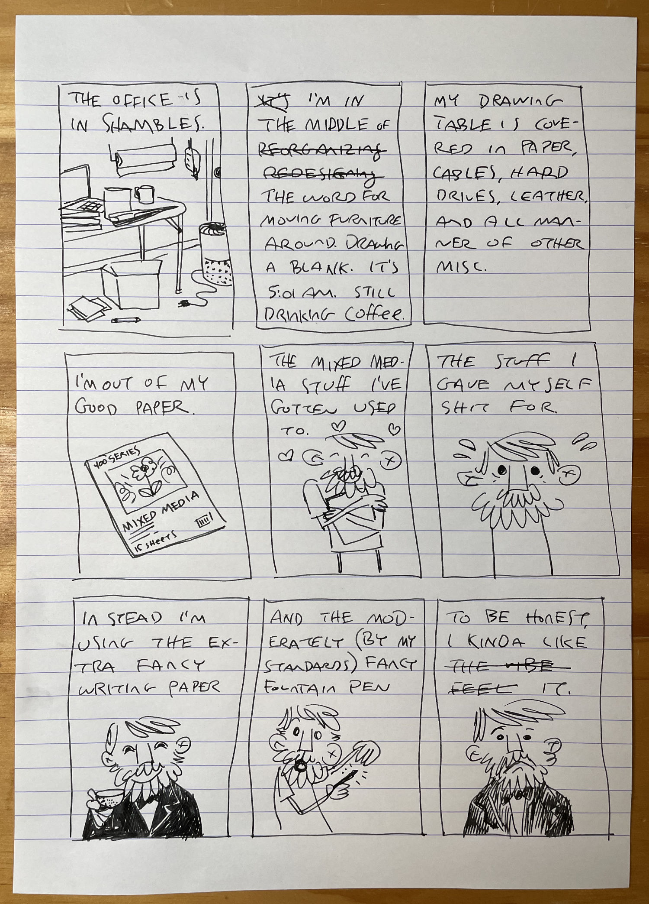
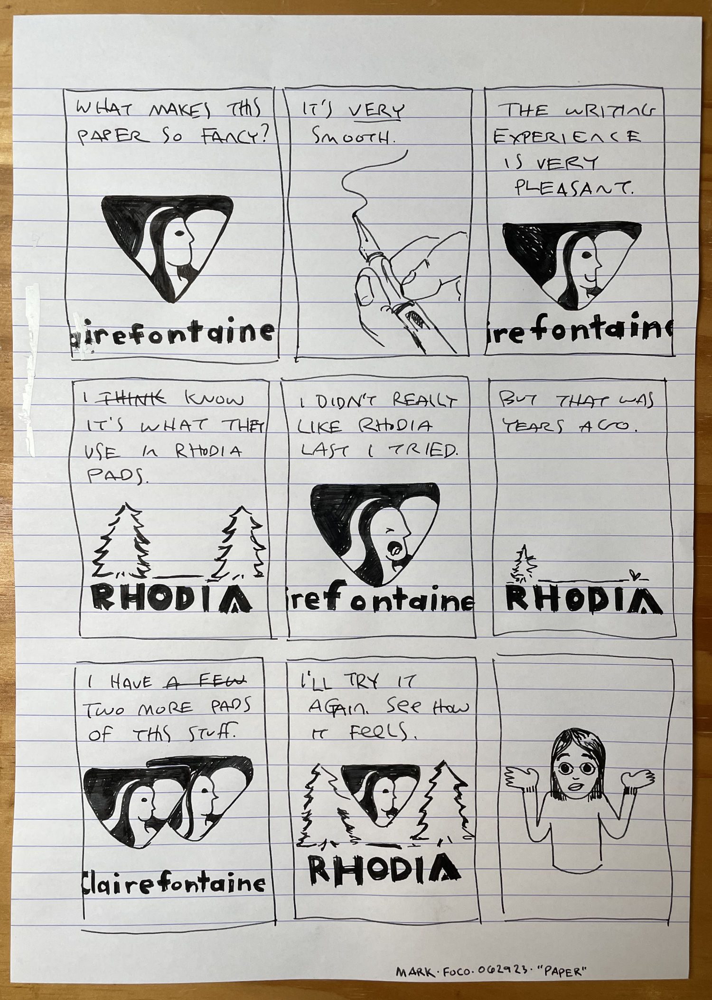
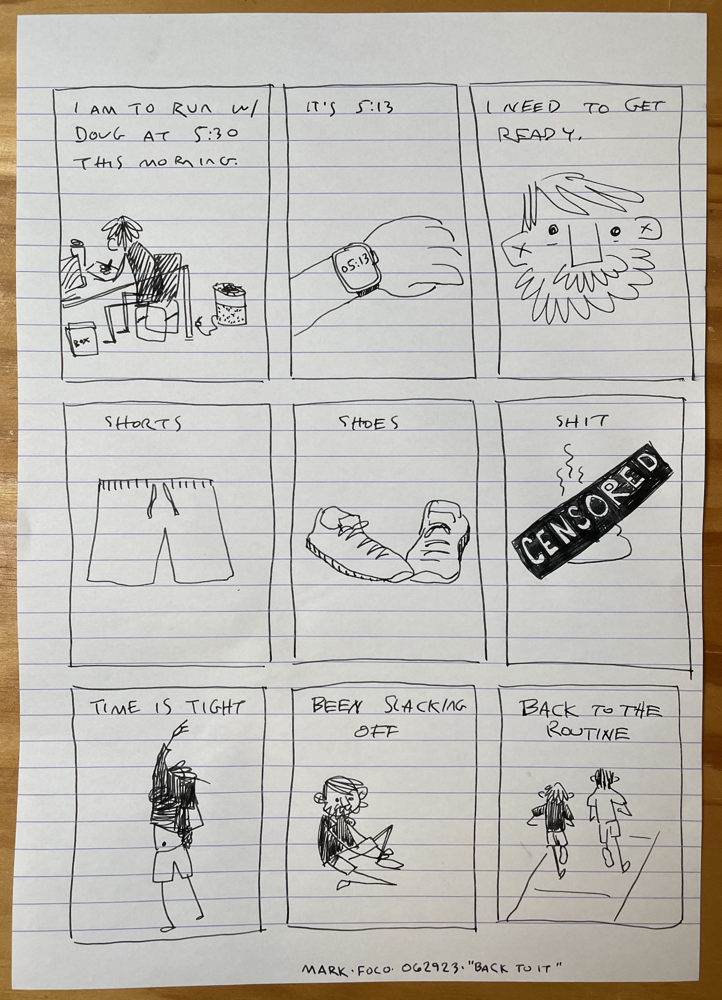
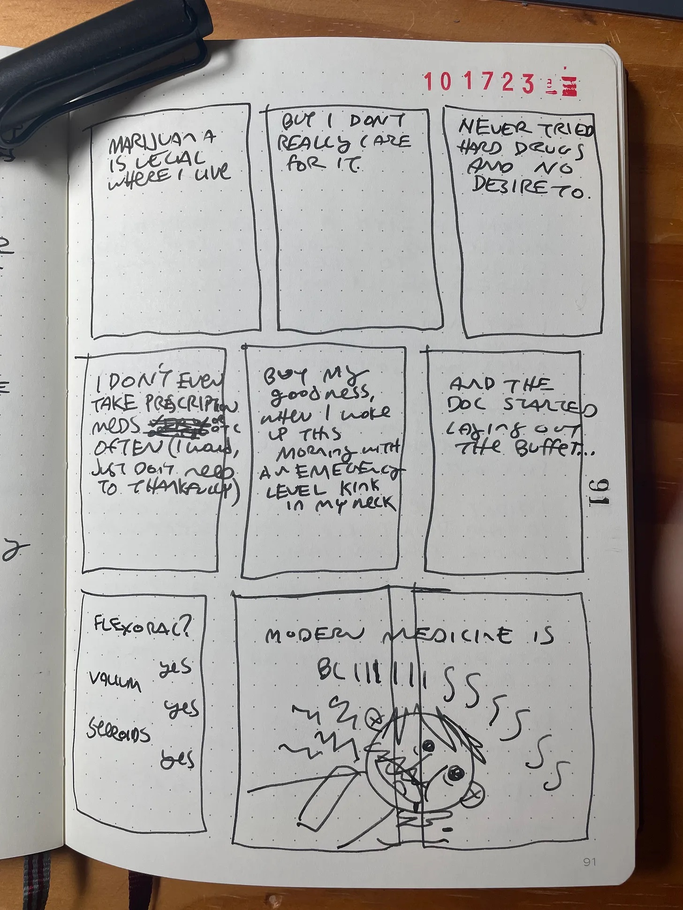
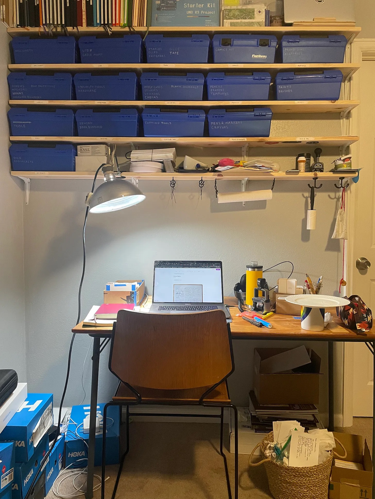

It’s been four and a half months since I drew those pages - so much has changed since then. A lot of life happens in that time. My process has has gone through many iterations. As have the concepts and motivations behind this project in general.

Doug and I don’t run as much together these days. We still hang out with the kiddos at the park pretty regularly but our running goals have changed. He had a pretty good day at the Horsetooth Half back in April and the motivation to keep up the pace has waned a bit. My goals shifted to proper trails and our regular route has been blocked by construction all summer long. Perhaps we’ll get back to our routine again come spring.

It’s the second half of October at time of writing and my last race of the year is in a few days. I somehow pulled a muscle in my shoulder so badly yesterday while getting out of bed that it required copious amounts of prescription drugs to get the spasms under control. Now it’s just really sore and I have no idea if it’ll be ready for the race on Saturday. But it’s the last one of the series, so barring the risk of serious injury I’m just gonna suffer through it.

I still haven’t gotten that Rhodia pad but I have returned to the old standby Leuchtturm 1917 - this time with 120gsm paper. It’s fantastic. I’ve gone through another creative high - obsessing relentlessly over my Spirit Box - a modified Zettelkasten. I started using notecards after a suggestion from and after a bit found them to be cumbersome to organize. After some research I stumbled on the Zettlekasten method and have been really enjoying it. I’m on my second iteration after working through some beginner mistakes and necessary modifications. I’m indexing my notebook in the spirit box so my ideas stop falling into a colorful blackhole on my top shelf.

I haven’t completed any new pages in a while but I have been writing actual scripts! I still have at least another month of backlog and probably a few more in the scripts that may or may not make it to the cutting room floor.

I had thought about finishing the one below for this edition but my shoulder is feeling pretty rough and for whatever reason I woke up 1:30am. I thought Valium was supposed to make you tired?! Oh wait, they gave me steroids too… ugh.

Anyhoo - the office is a mess again. It’s been clean in the interim but it’s def a bit out of hand at the moment. Here’s what that looks like.

The past few months have been full of transition, exploration, organization, injury, adventure, family, friends, football, reading, and Elden Ring. What about you? What have you been up to?

---

Did I mention I’ve been wearing [ear muffs](https://www.3m.com/3M/en_US/p/d/cbgnawus1742/) while working instead of listening to music? It’s AMAZING - like entering my own personal mind palace - how have I been missing out on this the last 40 years?

---
