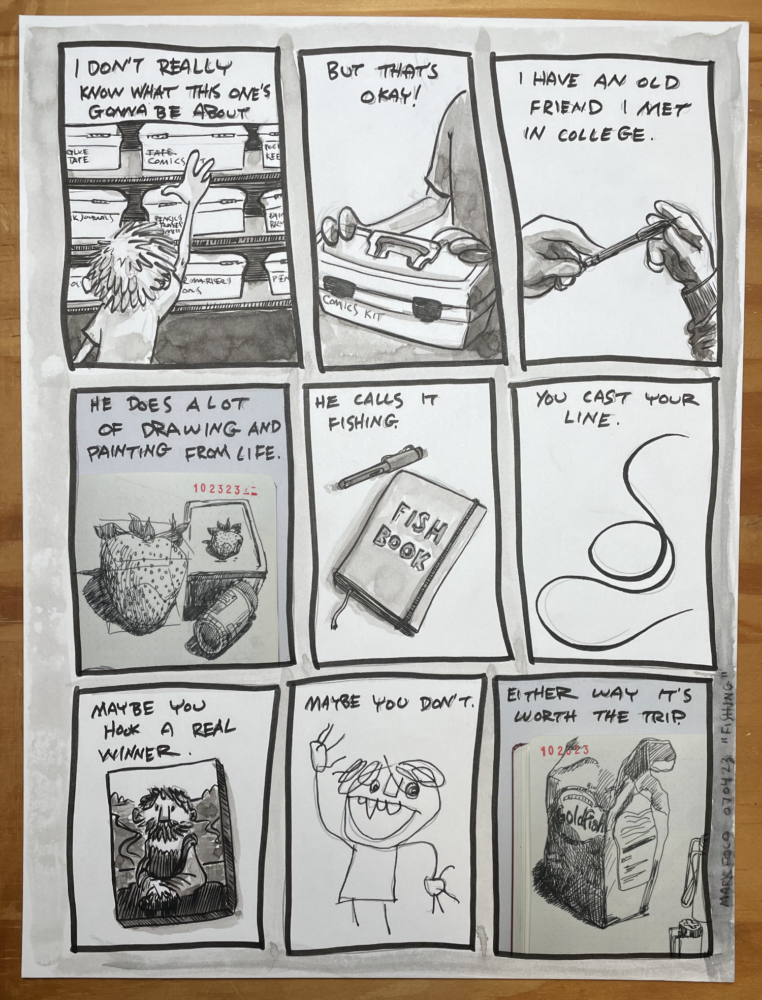
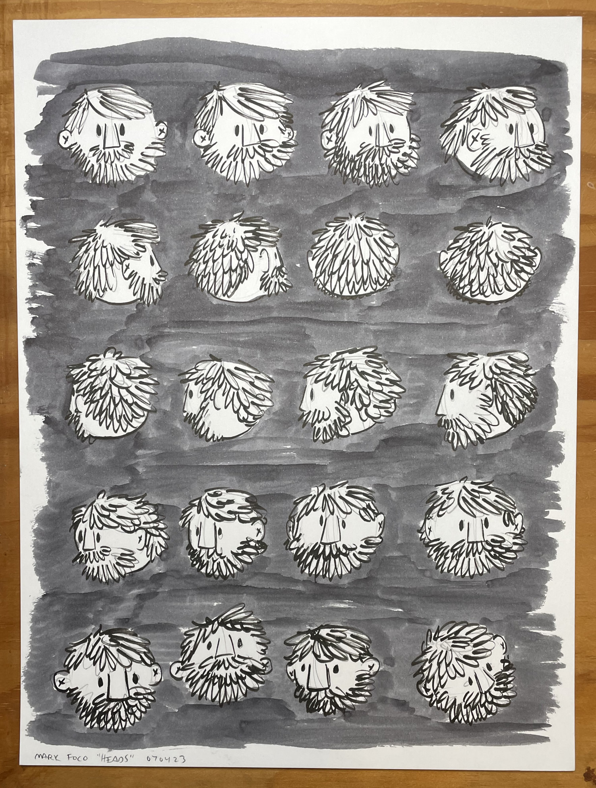
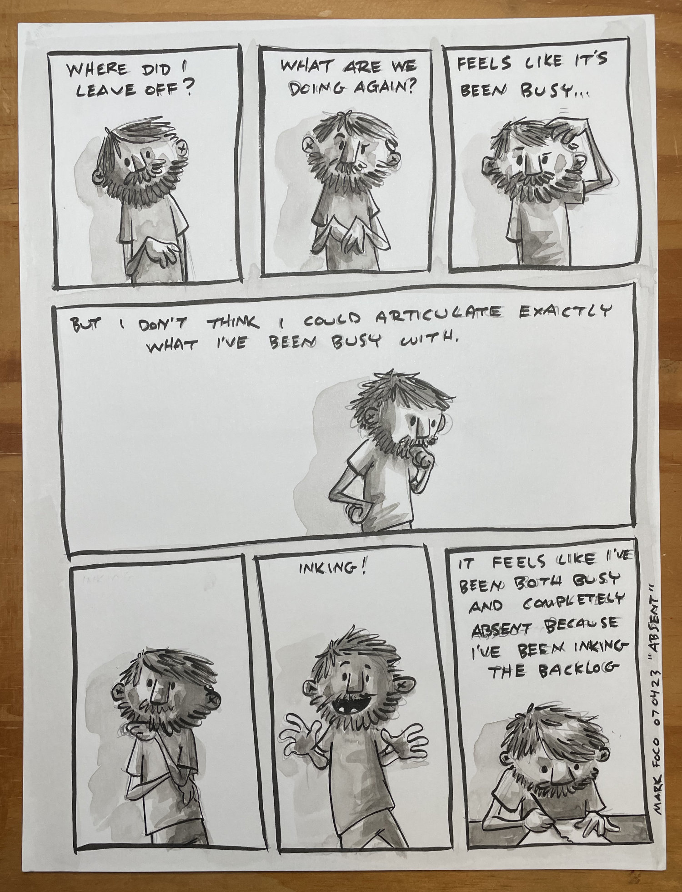
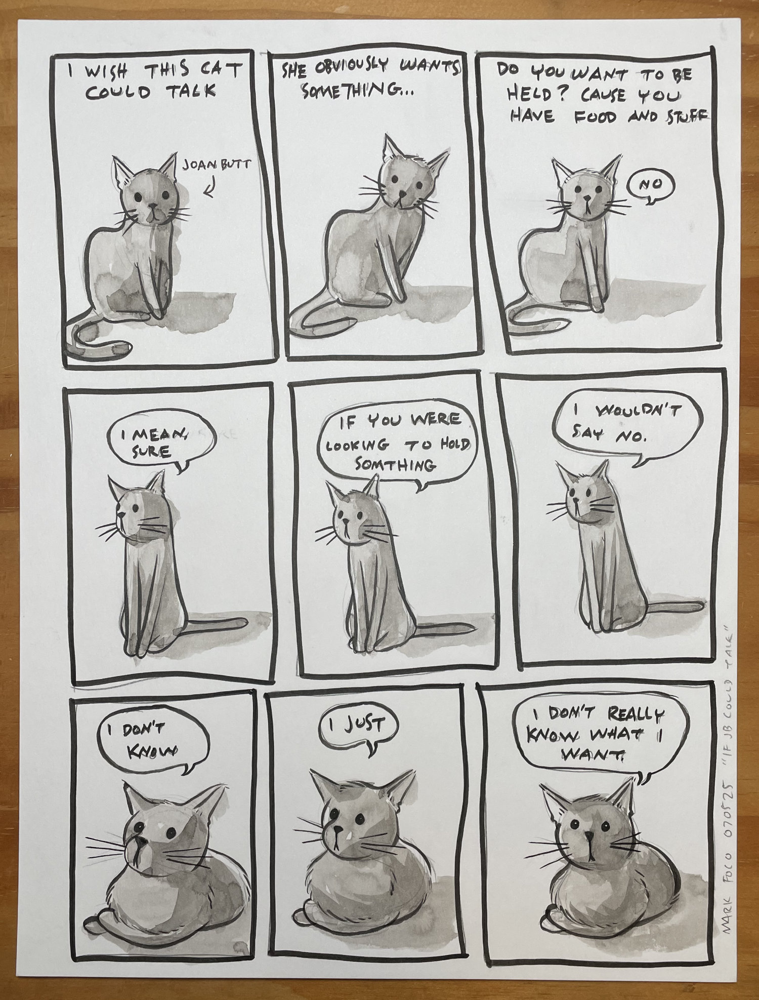
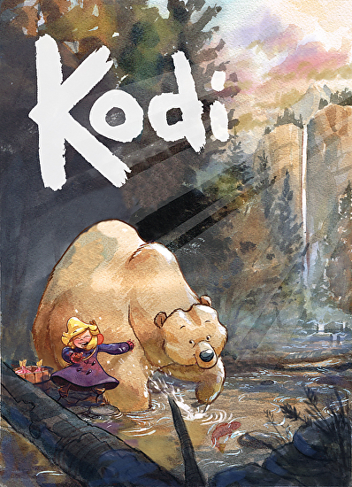

Jared’s video below was a key stepping stone on this latest creative journey. I’ve known him for a while and it’s been such an inspiration seeing his technical skill as an artist explode over the years. He wasn’t born a draftsman or expert painter. He became one over years of intentional practice.

I’m still working out what my current goals are and becoming an expert draftsman likely isn’t one of them. I don’t have a secret sketchbook as he describes. I think I might still be in the “that’s just too much drawing for me” phase. At the time I first watched this video back in February I had definitely lost all confidence in my ability to draw anything that even resembled a keeper.

> “A lot of times it’s just like fishing, you’re just sort of throwing it out there to see what you can get…”

That beautiful metaphor gave me the permission to start casting my line. I was gonna have to throw back a lot of old boots dredged from the bottom of the lake but now I knew if I just kept throwing it out there I might get a few keepers too.

Thanks for the inspiration buddy - it truly means the world to me.

Here are a few more lines cast. They’re not all keepers but I suppose that’s ok.

---

You can learn more about Jared and his work on his [website](http://jaredcullum.com/about) or you can support his work and enrich your life by purchasing [one](https://www.simonandschuster.com/books/Wonder-City/Victor-Fuste/Wonder-City/9781683839804) of his [books](https://www.topshelfcomix.com/catalog/kodi/1041?mobile=off).

