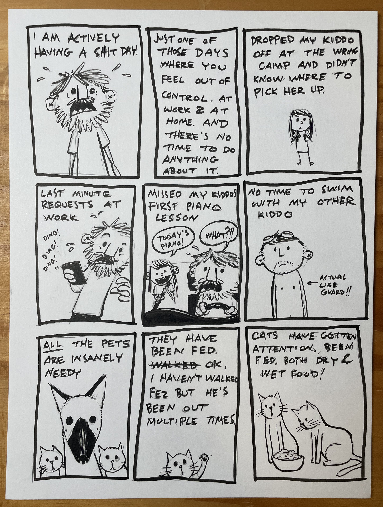
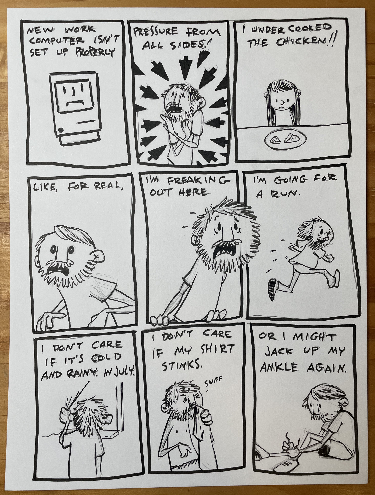
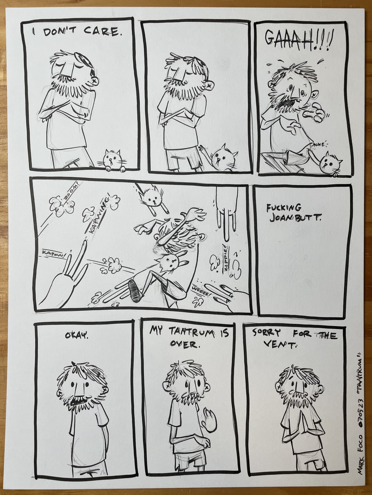

This was clearly just one of those days. Nothing went right and every new wrong thing just compounded on the last. Eventually I had to give in to the chaos, accept my lack of control over literally anything and go for a run. Afterwards I quickly scribbled down this script and worked through the illustrations for a bit of free therapy.

It helped!

Things mostly end up ok. I figured out where to pick up Frankie and wasn’t even late. We skipped piano and it was fine. Work still seems to think I do a good job despite my insecurities about it. Rem and I went swimming the next day. My computer eventually got setup properly and it’s awesome. In regards to the chicken - our oven was broken that day so not really my fault… just another bit of unwanted chaos injected into an already insane day.

Joanbutt still Joanbutts and the animals continue to make things awkward. Why won’t they just use their words?! Bunch of impossibly adorable freeloaders…

Anyhoo - hope your day is going much better than mine did back in July. If you are having a tough go of it, maybe take a step back, breathe, and listen to this classic by Van Morrison.

<iframe width="1250" height="703" src="https://www.youtube.com/embed/3UUWkr4FUlo" title="Van Morrison - Days Like This (Official Video)" frameborder="0" allow="accelerometer; autoplay; clipboard-write; encrypted-media; gyroscope; picture-in-picture; web-share" referrerpolicy="strict-origin-when-cross-origin" allowfullscreen></iframe>

