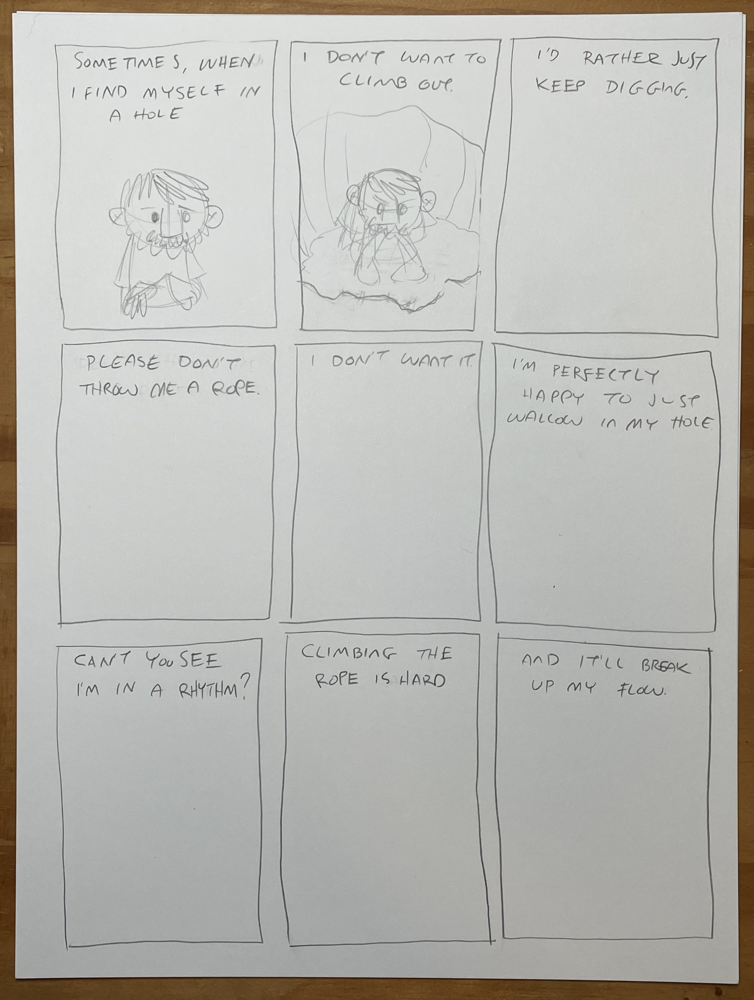
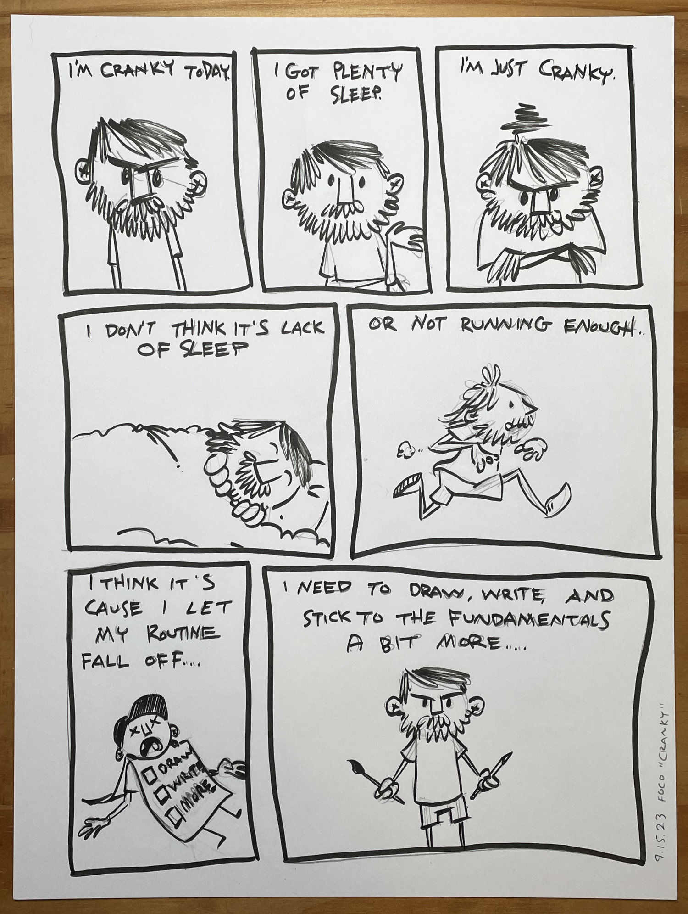
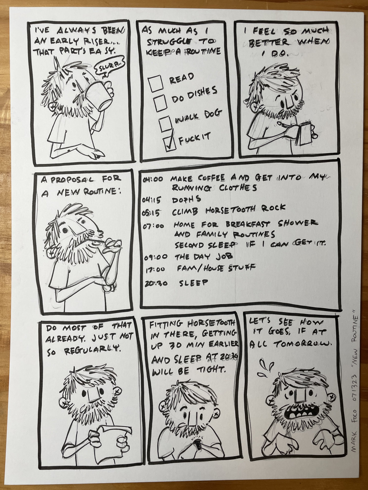
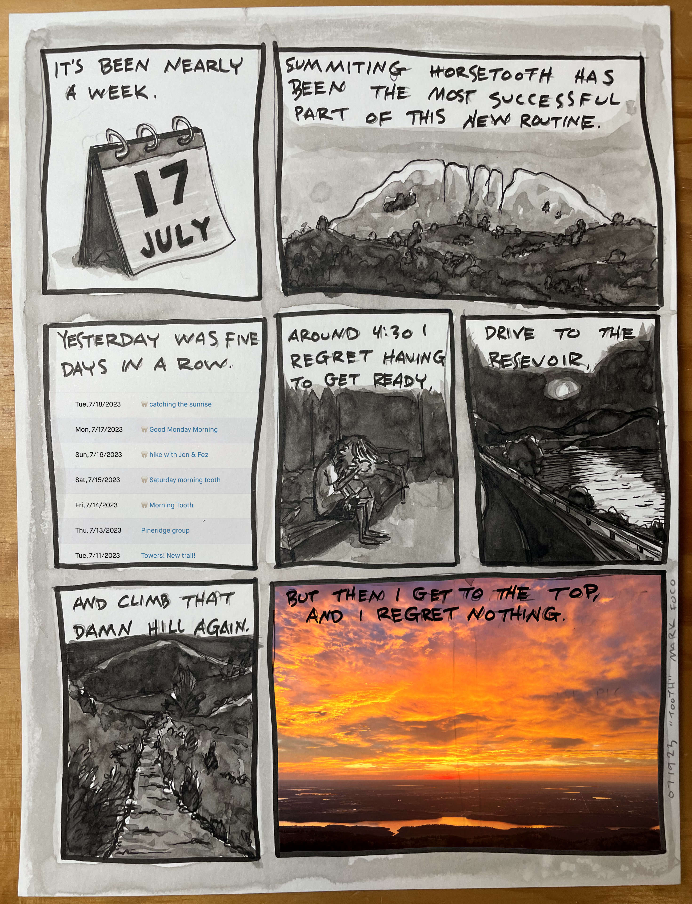

I don’t know why but sometimes when I’m in a really deep hole I don’t want to get out. I don’t want help. I just want to wallow. I want to listen to the most depressing music I can find, pull down the shades and just soak up the darkness. The worst part of it is when I’m in a hole like that, I don’t see it. The darkness is blinding and as far I know this is how it’s always been. How it’s supposed to be.

That seems to be where routines help me out. They’re my little canaries in the coal mine. I have some simple ones that I keep pretty regularly. I also have some foolishly ambitious ones that I might keep for a week or so. Noticing that they’ve _all_ fallen off - not just the ridiculous ones - is usually a sign I’m in a hole.

Every morning I like to write a page in my journal. It’s not about anything interesting or useful. The words really don’t even matter. It’s just a way to shake off the sleep and start my day doing something creative. It gets me in the right headspace. That’s one of the simple routines and if I skip it too many days in a row I’ll notice.

This next one is of the foolishly ambitious variety…

I had fallen into a hole after Quad Rock when it didn’t go as well as I’d hoped. Blowing up at mile ~18 of 25 was disappointing but survivable. I was never far from aid or other runners and there was plenty of time left to hike it in and ruminate on all of my mistakes without missing the cutoff. But blowing up at mile ~18 at Never Summer might actually be dangerous. You’re just about to enter the most difficult and remote parts of the course and you’re only about halfway. Long story short I was getting worried about my next foolishly ambitious endeavor and dealt with it the only way I seem to know how - another foolishly ambitious endeavor!

I don’t climb horse tooth everyday. I made it six days in a row before falling off that routine - it was never sustainable and I knew it. I was at 13 when I started counting and at time of writing, close to 4 months later I’m at 48. There have been a lot of days where I didn’t want to go or wanted to turn around halfway. There have been days where I didn’t go. And a few where I turned around. But like all these simple routines that keep me grounded the only runs I ever regret are the ones I don’t do.

---

If you want a better sense for Horsetooth Rock, watch this video by Nick Sangetta. Nick has a great hiking channel on Youtube that focuses mostly on trails in my neck of the woods. Here’s one of several videos he has of Horsetooth where he takes the standard route to the summit of the North Tooth, snags the South Tooth, and then takes the long way back down with a stop at the falls.

<iframe width="728" height="410" src="https://www.youtube.com/embed/FzJYsqK5xTs" title="Horsetooth Mountain Open Space - Roosevelt National Forest" frameborder="0" allow="accelerometer; autoplay; clipboard-write; encrypted-media; gyroscope; picture-in-picture; web-share" referrerpolicy="strict-origin-when-cross-origin" allowfullscreen></iframe>

