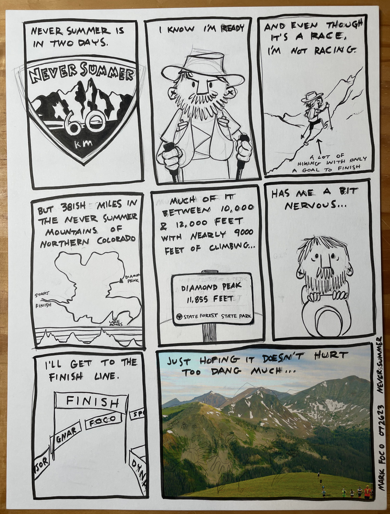
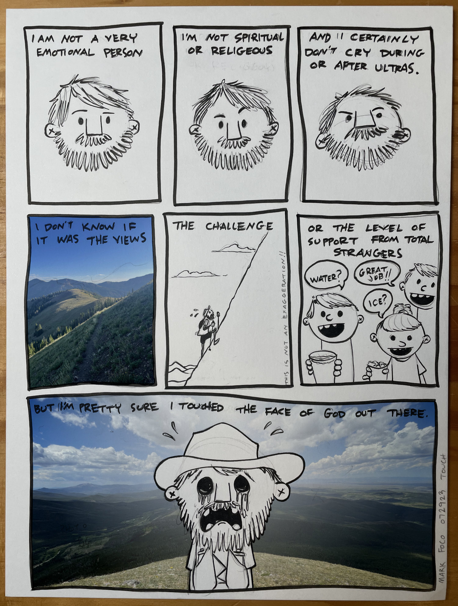
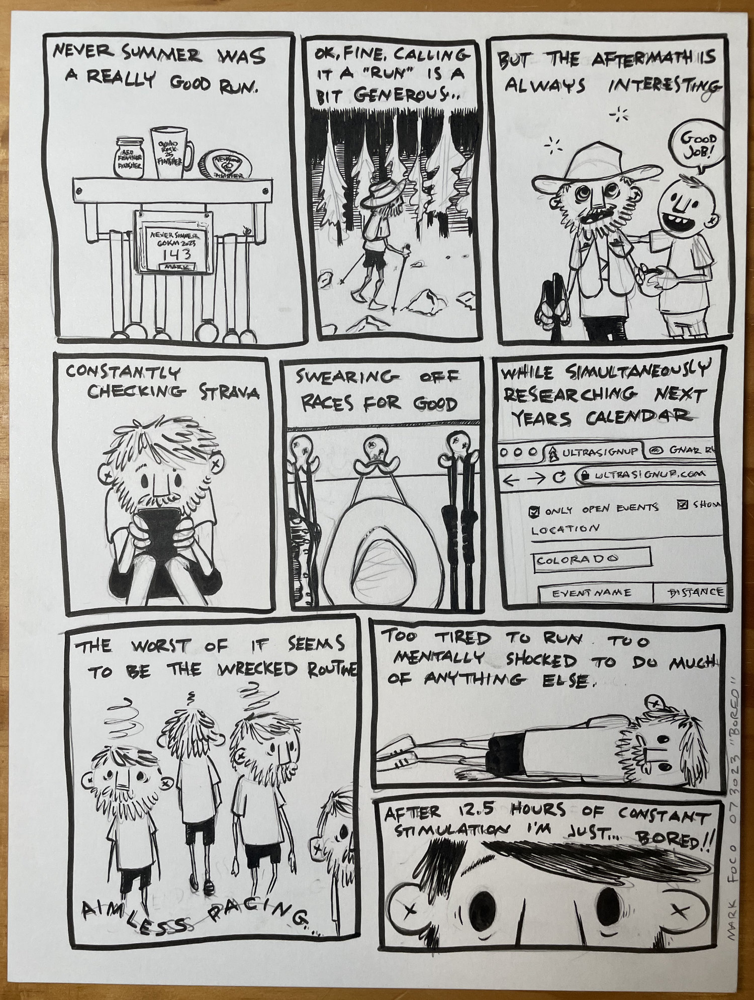
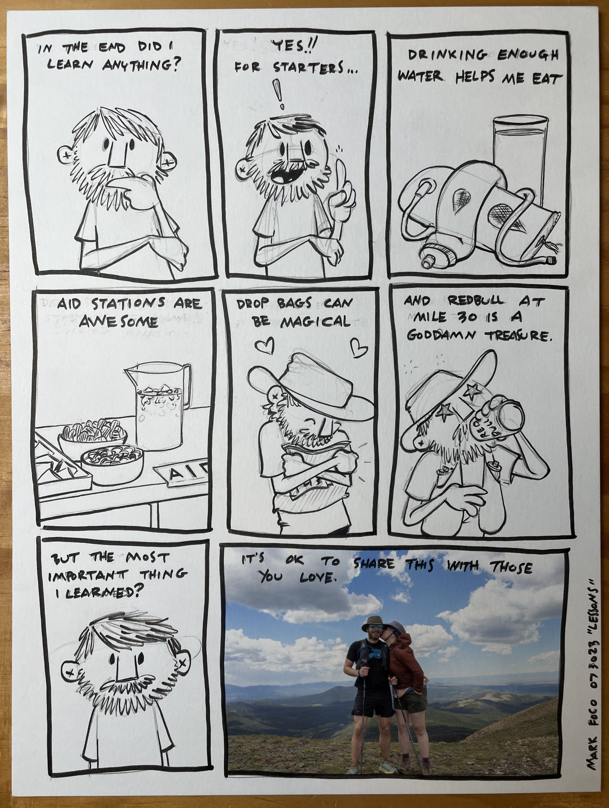

On July 28th, 2023 I “ran” the [Never Summer 60k](https://gnarrunners.com/never-summer-100k) in State Forest State Park in Northern Colorado. The race takes place between the [Never Summer Mountains](https://en.wikipedia.org/wiki/Never_Summer_Mountains) on the northern border of Rocky Mountain National Park and the [Medicine Bow Mountains](https://en.wikipedia.org/wiki/Medicine_Bow_Mountains) to the north of Cameron Pass. I’ve run ultra distances before but not like this. I had trained, but it didn’t feel like enough. Having just come off of a disappointing result at Quad Rock I wasn’t entirely confident I would finish at all.

12 hours, 20 minutes, 51 seconds and 39 miles later I crossed the finish line.

In a word, it was transcendent.

---

…

Never Summer left me shell shocked. Speechless in all the best ways. I somehow felt good enough to drive the 2 hours home through the Poudre Canyon immediately after the race. I couldn’t fall asleep despite having been up since 4 in the morning and on my feet, literally all day. It was by far the most elevation I had ever climbed in one go - and yet my legs felt fine. So much of the experience brought extreme clarity while simultaneously making absolutely no sense at all.

These events bring with them the very real risk of failure. Failure is hard and my struggle to deal with it has always been one of the driving features that attracts to me to this sort of thing. That said, the possibility of failure is also the reason I have insisted on doing these alone.

I have actively discouraged my family from joining me in this weird hobby. I don’t want to disappoint them, or let them see me struggle, or yell at them at an aid station. I’ve never yelled at anyone at an aid station, but I’ve heard stories and I know how I can get sometimes.

This time Jen was adamant that she be there. Not only did she drive the two hours through the canyon after a 12.5 hour shift as a floor nurse - she climbed fucking [Diamond](https://www.youtube.com/watch?v=ytIqnKlsR80) to meet me at the high point on the course.

Going into the race I really wasn’t sure how to feel about having her there. I wanted to focus on getting through the course - not worry about meeting up. I didn’t want to think about anyone else. I wanted to do this alone so it could be about me.

What a fool I was.

Sharing this experience didn’t diminish it. It expanded it. Love is never divided. It only grows.

---

Thanks to [Nick and Brad of Gnar Runners](https://gnarrunners.com/community/#about) for organizing this incredible event. Thanks to all the [volunteers](https://gnarrunners.com/volunteer/) who made it possible. Thanks to Taylor and Alex for the the Red Bull at mile 30 - it was clutch. And thank you Jen for being there. You know me better than I do.

photo credits: Ed Delosh and [Monica Ohnsorg](https://www.instagram.com/monica.ohnsorg.art/)
