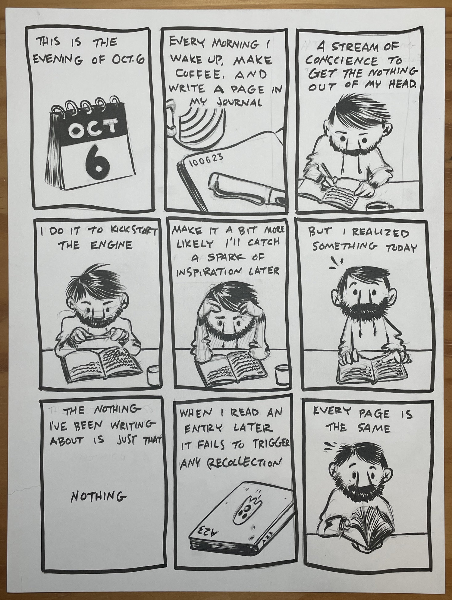
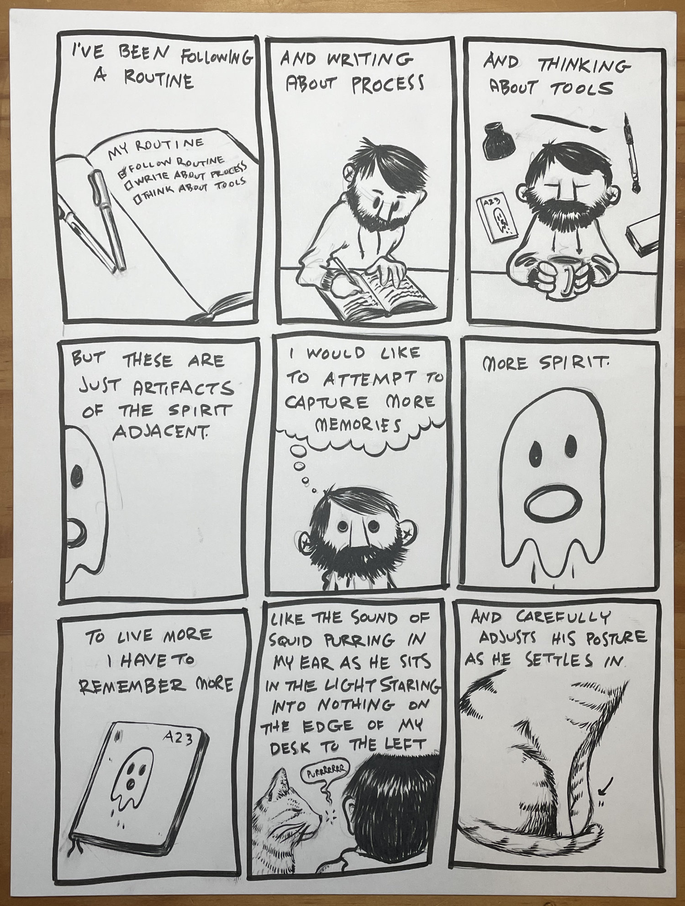
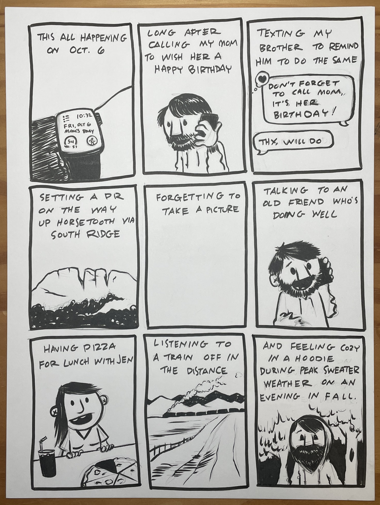

Back in early October I listened to an episode of the Radio Lab podcast called “[The Secret to a Long Life](https://radiolab.org/podcast/secret-long-life)”. At the risk of spoiling the episode - and you should absolutely listen regardless - it inspired me to take a few minutes to capture some moments of my day, both the extraordinary and the mundane.

In doing so I found that what had seemed like a relatively average day was actually one packed with connection and nuance. Noting those moments and storing them in words and pictures has cemented them in my brain. Lovely little bits of life that would have most certainly been lost - now contribute to a funny little illusion - the sense that my life is longer, fuller, and moving more slowly.

Reading the script for this comic over a month later - feels like opening a gift from my past self. The best parts of the day all wrapped up in a bow. Our lives are full of tiny moments that are shed from our minds as quickly as they occur. I hope you can take a moment to notice a few of them, be thankful for them, and perhaps record them in some way as a gift to your future self.
