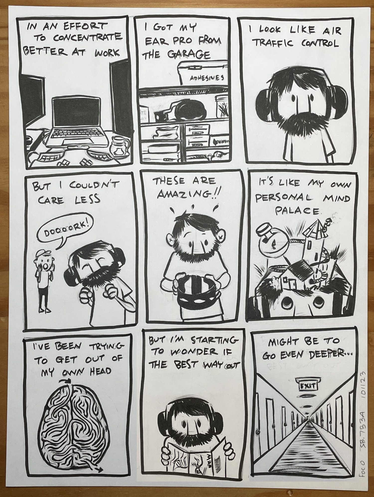
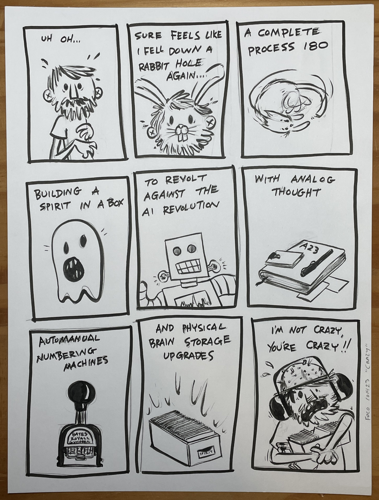
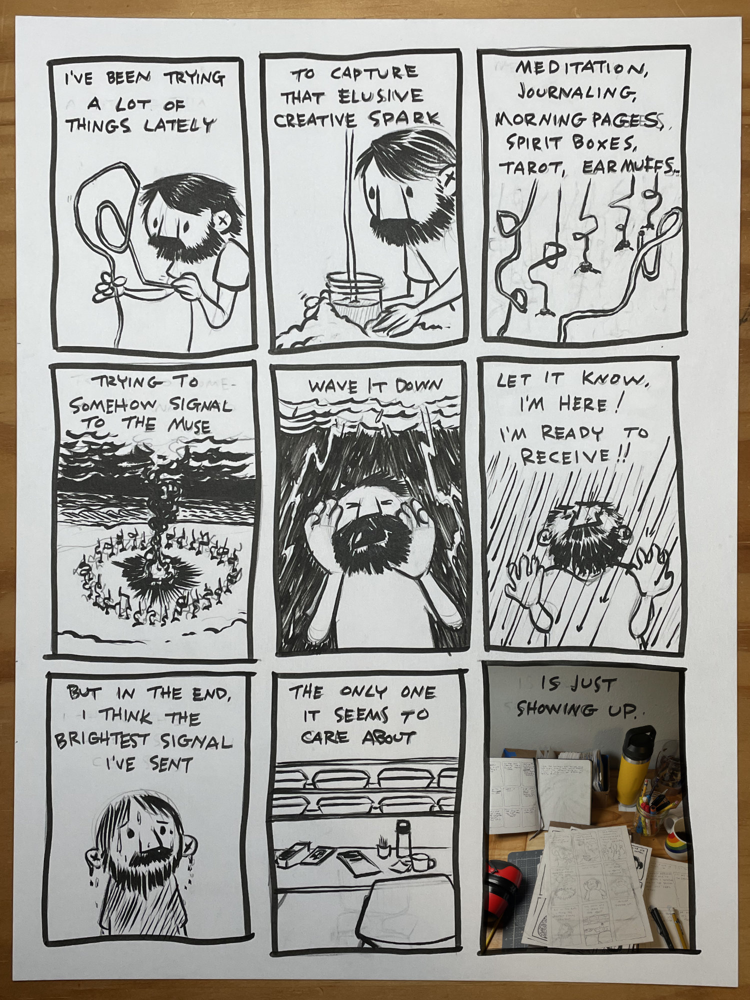

I used to listen to music to drown out the world while working. It kinda worked but I had to turn it up pretty loud to get the desired effect which wasn’t great for my ears. Not to mention I’d get distracted by a great song or interesting lyric.

At some point I realized that often I didn’t even notice the music had ended and I found myself not actually listening to anything at all. That’s when I got the bright idea to just use my ear muffs from the garage.

It’s been over a month and I honestly don’t think I’m ever going back.

Yeah… I’ve been on some sort of journey. When I started making comics again back in April I made a point to excise process as much as possible. I didn’t want thumbnails, second guessing, and rewrites to get in the way. I told myself I wanted whatever process remained to be exposed and raw - to preserve the human spirit!

When this all started, I was working through a sudden flood of ideas. The dam had finally burst on a ten year creative block. It became obvious pretty early on that I wouldn’t be able to rely on that energy or keep using so many shortcuts. I needed something sustainable to keep the fire going.

For all the creative exercises, ear muffs, tarot, and spirit boxes, turns out the best way to get better and keep the well from going dry is to just keep showing up.

I guess there aren’t any shortcuts after all.
