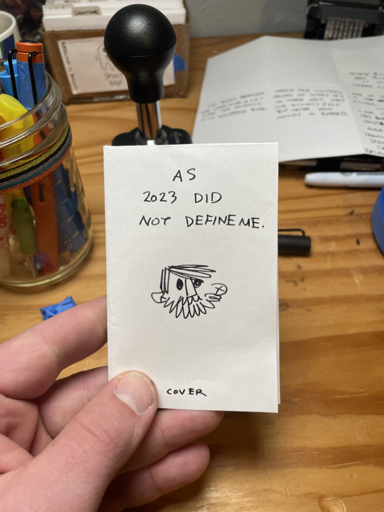
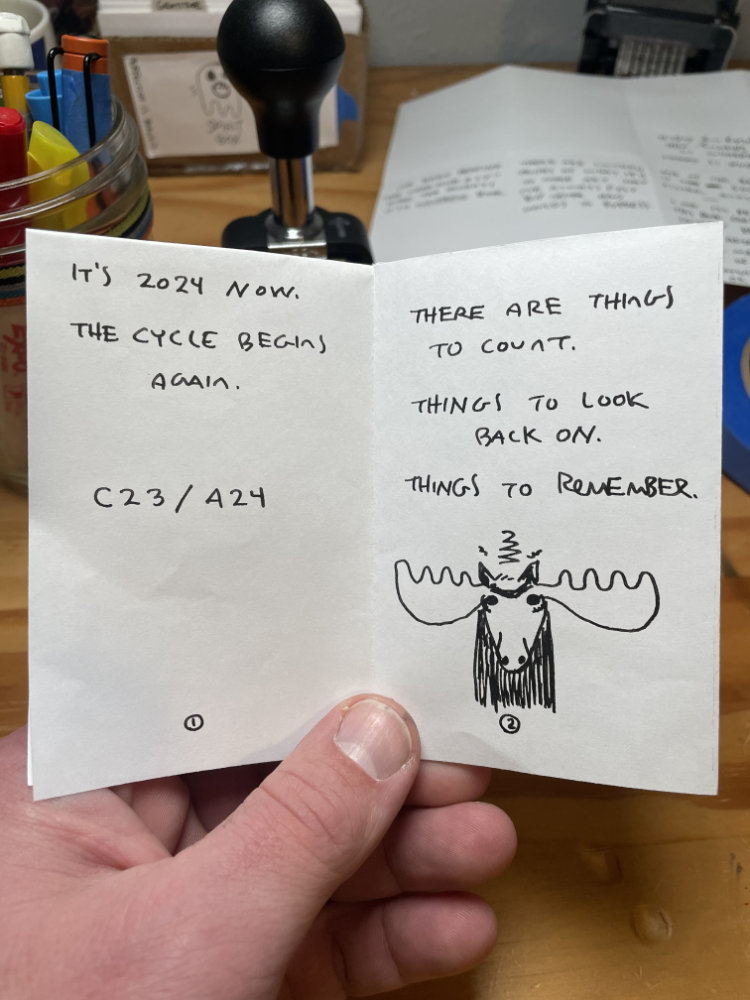
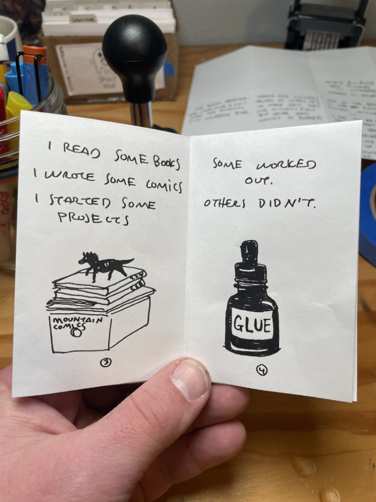
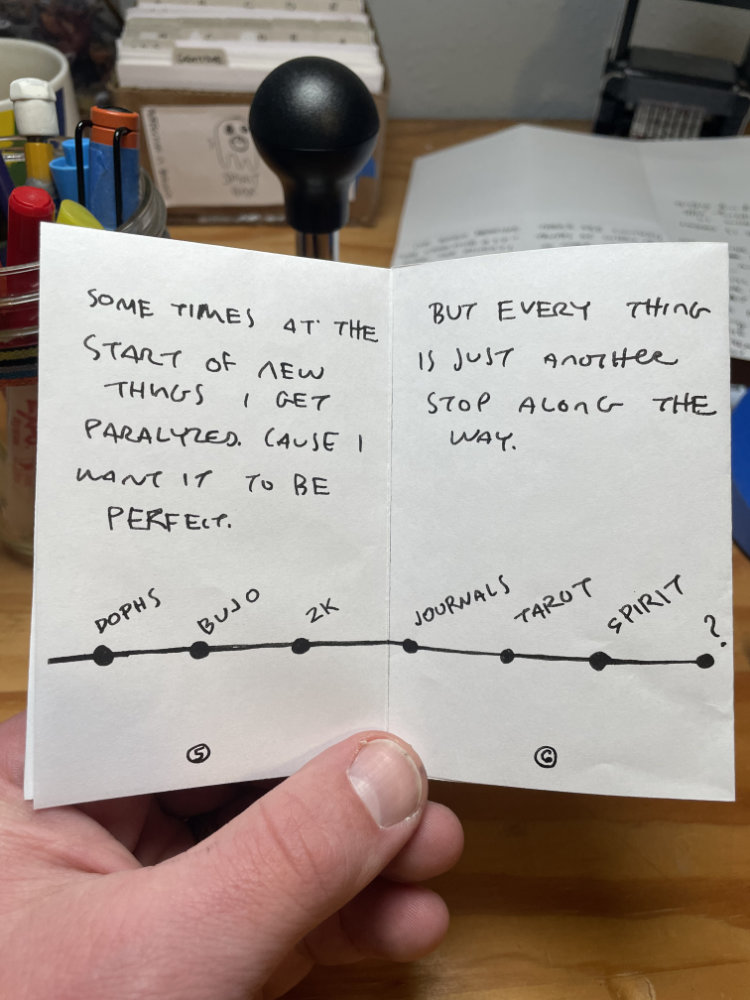
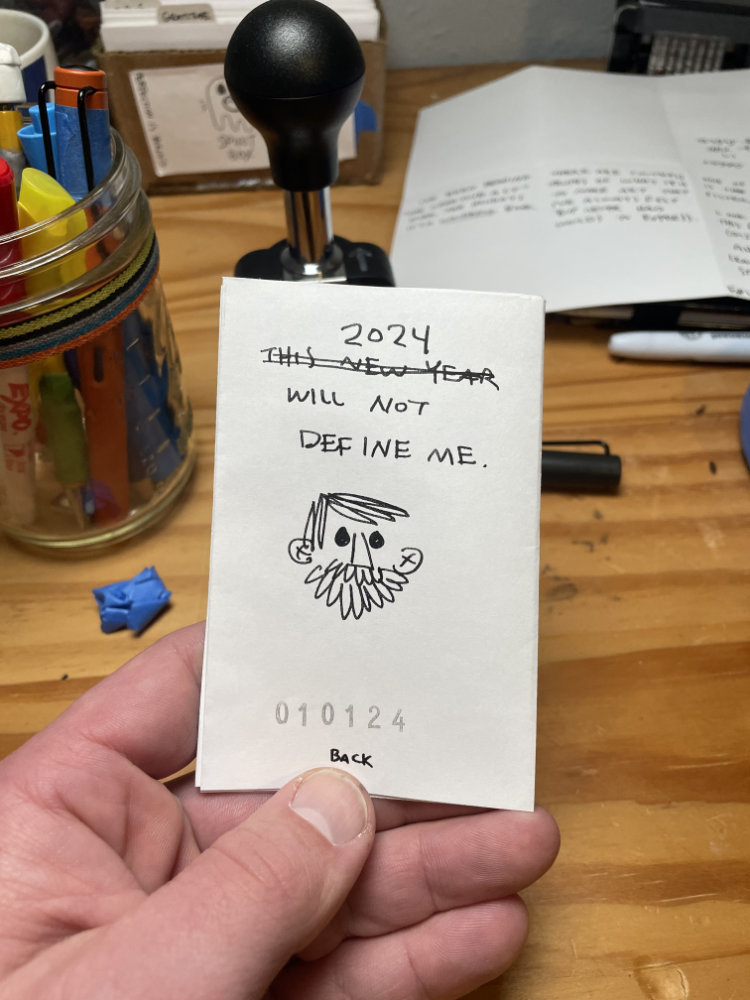
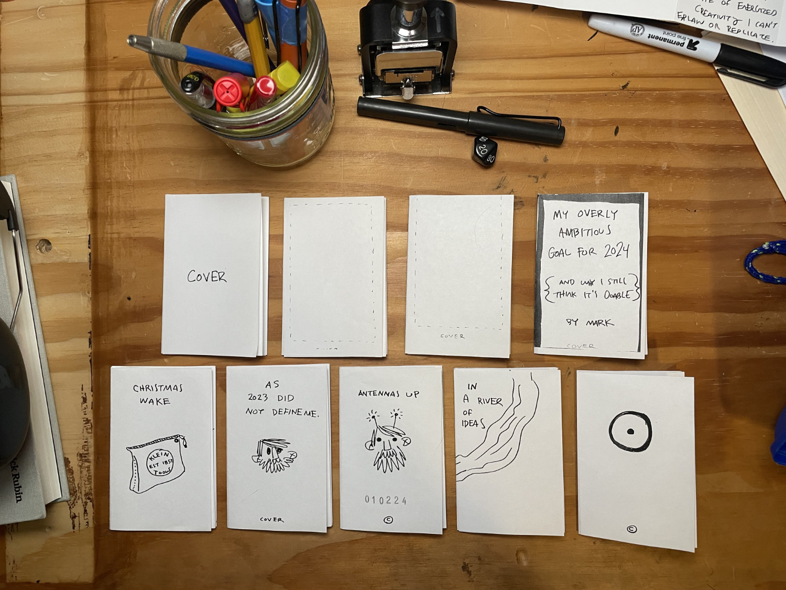

It’s easy to fall into the expectations trap as an artist. Making things for an audience, no matter how small, is very different from just making things. When something works - you want to do more of that thing. But sometimes, that thing, whatever it is, isn’t what you should be making.

Do you make it anyways - to satisfy an audience?

I’ve spent the break reading _The Creative Act: A Way of Being_. I cannot recommend this book highly enough. It is a devotional for artists - expressing in words core Truths of art making I have felt but could not articulate.

I started trying to take notes, but the book is so dense I found it nearly impossible. Then on page 20 the author writes:

_”If something strikes me as interesting or beautiful, first I live that experience. Only afterward might I attempt to understand it.”_

I stopped taking notes. I am living this experience. My mind is on fire.

I’ve been making zines over the past week or so. I’m not sure what to do with them yet but I love the low risk functional nature of them. One sheet of paper, six interior pages, a back and a cover. It’s not a lot of space to get a point across but the limitations create a sort of alchemy that somehow adds up to more than the sum of its parts.

It’s been a rewarding exercise that I think I’m going to continue for a bit.

Talk soon. Enjoy the journey.

---

The object isn’t to make art, it’s to be in that wonderful state which makes art inevitable.  
_~ Robert Henri_
