I’ve been able to make at least one zine a day so far this year and am still really enjoying the exercise. Here are three favorites from the past week or so.

---

recently shared some sketches done as part of a 30 day drawing challenge. It was a nice reminder to keep things low key and just draw what’s around. As a bonus it gave me a chance to experiment with two tone lighting. Not a lot of room for nuance with a laser printer.

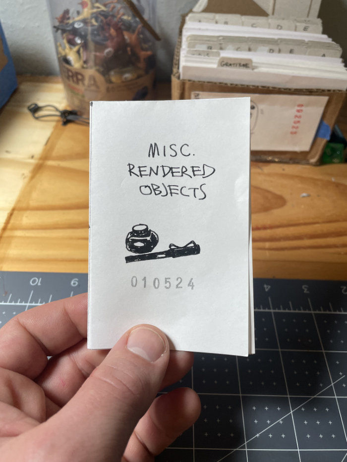

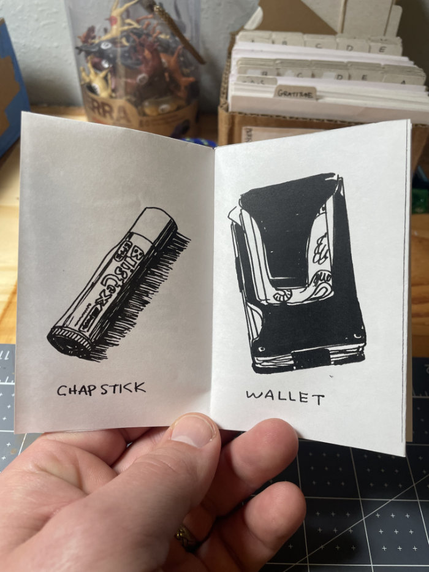

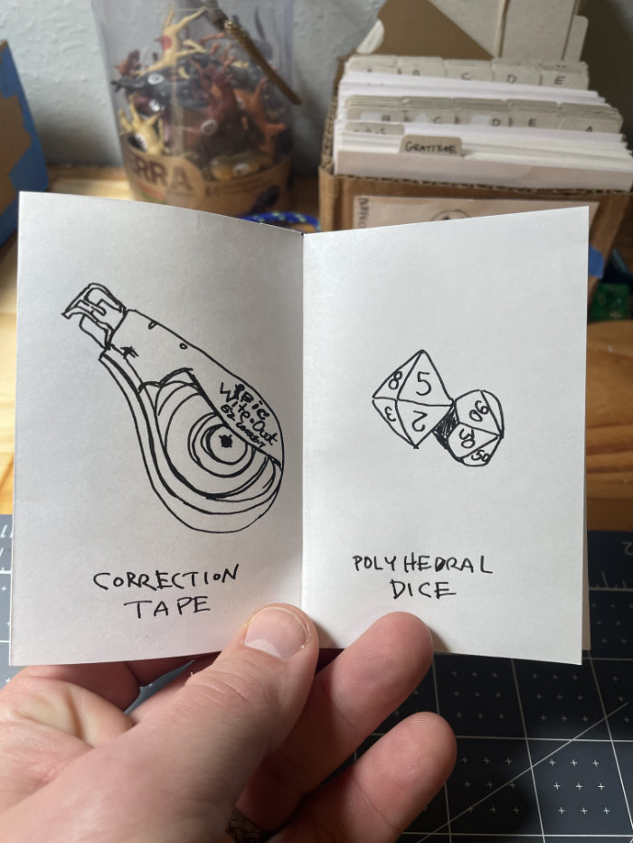

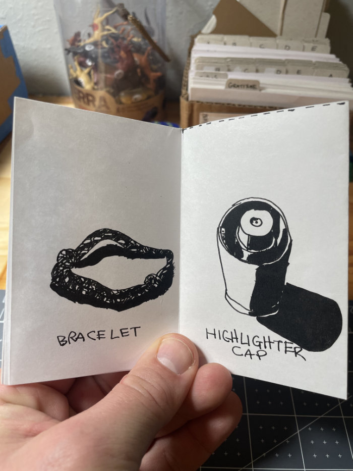

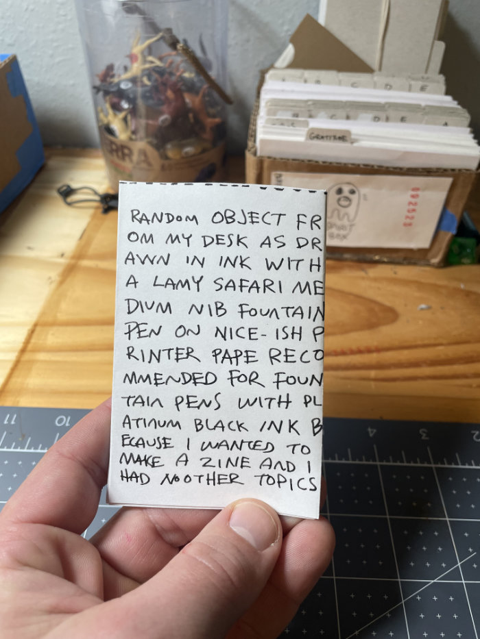

I asked my daughter to make a book with me. What follows is her impatient commentary as I did the drawing and writing. As promised, she colored.

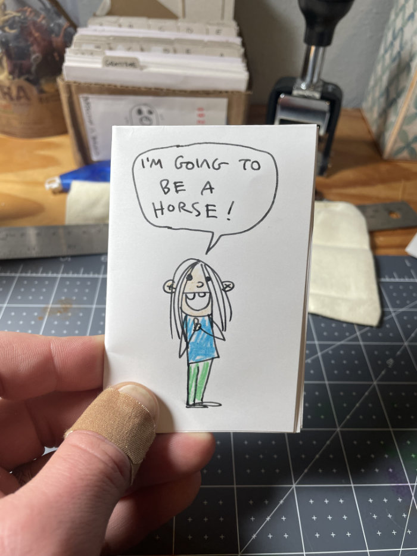

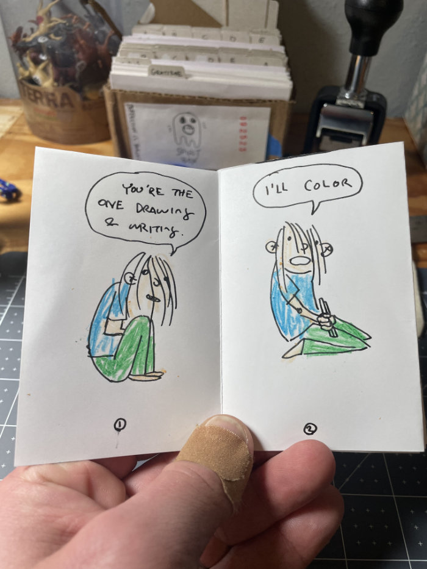

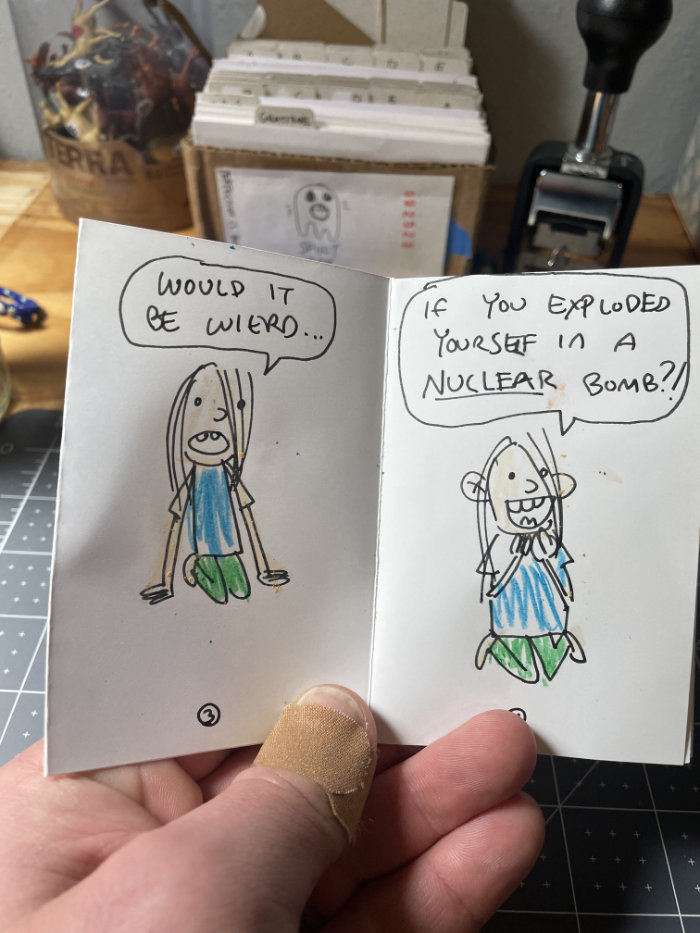

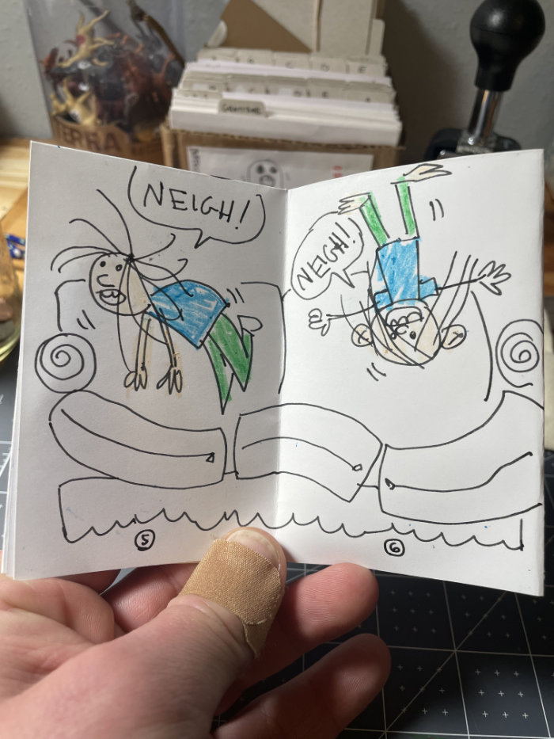

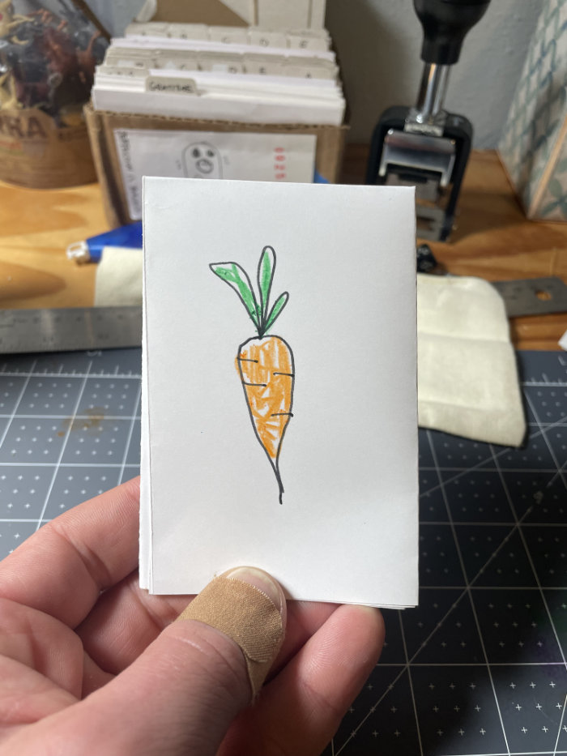

And finally, a zine inspired by “_The Creative Act: A Way of Being_”. There’s a beautiful chapter in it called “_Surrounding the Lightening Bolt_” that discusses preparing for inspiration to strike and honoring it once it does.

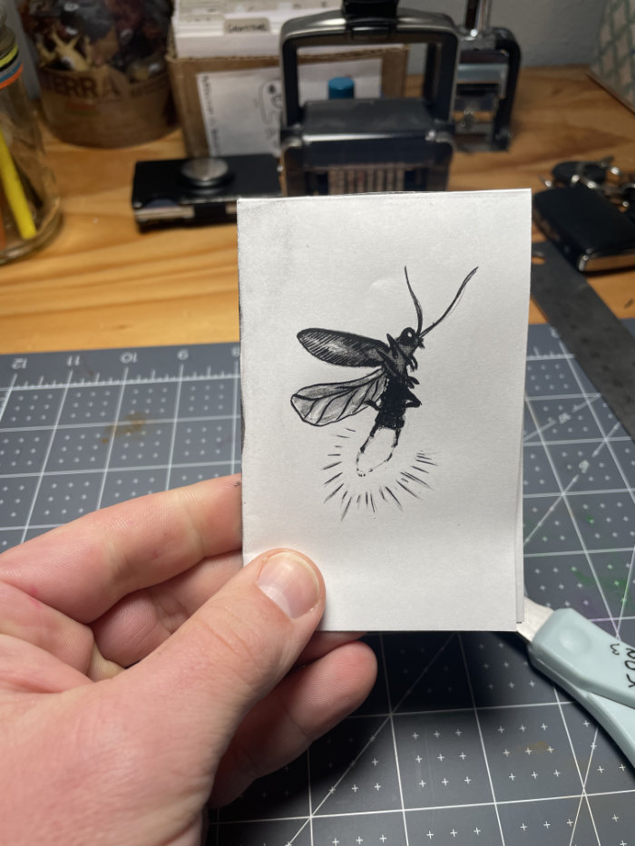

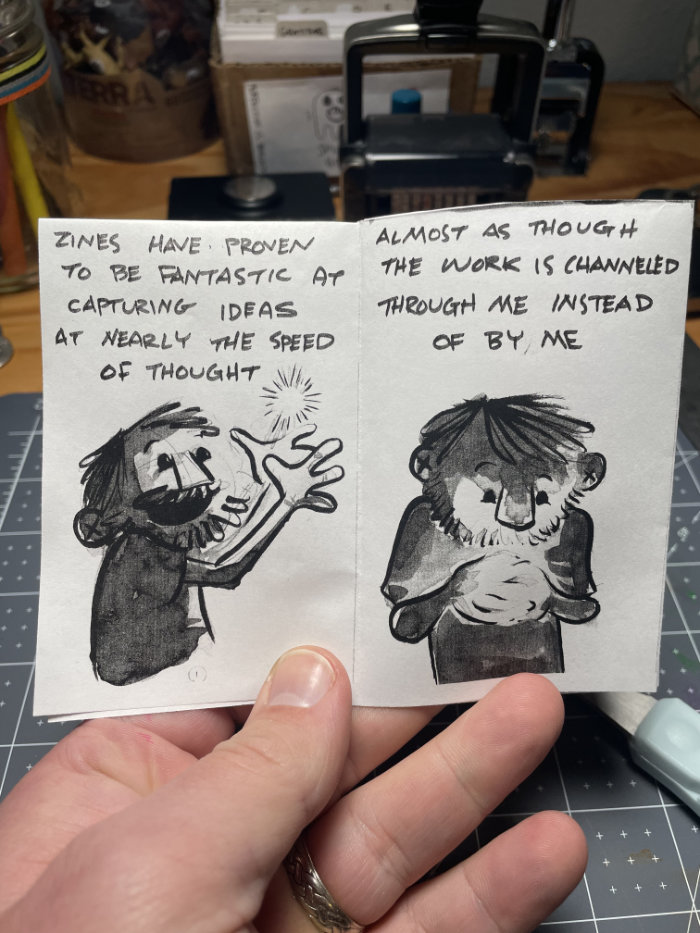

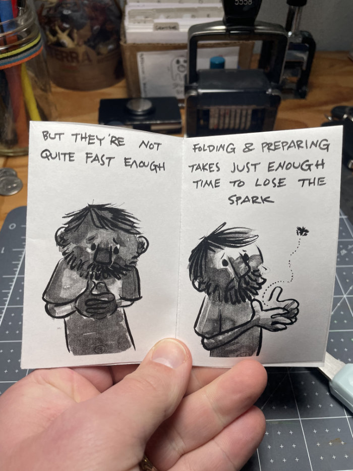

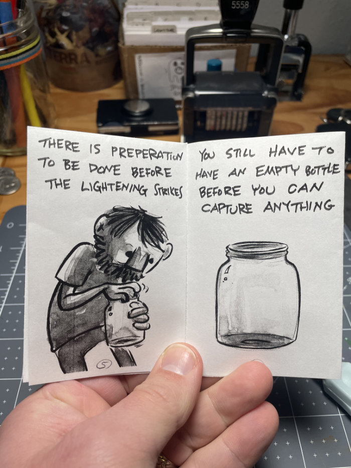

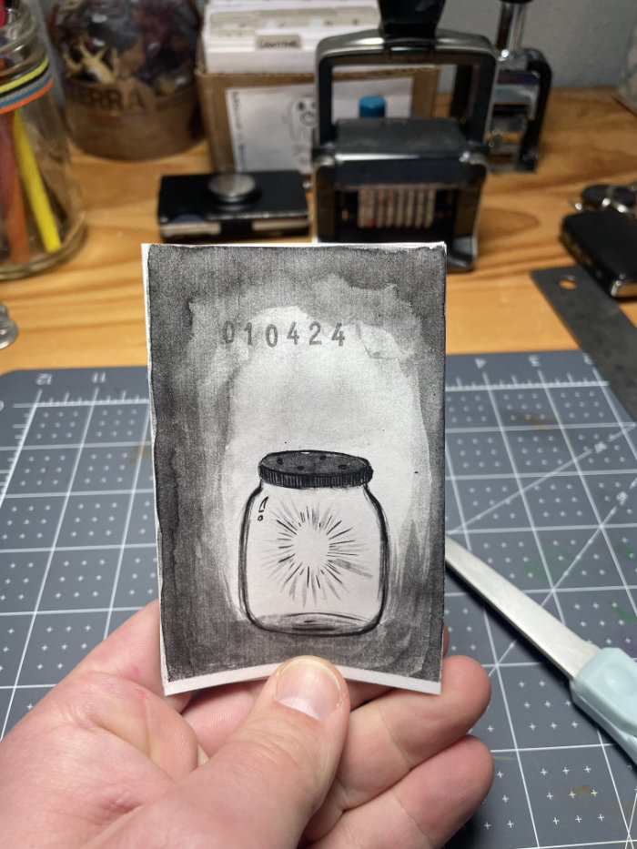

I’m still figuring these out - experimenting with format, layout, and pacing. There are the limitations of print, the quality of my printer, the final form factor and consideration for how these may or may not be distributed.
