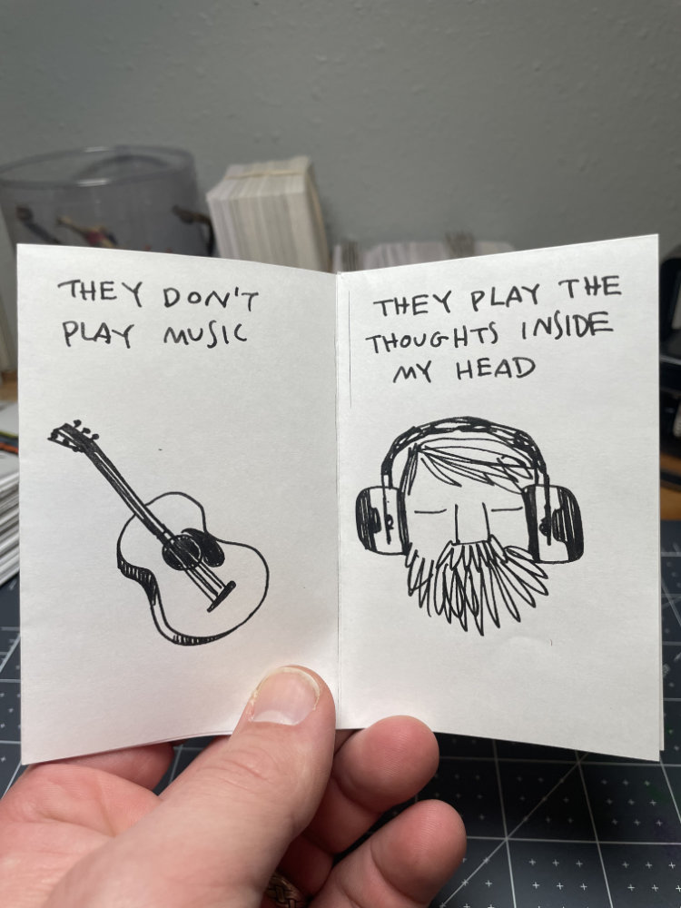

It’s been a wild week. Busy day job. Old friends coming out of the woodwork. Unexpected drama. Death.

Navigating the unexpected alongside the everyday is a challenge, especially when it comes in a tidal wave. It’s times like these where I’m especially grateful for a creative practice to recede into. Here are 6 more zines from the week of varying emotional weight. And an emotional support cat. If you want.

---

I love music and listen to a lot of it. Yet a few months ago I stopped listening to it while working. It’s taken a while to figure out how to articulate exactly why but this feels like it’s getting closer. Whatever gets you to the river…

I have a very old friend on one of the coasts who’s going through some stuff. One of the things that really stuck out to me as we were talking was how they were trying to subtract their past life from their present. I don’t want to be proscriptive - as different people we all have different needs but as much I sometimes want to lop off chunks of my past I just don’t think it’s a great idea. It’s only ever resulted in phantom pain - throbbing emotional wounds from past scars I refuse to accept.

Our lives are a journey. Every step a present moment built upon the last. We may not always like where we are but we can always take another step forward towards building something different. Something better.

Don’t throw away the past. There are lessons there. All that we were is all that we are.

Good people make mistakes. They deserve some grace.

---

Sometimes you just need a good distraction and a fresh perspective.

So in spite of it all, in the end, the team with the most dance parties wins. If you’re struggling right now, I hope you find your way to the dance party and that your team wins. You deserve it.

---

Bonus!

Sometimes in the morning I do a quick Tarot reading for myself. I don’t believe in fortune telling or anything but I do believe in visual metaphors and apophenia. It helps to start things off on the right foot creatively. Anyways, as a part of that, I like to draw the cards I pull.

---

