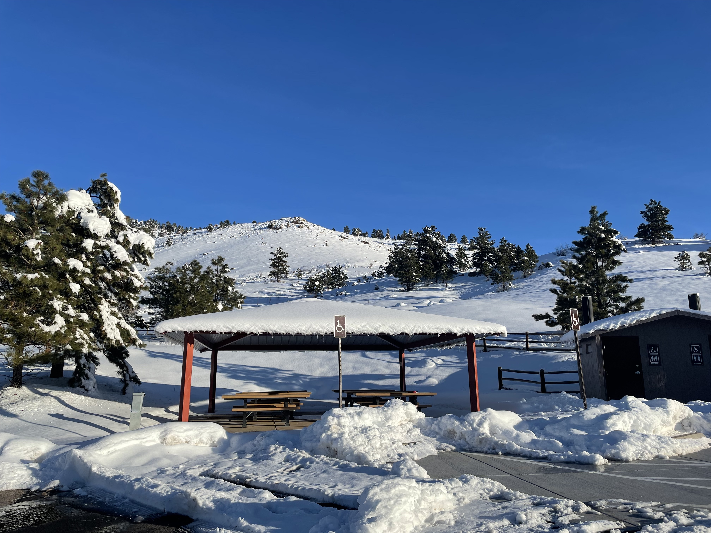
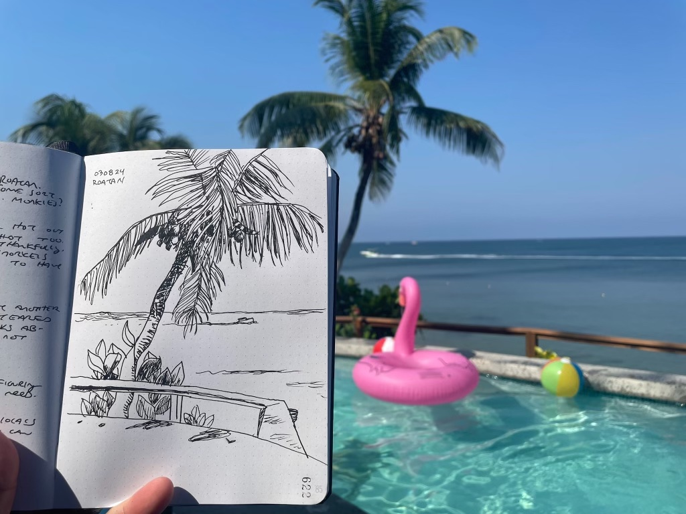

Good morning. It’s 3:44am. 40°f with a high of 59. Mostly clear. The valley trails are muddy and closed, the foothills still have too much snow to really run and the high country - well, it’s a couple months before you’ll be able to do anything up there without skis.

Horsetooth Mountain Open Space, upper lot, Saturday, March 16, 2024.

In just under 2 months I will toe the line at the Quad Rock 50. The longest distance I’ve run in almost 10 years. It’s the first of a series of races and probably the hardest if not the longest of the group.

Turtle Beach, Roatán, Honduras, Friday, March 8, 2024

Less than a week ago we were in Honduras. More specifically we were on the island of Roatán. The temperatures there were in the low to mid 80s. The daily range of temperature was only about 3 degrees. It was very (extremely) humid. Heat is my kryptonite. If not for the stunningly beautiful, relatively cool ocean and the world’s second largest coral reef just outside the front door of our rental I think I would have melted into an unrecognizable goo.

I’ve been drawing hands everyday as part of a 100 day challenge. I have also been questioning why I’m drawing hands everyday as a part of a 100 day challenge. I’ve done these sorts of long term things in the past with varying degrees of success. A year of posting [daily drawings on instagram](https://www.instagram.com/luetkemj) played no small part in killing the joy of it all 10 years ago. 500 days of running everyday rekindled the joy of running for me but absolutely destroyed it for my brother.

I guess what I’m saying is it’s important to approach these things with a bit of caution. I’m not sure if I’ll finish the hands challenge. I only have so much time in the day. Waking up at 3am isn’t exactly normal or sustainable. Candles have two ends but it’s not advisable to burn them both.

I started making zines after some time off over the holidays. I’m not sure why that shift happened but it was a good diversion. After Roatán I feel a familiar gravitational shift. Something different if not entirely new.

Instead of diving head first into the deep end of this new thing I find myself instead thinking of DoPHS. How does that shift fit in here? It’s not comics. It’s not zines. It’s not drawing. It’s not writing. It’s something different. It’s a niche within a niche.

What do I owe this audience? Do I owe more comics, or zines, or drawings of hands?

Why do I feel compelled to make things at all?

In trying to understand what DoPHS is I find myself returning to the name and what it stands for. Do Preserve Human Spirit. The artist is compelled to make things because of their spirit and dammit, [it’s the artist’s job to preserve the human spirit](https://www.youtube.com/watch?v=XrgUKL1wDPw).

[DoPHS is that spirit preserved](https://dophs.substack.com/archive). The artist won’t be swayed by perceived expectations. [The artist does their own investigations](https://soulrideblog.com/2023/10/21/book-talk-tom-waits-on-tom-waits/#:~:text=%E2%80%9CIf%20somebody%20doesn%E2%80%99t%20like%20what%20I%20do%2C%20I%20really%20don%E2%80%99t%20care.%20I%E2%80%99m%20not%20chained%20to%20public%20opinion%2C%20nor%20am%20I%20swayed%20by%20the%20waves%20of%20popular%20trends.%20I%20just%20keep%20on%20doing%20my%20own%20investigations.%E2%80%9D). [The artist doesn’t play to the gallery](https://www.youtube.com/watch?v=JRtZc_Nmo5w). [The artist is here to achieve what they want to achieve](https://www.youtube.com/watch?v=_OoevpPS0-k). The artist has a different measure of success.

* * *

This past week I resurrected an old project. [Skulltooth](https://luetkemj.github.io/skulltooth/) is the early (very early) makings of an [old school roguelike](https://en.wikipedia.org/wiki/Roguelike). Ascii graphics, no mouse control, unbalanced, the whole bit. The joy is in the making of the thing. For all the foundational work of [authoring a game engine](https://github.com/luetkemj/skulltooth) all you can do at this point is move an “@” around the screen with arrow keys. I don’t expect DoPHS to turn into a code heavy dev blog. But I don’t exactly not expect that either.

There’s still a lot of room for illustrative drawing and creative writing in a project like this. How else do you expect a “g” to fill you with existential terror?

In order to move unencumbered in this project I’m trying to reset expectations of what it is exactly I do here. Perhaps with a shift like this I’m more or less nuking those expectations from orbit. I don’t know.

Hopefully you’ll still find something interesting as we settle into a new spot on the river. It’s not my first time here. I’ve left a dozen or more of these games in my wake. Perhaps we’ll look at some of them later.

Unrelated, here’s a spectacular interview with Lynda Berry from [Mitchell Volk](https://mitchellvolk.substack.com/p/lynda-barry?utm_source=substack&utm_campaign=post_embed&utm_medium=web).

And another unrelated post that really hit home this week by [Kat Schneider](https://katschneids.substack.com/p/on-productivity?utm_source=substack&utm_campaign=post_embed&utm_medium=web).

And finally, thanks to and for some great conversation this week. Maybe I should keep drawing hands after all. 🤷‍♀️
