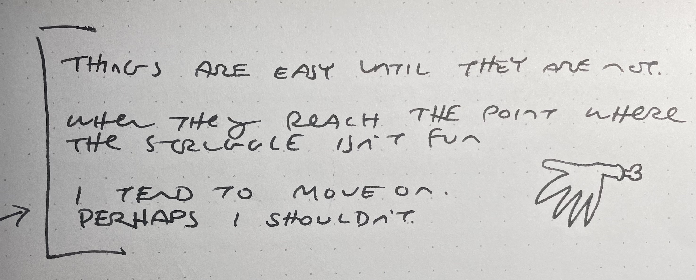

There’s a comic in here. I promise.

I have always been a bit of a tinkerer. Some people have no idea what they’ll do when they retire. I know exactly what I’ll do. The same thing I do now - just less of it for someone else. Having a job-job can be a pain but it does force me to see projects to completion.

This past week I’ve been working on [Skulltooth](https://luetkemj.github.io/skulltooth/). Mostly it’s been an exercise in porting old code to typescript and remixing libraries from past projects into something simple enough to move beyond the beginning prototype stages of game development.

There now exists a randomized dungeon map with stone walls and field of vision. The first four steps of [the complete roguelike tutorial](https://github.com/luetkemj/jsrlt). Only nine more to go!

A common mistake I make is to get lost in the details. For example, I spent way too long on an earlier game focused on a dynamic lighting system that had nothing to do with the game itself. It was a rabbit hole. A well lit and performant rabbit hole that I’m actually quite proud of. I learned a lot about lumens, lux, stationary and ambient lighting. It was a whole thing. You can [read the source code here](https://github.com/luetkemj/skrimshank/blob/master/src/ecs/systems/lighting.system.js) or [play the “game” here](https://luetkemj.github.io/skrimshank/). Unfortunately the controls are extremely unintuitive. I was too busy working with light beams. I’m sorry, but you’ll have to figure them out for yourself [from the source](https://github.com/luetkemj/skrimshank/blob/master/src/ecs/systems/userInput.system.js). Good luck.

At some point I realized the game wasn’t very fun. Trying to make it fun was hard. I lost interest and moved on. Perhaps I should stop doing that.

* * *

10 years ago I drew this comic adaptation of a pretty famous quote from Ira Glass. I was trying to get through that volume of work he speaks of. I’m still trying to get through that volume of work.

* * *

I’m still fighting, but sometimes I wonder - if I keep letting myself get distracted by shiny new projects will I never get through that volume of work? I have a dozen unfinished volumes of work laying at my feet already. Maybe it doesn’t matter and I should just keep doing what makes me happy regardless.

* * *

In other news, I haven’t just been writing code and resurrecting old comics. I started reading and working the spirit box again - something I’d fallen out of the habit of doing. I wrote some rough drafts for zines that may or may not ever see completion and started thinking about how to fit them into this new game development fascination. I have some ideas that I’m pretty excited about. Whether I can focus on any of it long enough to see to completion remains to be seen.

But I have confidence!
