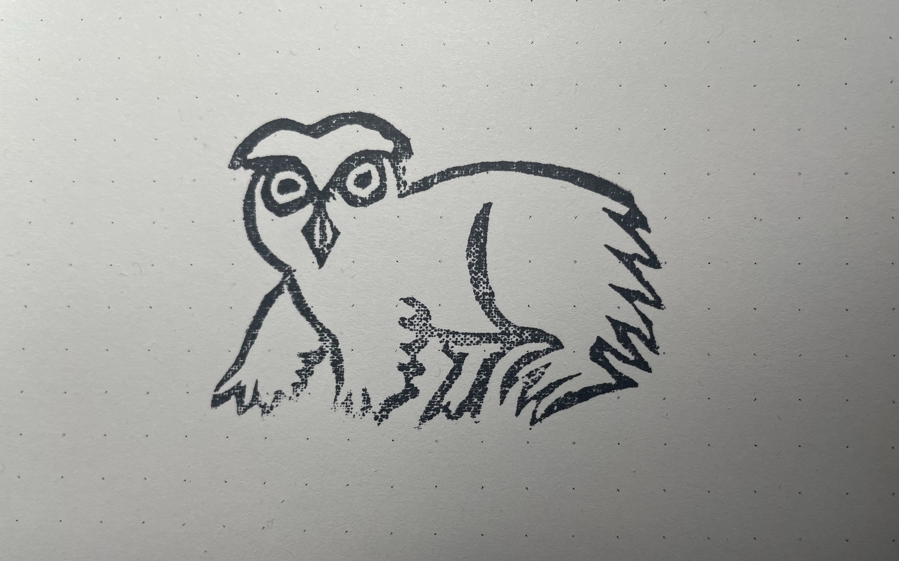

Why games? Why art? Why any of it?

asked a wonderful question yesterday in regards to [last week’s post](https://dophs.substack.com/p/volumes-of-work-a94).

> Do you think the "volume of work" needs to all be the \[same\] type of work? Could it be a broad creative bridge that is being built to a less specific creative place?

I love the idea of a broad creative bridge. We don’t have to inhabit a specific creative place. We can visit many spots along the river.

Why am I suddenly making games again? Not long ago I was committing myself mentally to making long form comics. Before that I was making zines, and those came after a long stint making short form improvisational comics.

So much of what I actually found myself working on, intentionally avoided the rigors of craft. I didn’t edit or erase. As if making changes would somehow get in the way of “Spirit” or hide the “Process”.

Has my lack of craft been the result of laziness? Should I have put more effort into the work such that it could reach some higher level of fidelity? Would that have built a better bridge?

I don’t think so.

I didn’t shortcut the creative process out of laziness - I did it because the river was flowing too fast to keep up. The only way to catch anything was to yank it out of the water, throw it on the shore, and worry about identifying the species later.

That frenzied pace was in the service of a single volume of work. To build a bridge from a place where the creative act felt impossibly laborious and fraught with anxiety to one where ideas are able to flow unobstructed.

That gap has been bridged. But it’s not the only gap on this journey.

There isn’t a single volume of work to get through. There are volumes.

It’s up to you to decide which bridges to build.

* * *

It’s been difficult lately to find time for creative pursuits. Work has been ramping up and takes much of my time and energy. I entered peak training for a goal race in early May. This weekend calls for a 25 mile course preview with three more weeks of high mileage and as much vert as I can possibly cram into each one. My wife started a new job, my kiddo is on the verge of graduation. It’s been the good sort of busy.

I did manage to fall down a bit of a rabbit hole in Skulltooth this week. There are now owlbears that inhabit the dungeon. But instead of buttoning up combat I took a wide left and built the groundwork for a sensory system. The data is there to model what the player can feel, see, smell, hear, and taste. Is it necessary? No. Is it interesting? I think so.

So far there is only sight, but it won’t take too much more to model a nervous system for feeling, ears to hear, a nose to smell, and a tongue to taste. Ok, it’s gonna take a lot but I think it’ll be worth it. Hit me up if you wanna chat dijkstra maps.

Anyways, lots of UI bits, lots of systems work. Lots of rabbit holes. A good distraction from the weight of a busy week.

