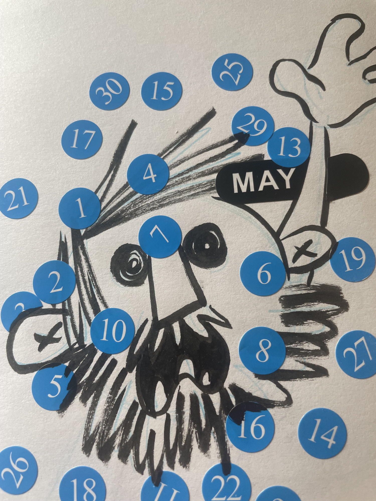
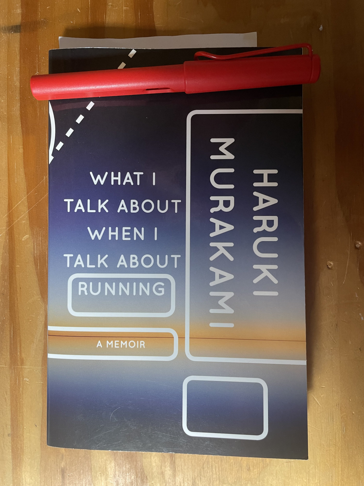
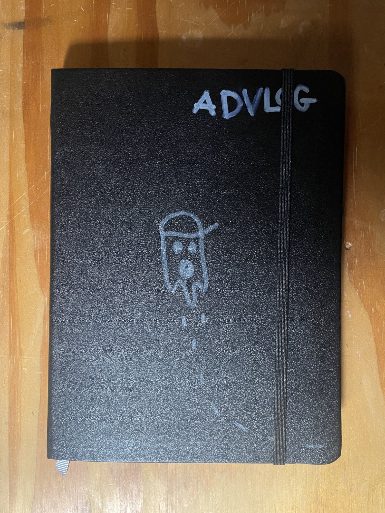
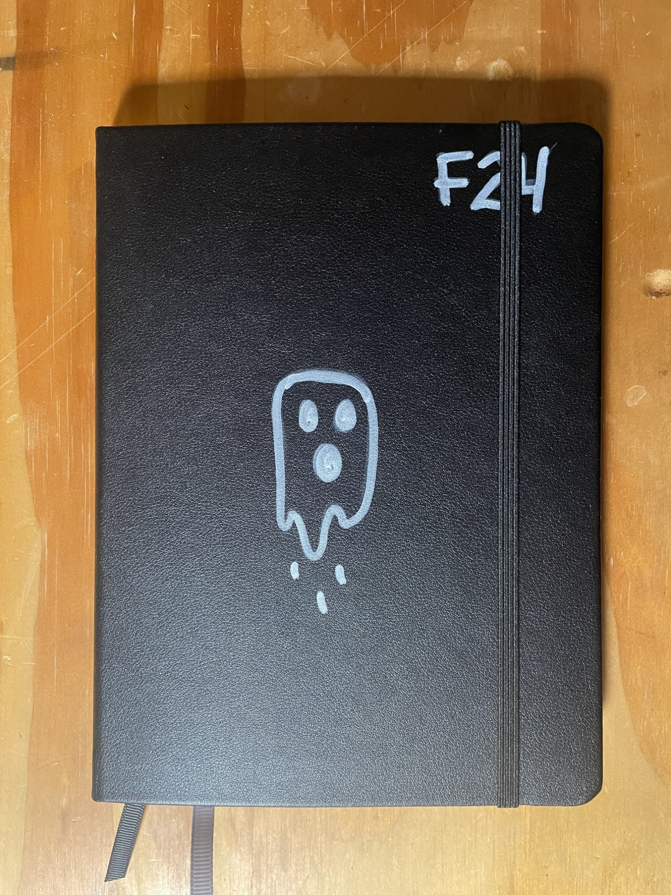
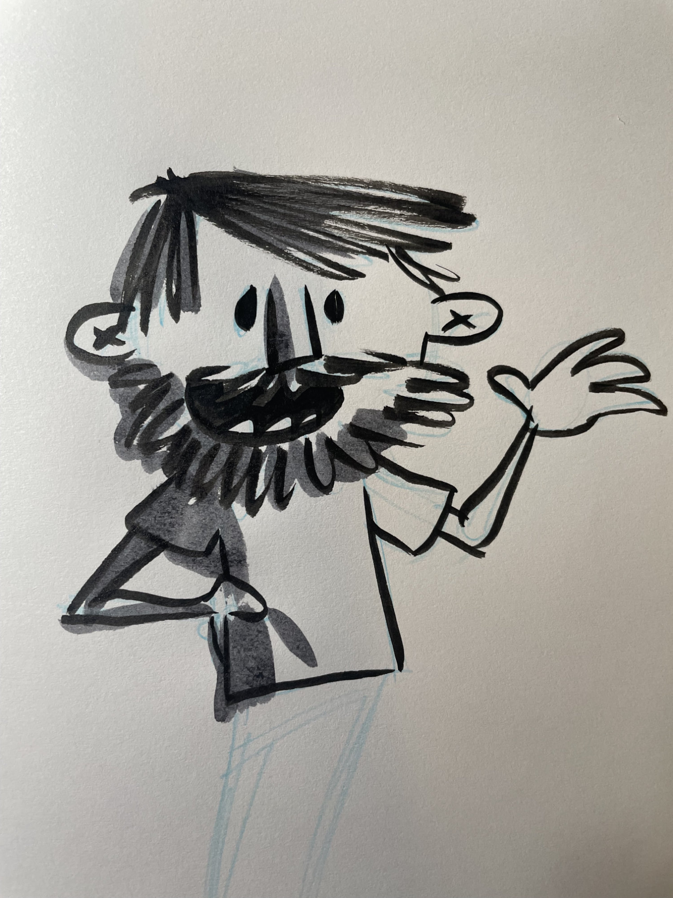

Within the month of May we did many things. Probably too many things.

Mother’s day. A birthday. Girl’s trip to Michigan, Canada, and Ohio. Quad Rock. Family in town for over a week. High school graduation. Read a couple books. Yard work, house work, work work. And somehow in the midst of it all we started rock climbing as a family.

It’s been a lot.

But it’s been a good lot!

And it was that specific lot that kept me from keeping up with the newsletter.

But here we are, on the eve of summer. Less than 2 months from Never Summer. And I find myself refreshed. Ready and eager to jump back into it all.

* * *

As this newsletter goes out I expect to be starting Horsetooth summit #55. Over half way to 100 teeth on the year.

I've almost finished my third reading of “What I Talk About When I Talk About Running”. A wonderful book by Haruki Murakami about the intersection of writing and running. It’s become a bit of a comfort book - something to lean on when the candle has been burned on too many sides.

* * *

I’ve started keeping an Adventure Log. Strava, where I record runs, doesn’t really make sense for tracking climbs at the gym. And sometimes I’d like to remember a walk that maybe the world doesn’t care about. So I keep it here.

* * *

I’ve started another regular journal - F24. I’ve fallen behind on the Spirit box - I’m only halfway through indexing D24. Over a journal behind. Feels a bit insurmountable to be honest. But I think if I can get back to routines and keep chipping away at it - I’ll get there.

* * *

Work has been busy. Too busy to keep up with Skulltooth. I’m excited to get back to game dev but like the newsletter - some things just had to be shelved in the month of May to make room for an absolute tsunami of must haves.

* * *

So here we are.

Nearly half way through 2024.

Some goals ahead of pace, a few already achieved, others far behind or forgotten altogether.

What’s left for the year?

🤷‍♀️
=====

See ya next week.

