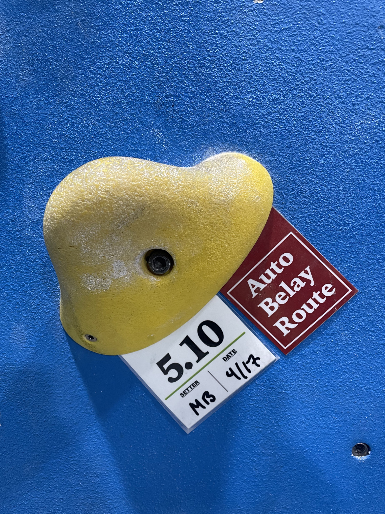
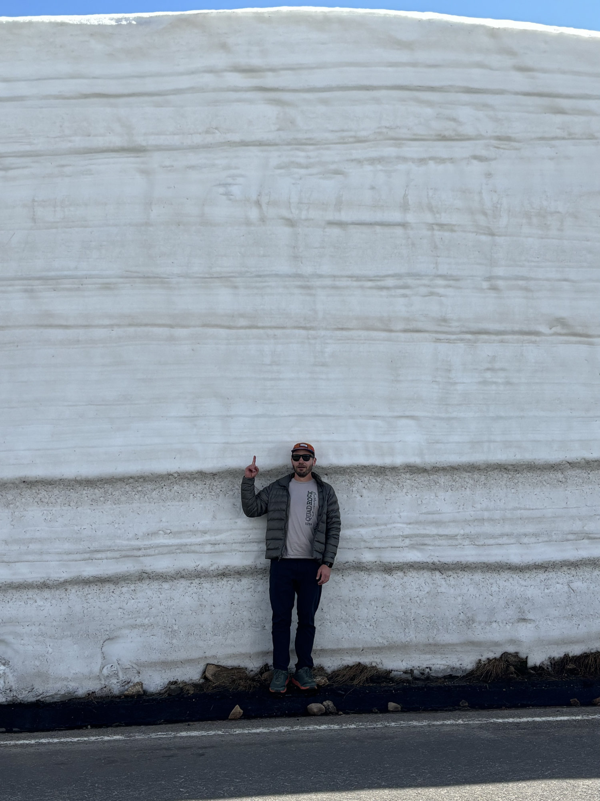

This past week I finished reading _What I Talk About When I Talk About Running_. I’ve nearly finished _Novelist as a Vocation_ and am a good chunk into _Hard-Boiled Wonderland and the End of the World_. I guess I’m on a Murakami kick.

The last time I read Murakami’s running book, I started on December 29, 2022. It took 6 days. It was the first book of many and I began to draw again a few months later. I don’t believe that to be a coincidence.

Murakami talks about running in _Novelist as a Vocation_. He deems it a required ingredient in his own artistic journey. He says “No matter what, this is something I have to do in my life.” I’m beginning to view reading as something I have to do in mine.

* * *

Last week at the time of publication I was, as planned, on the way up Horsetooth for my 55th ascent. It was a casual climb shared with a friend. The next day I notched #56 solo and on the way down took a nasty fall and shredded my palms.

57 teeth at time of writing.

My palms have healed enough to climb again. I sent my first “project” - a 5.10 that took me several sessions to figure out. If you’re unfamiliar with how climbs are rated, a 5.10 is about where intermediate difficulty begins. I am still very new to climbing so I’m pretty proud of that one. I finally stopped trying to just muscle my way up the wall.

* * *

Jen and Remus went on a hike this week at a local gulch. They encountered a section with an unreasonable amount of butterflies. Enough that you might consider covering your nose and mouth with cloth to avoid breathing them in.

Summer is well and truly here as long as you stay out of the high country. Up there it’s early spring at best. We drove up Trail Ridge Road in Rocky this weekend. I knew there was still snow but seeing an 18 foot wall of it on the side of the road is something else.

The marmots were wholly unimpressed with our presence. With a growing season of only ~40 days they have more important things to worry about.

* * *

When the heat of summer gets to be too much you can drive to the mountains and temporarily reset the seasonal clock. We call it chasing spring. When the daily grind gets to be too much I find a good book can similarly reset my creative clock.

* * *

> “No matter what, this is something I have to do in my life.”
