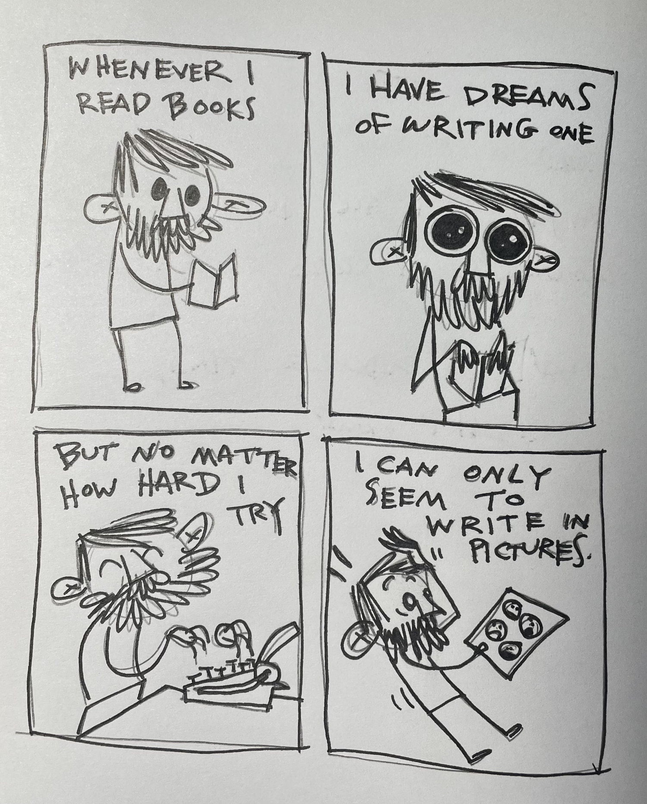
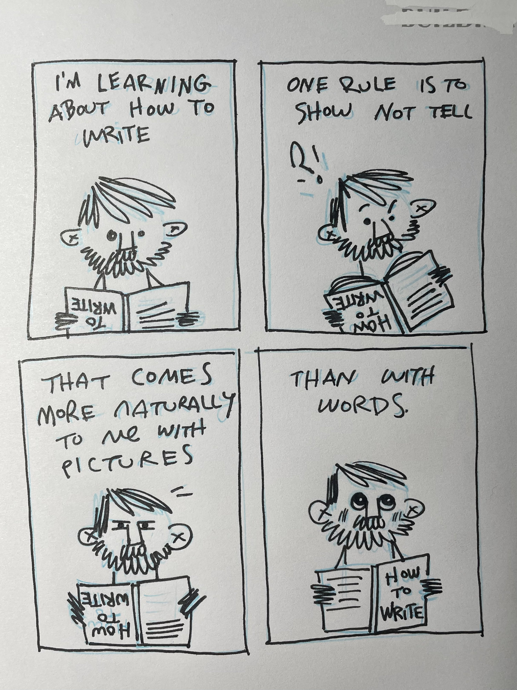
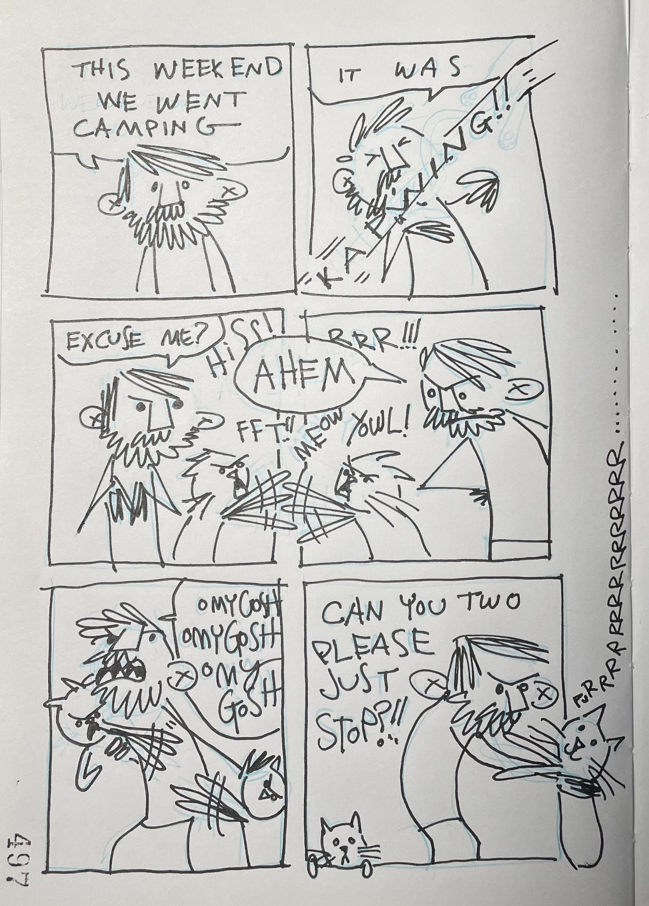

I’ve been listening to _[The Essential Guide To Writing a Novel](https://podcasts.apple.com/us/podcast/essential-guide-to-writing-a-novel/id1612967885)_ podcast by Jim Thayer. It does a really good job of explaining fundamental techniques that I sometimes recognize but don’t at all understand.

In other news, we went camping this weekend. It was a lot of fun! we tried dispersed camping for the first time and it was way better (and easier) than expected.

Please enjoy this cartoon about the experience.

Sometimes it’s hard to do things with cats.

* * *

