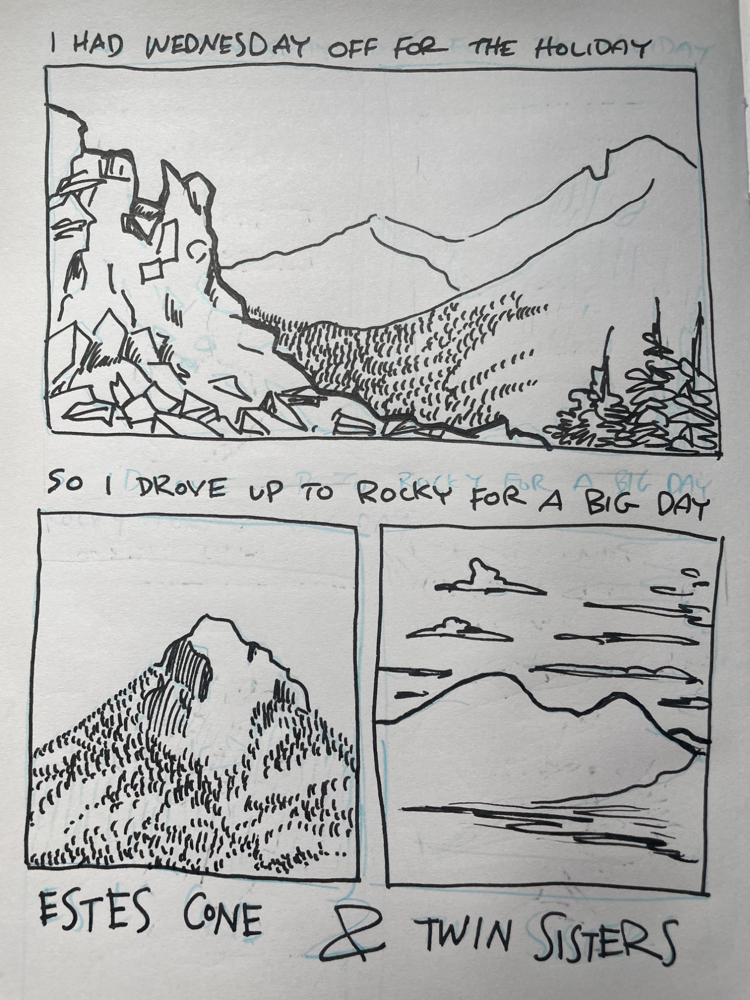
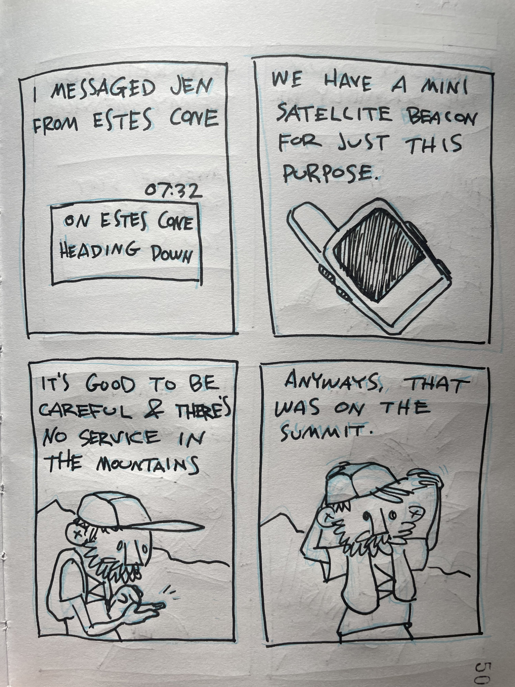
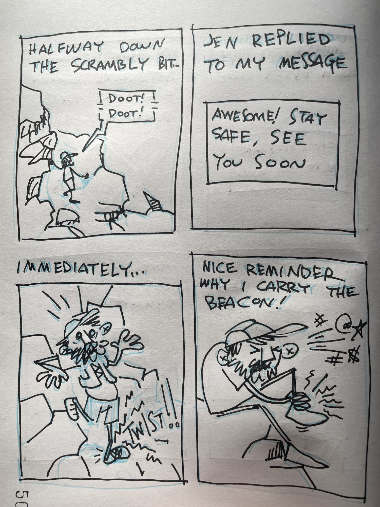
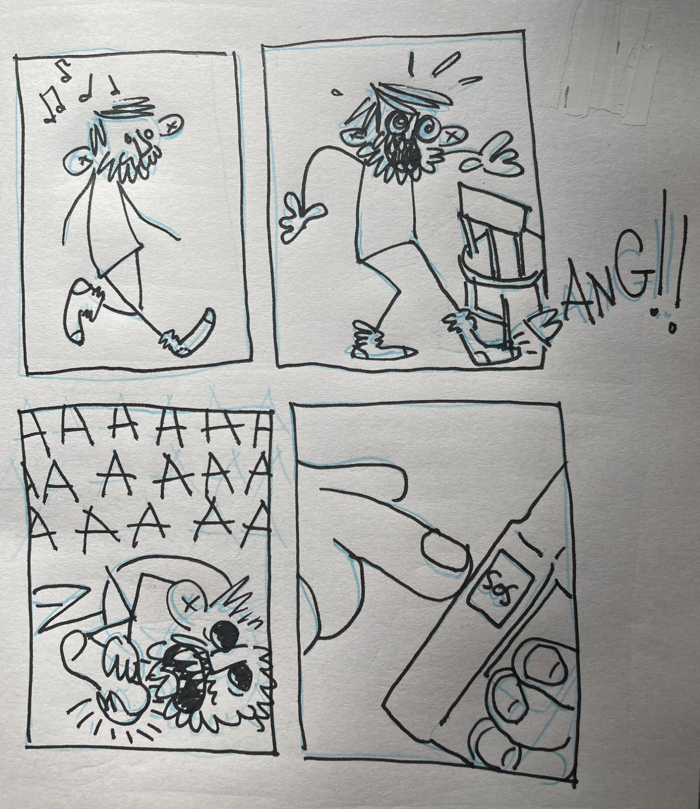

Fortunately it was just a minor sprain and I didn’t have to hit the SOS button. I’ve heard if you hit the SOS button a helicopter will come and save you - thankfully, I’ve never had to find out if that’s true.

Everybody gets one? I feel like the chopper crew would understand…

