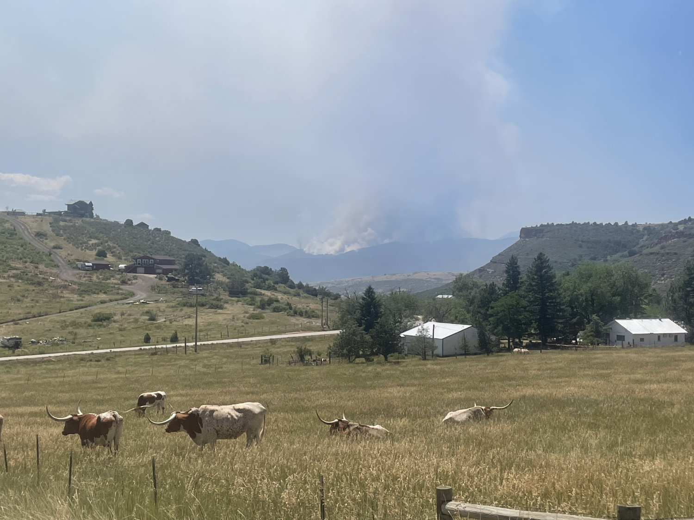
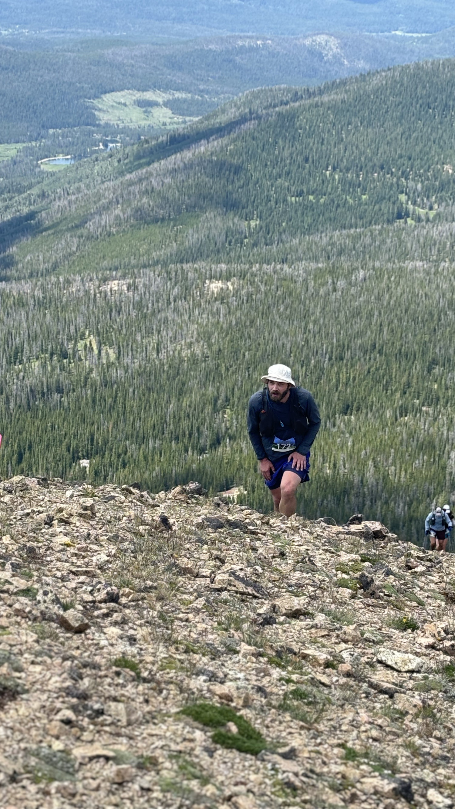

* * *

It’s been a bit. A summer filled with success and also failure.

I climbed outdoors for the first time in my life. Learned to repel. Discovered that outside, there are no brightly colored hand holds. It’s a different sport altogether.

I don’t think we spent a weekend in July at home. Opting instead to escape to the high country - chasing spring - as a family and with friends.

I finished Quad Rock but did not finish Never Summer. At the time, it seemed like the right choice. I had been nursing a sprained ankle and wasn’t sure I wanted to go into the most difficult and remote portion of the course only to reinjure myself. I made the climb up Diamond again. Was way ahead of my paces. Was feeling pretty ok. I was honestly having a really good day. And yet after 25ish miles, instead of continuing on course toward Montgomery I went back down to the highway and turned in my bib.

At the time it felt like the right choice. It was the right choice. It was the safe choice.

But then we got home and someone set the mountains on fire.

The Never Summer Mountains have burned before. They can burn again. There might not even be a course next year. And if there is, who’s to say I’ll be healthy enough to run it.

The weather was good. There were no reroutes. I could have finished that day. Given what I know now, I should have finished that day.

* * *

Cresting North Diamond Peak shortly before quitting Never Summer 100k.

* * *

To go anywhere you gotta start somewhere.

But you also have to keep going.

