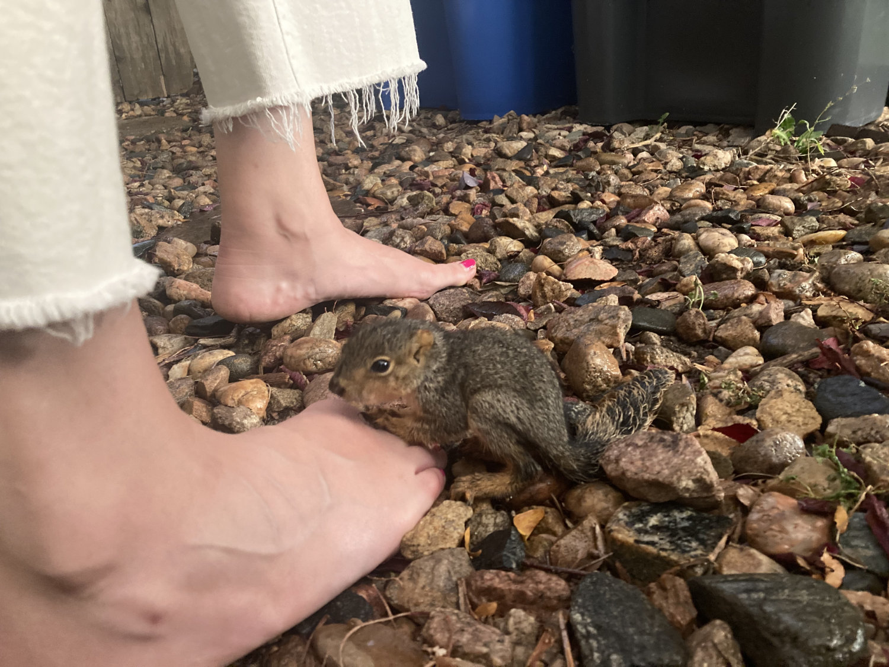
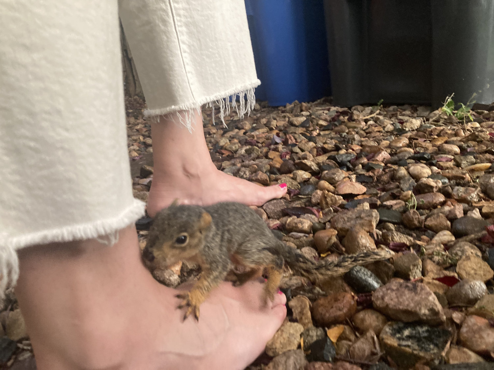
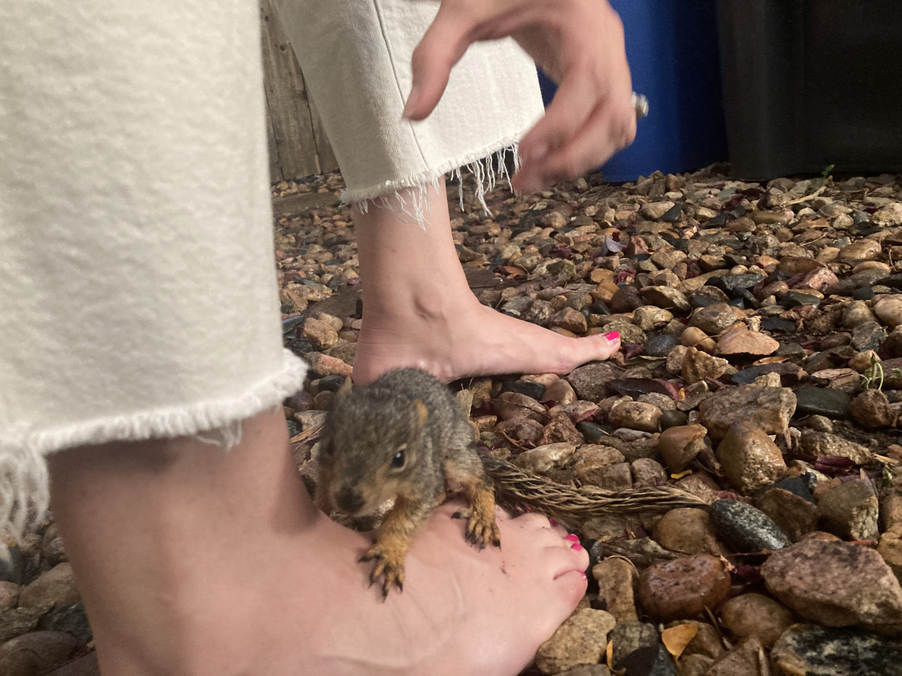
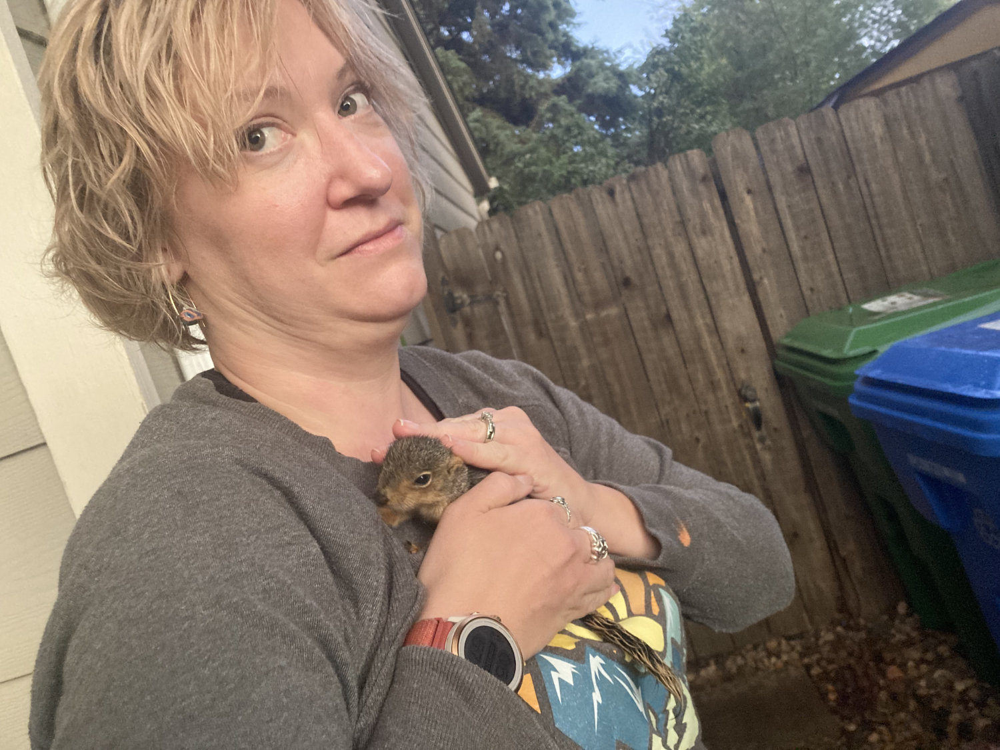

Sometimes when you are struggling to craft the words for a newsletter, a baby squirrel might fall out of a tree during a rain storm, crawl desperately onto your wife’s foot, and adopt her. If this ever happens to you, it will quickly become apparent that no matter how you’re feeling in that moment, no matter what you thought were doing, this is what’s actually happening and it’s best to just go with it.

Animal rescue was closed for the night so we called a friend who used to work there. She advised us to put the squirrel in a small box and place it back in the tree it fell from so its mamma could take it back to the nest.

So that’s what we did.

We’re all rooting for you little buddy!

Good luck 🙌

* * *

I was working on a post about shrines, and the internet, and geo caching, and mountains, and it was this whole thing. My greatest work yet, I swear. But then it started raining squirrels.

The actual sequence of events went more like this:

There was a curious noise from the front yard that sounded like an animal in distress. A series of chirps every few minutes. Eventually, Jen found a baby squirrel trying to climb over a small stone wall to get back to it’s tree. She grabbed some pot holders to help without actually touching it when another fell from the same tree. At this point we had two baby squirrels on the ground, soaking wet from the rain, and loud chatter from up in the tree. Realizing it’s momma was nearby we decided to step away, confident nature would do its thing.

After supper we went outside once more to check on the situation. That’s when the little one above crawled pathetically across the rocks onto my wife’s foot. What had been a cold, wet, and scared little creature, quickly warmed up, calmed down, and fell asleep in her arms. There was talk about making a box for it and a space in the closet. There was also talk about how we already have two cats and a dog that would love to eat it. It was at this point we remembered to phone a friend and let the experts take over.

We’ll check the box in the morning, and if momma still hasn’t returned we have a number to call.
