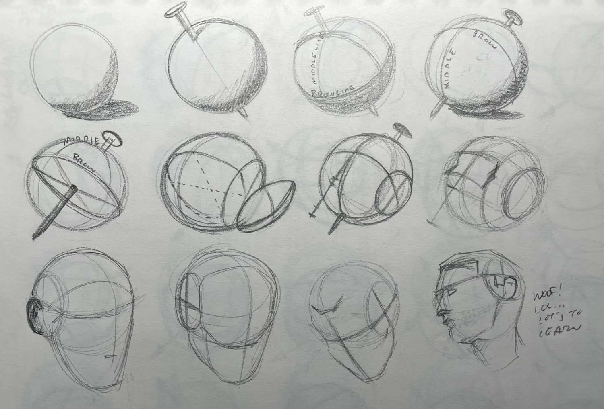
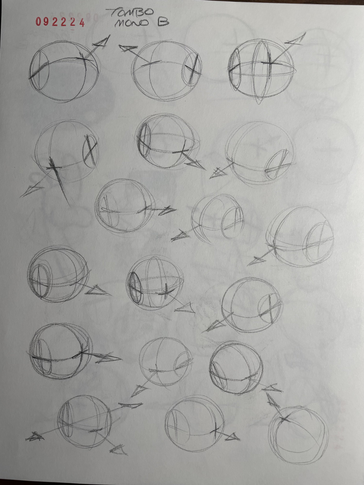
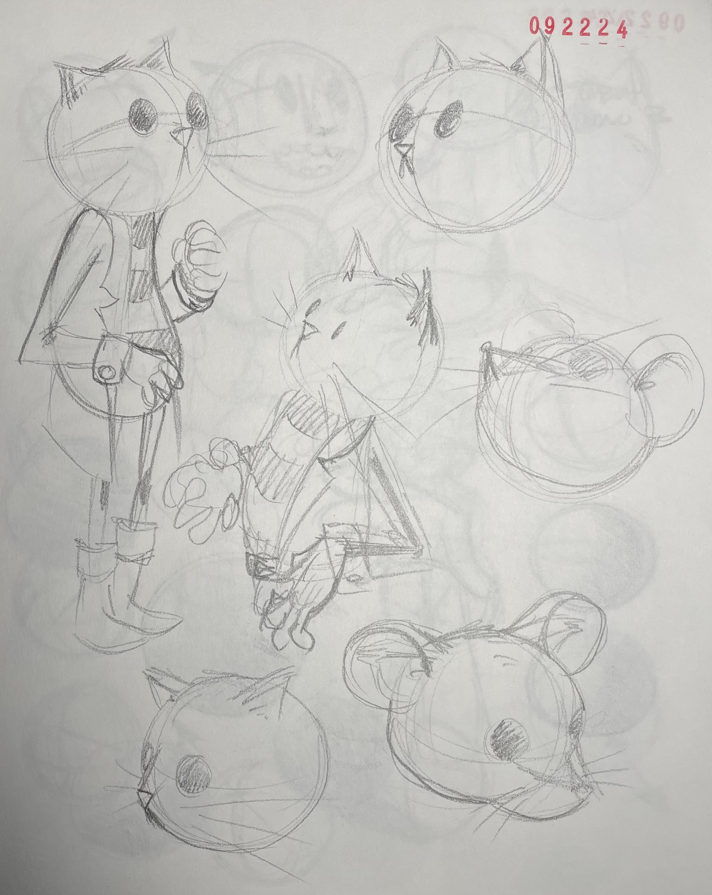
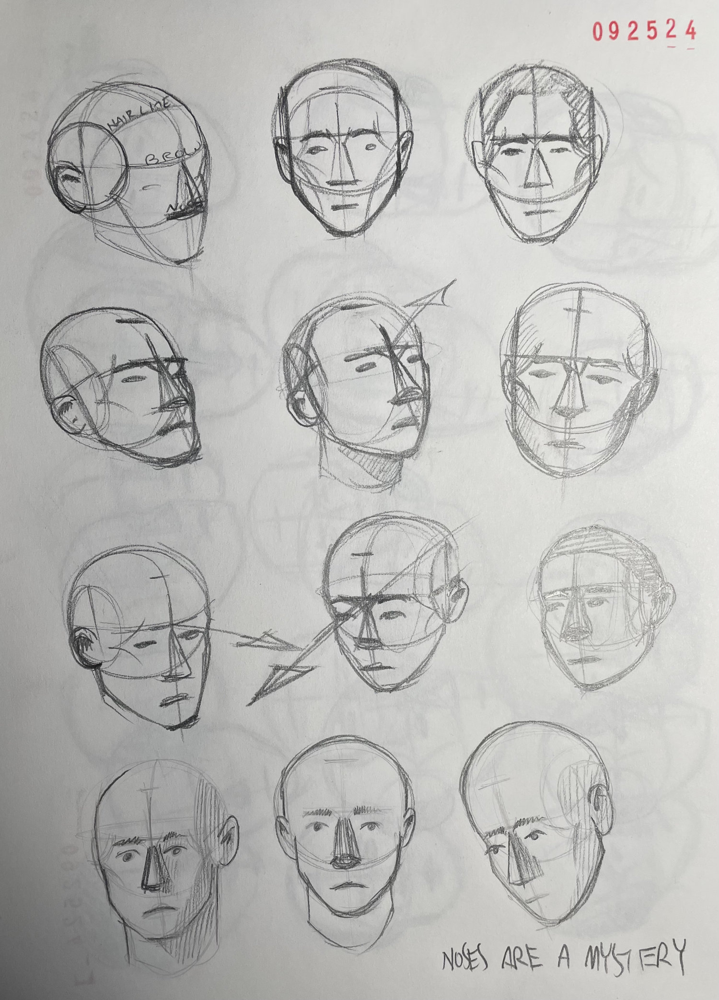
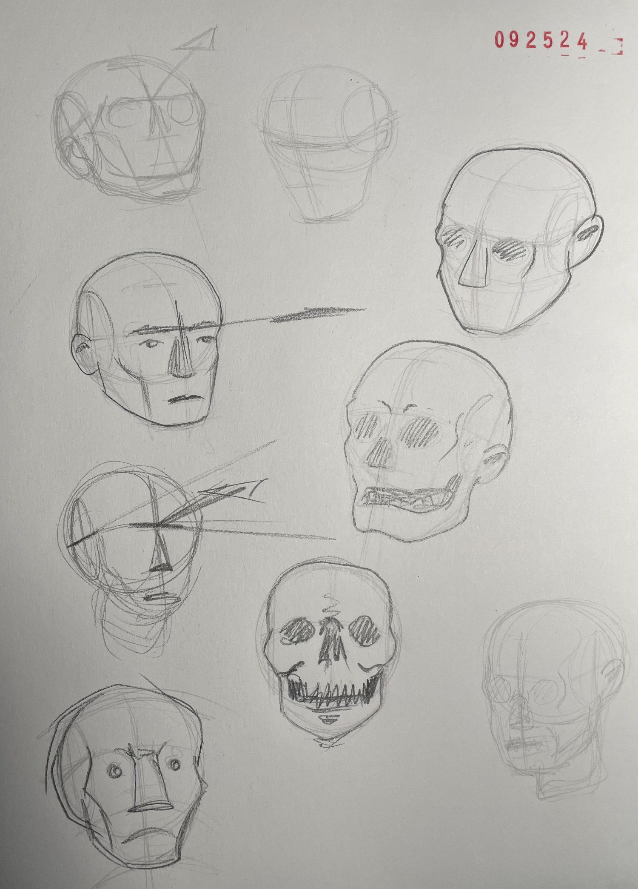
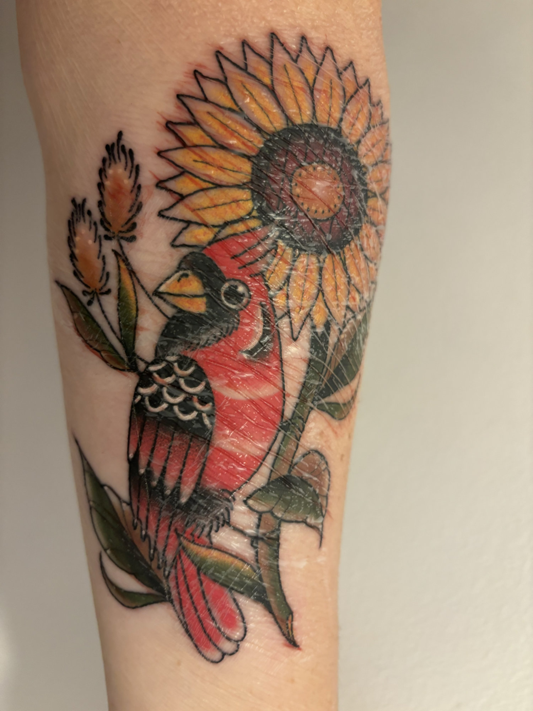

I am not a technically gifted draftsman.

I am not a professional artist.

I am not a rock star.

I am not a published author.

I grew up believing I couldn’t be any of those things.

I don’t believe that anymore.

I’ve been practicing drawing this week. It’s a lot of repetition as practice tends to be. There’s no finished piece to show off. And most of the artifacts kinda suck. But a wise dog once said “**Sucking at something is the first step towards being sorta good at something.”**

* * *

I hope you enjoy your practice this week as much as I’ve been enjoying mine.

* * *

Currently open books:

*   [Killing Commendatore](https://www.goodreads.com/book/show/38820047-killing-commendatore) - Haruki Murakami
    
*   [Akira](https://www.penguinrandomhouse.com/series/AKR/akira/) - Katsuhiro Otomo
    
*   [Four Faces of the Moon](https://www.annickpress.com/Books/F/Four-Faces-of-the-Moon2) - Amanda Strong
    
*   [Oksi](https://www.levinequerido.com/oksi) - Mari Ahokoivu
    

* * *

I don’t know if I actually want to be any of those things but I definitely don’t believe I can’t be any of those things.

* * *

Maybe it’s cause I’m knocking on 42. Maybe it’s cause some random grouping of neurons took over 41 years to fire. But I spent the week practicing and I’ve been enjoying it. I don’t really have much of a goal beyond getting better and enjoying the feel of a pencil on paper again.

* * *

“You can’t tell _me_ what to do. I will tell _you_ what to do.” - Miss Bean

I grew up believing I couldn’t be a professional artist, or a rock star, or a published author. You were given gifts from God and all your hard work was in service of realizing those gifts not for yourself but for the glory of he who saw fit in his unknowable wisdom to give it to you.

* * *

None of that matters because with practice and hard work I can be anything.

* * *

I’m reading “Killing Commendatore” and loving it.

I just started part two and thankfully the library auto renewed it for me cause I’m a pretty slow reader. I convinced a friend to read it and he’s almost done but he’s listening to the audiobook and by his own admission that’s cheating.

This isn’t the first Haruki Murakami book I’ve read and I haven’t found a rotten one yet. But there’s a line in this book that bothered me a bit. The main character in the book is a painter going through a creative block moonlighting as an art teacher. At some point he states in no uncertain terms that you’re either born with the ability to be an artist or you’re not. He’s teaching a subject he believes to be unteachable.

Among other things the novel is about a painter going through a creative block who moonlights as an art teacher at a local community center. He states in no uncertain terms that you’re either an artist or you aren’t. He’s teaching a subject he believes to be unteachable.

Murakami or Stephen King in either “Novelist as a Vocation” or “On Writing” (I can’t remember which) puts a writer’s skill on a spectrum. According to them you’re born somewhere on that spectrum. Hard work and practice will improve your position but only within a set range. In their eyes only a select few have the potential to reach the heights of Kafka, Hemingway, or Austen. You’re either born great or you’re not.

There’s a video by Van Neistat wherein he claims that if you haven’t reached professional status by age 40 you’re washed. Might as well hang it up now and go home.

Maybe it’s my 41 years talking but I just don’t buy it. I’ve seen too many friends and acquaintances with limited gifts and mediocre talent put in the time and effort to level up and make it to the big time. Hell, I struggled in math my whole life and somehow ended up as a reasonably successful software engineer.

I grew up believing I couldn’t be a rock star. To be fair I had no interest in being one. But I did want to be an artist and I was told I couldn’t do that either. It’s wasn’t so much that I was told I wasn’t allowed to, but rather I just couldn’t. Real people didn’t do that. But then I got older and watched as my friends became actual rock stars you’ve probably heard of or artists who write books you might have read.

I’ve been publishing DoPHS for over a year now. Do Preserve Human Spirit. I should probably have an idea where I want this thing to go at this point but I don’t. And I guess that’s ok.

Look, I can draw, I can layout a comic page, but I’m not winning any awards for it either. And honestly, given how little I’ve worked for it in comparison to any of my friends who have won awards, I don’t feel bad about it.

That said, were any of us to put in a comparable effort, I believe there’s nothing to stop us from gaining a comparable level of talent.
