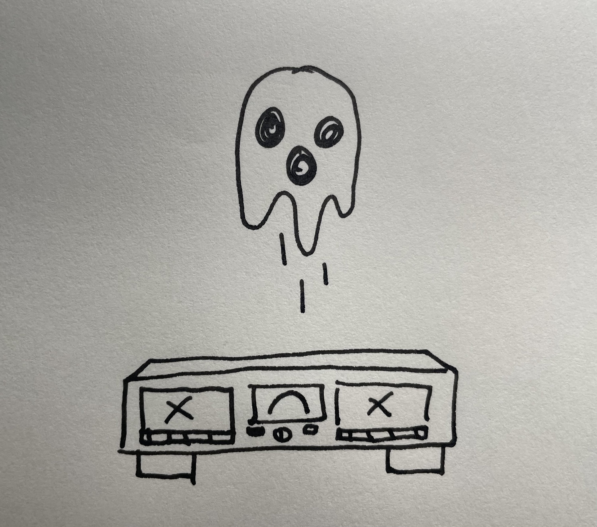
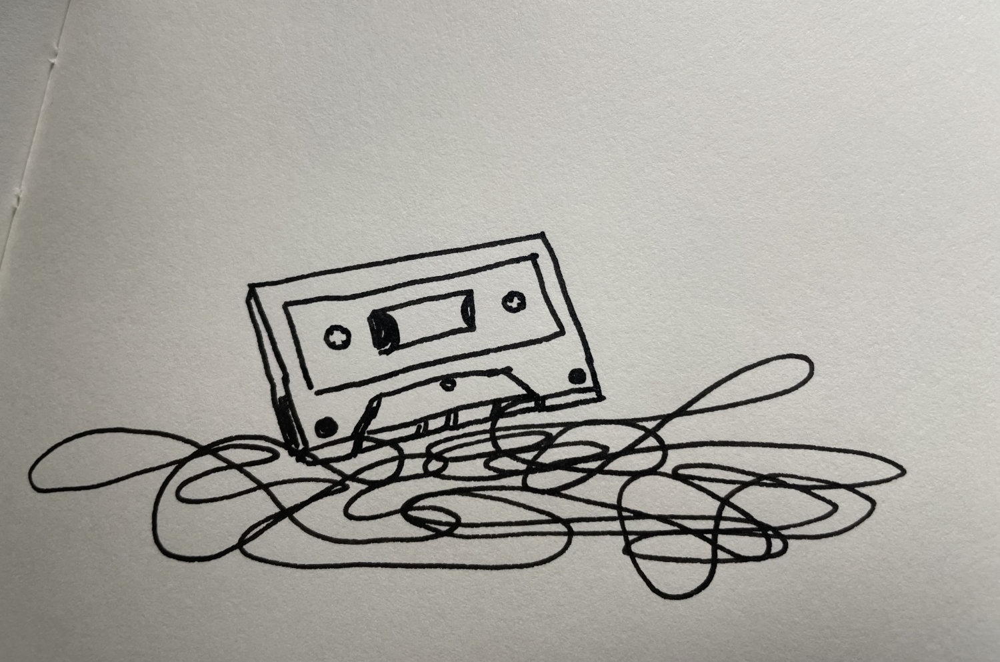

Yesterday, I went to my local _Goodwill_ and purchased a dual cassette recorder. Immediately after I stopped at _The Bizarre Bizarre_, a used books and music store, here in town. I bought two cassettes, _Big Time_ by Tom Waits and _Carrying Your Love With Me_ by George Strait. _Big Time_ is for listening and _Carrying Your Love With Me_ is for recording. The latter will serve as a donor for my first mix tape in over 20 years.

I eagerly plugged in the dual cassette player and quickly discovered it didn’t work. Probably a broken belt. It made plenty of noise but couldn’t advance the ribbon. A pity considering it was a rather robust all in one unit with a radio, receiver, and balancer. A pretty good deal for only $20.

I returned the broken deck later that day in exchange for separate components. The new receiver’s great but the cassette player still wasn’t worth keeping. The left bay was fine but the right played slow, couldn’t record, and eventually just gave up the ghost entirely.

I made yet another trek to _Goodwill_ and exchanged for the last deck they had available. It was slightly more beat up with fewer bells and whistles but still had dual player/recorder capabilities. I got it home only to find that while both bays worked - the one on the right also ate my tapes.

Still determined, I did a bit of actual research, and bought a quality used deck on ebay for a steal. It’s a _Marantz Professional PMD511 Stereo Dual Cassette Deck_ - “SERVICED - NEAR MINT!”. The listing claims it to be one of six salvaged from a local Radio DJ’s estate somewhere near McKinney, Texas.

When I started this little quest I forgot about how difficult analog can be. There aren’t many places to buy cassettes and the blank ones, if you can find them, aren’t really any cheaper. The equipment required to play anything is big and janky and sometimes just eats whatever you feed it.

Why am I welcoming this chaos into my life? It’s frustrating, painful, expensive, _and_ _absolutely wonderful_.

A soft static of tape is winding it’s way into my ears while I sit on old carpet in a dusty basement surrounded by a nest of cables slowly realizing that there is a very real possibility I won’t get back whatever cassette I just fed into this godforsaken machine and that that uncertainty adds a delicious drama I didn’t know my listening experience was missing.

* * *

**The cutting room floor:**

Tom Waits’ guttural growls and out of tune guitars have never sounded so good -

Is this what nostalgia feels like?

Is that the sound of the tape deck eating another 10 dollar cassette or just Tom being Tom?

I like it when you say B-E-D.

When Wednesday rolls around I sit down to write something to share with the world. Usually I have some vague sense of what it might be about. Perhaps I’ve been mulling something over in my head for a few days.

The equipment required to play them takes up way too much space and introduces miles of random wires and power cords. The whole setup is pretty janky and if you’re not careful it’ll just eat whatever you feed it anyways.

Again, I made the trek back to goodwill and exchanged the tape deck for the last one available. It was slightly more beat up with fewer bells and whistles but still had dual player/recorder capabilities. I got it home only to find that while both bays worked - the one on the right ate my tapes. What is it with the right side bays on these things?

Ebay doesn’t come with the 14 day return policy of my local Goodwill but the seller has a pretty solid rating. I guess I’ll find out in about 2 weeks whether or not I’ve been taken for another ride.
