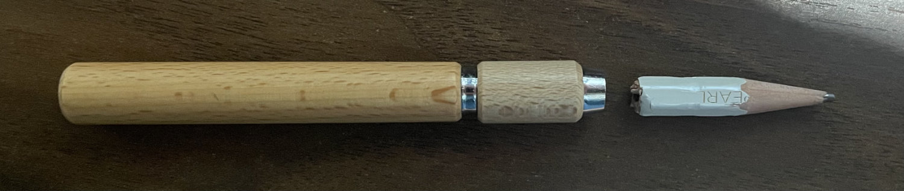
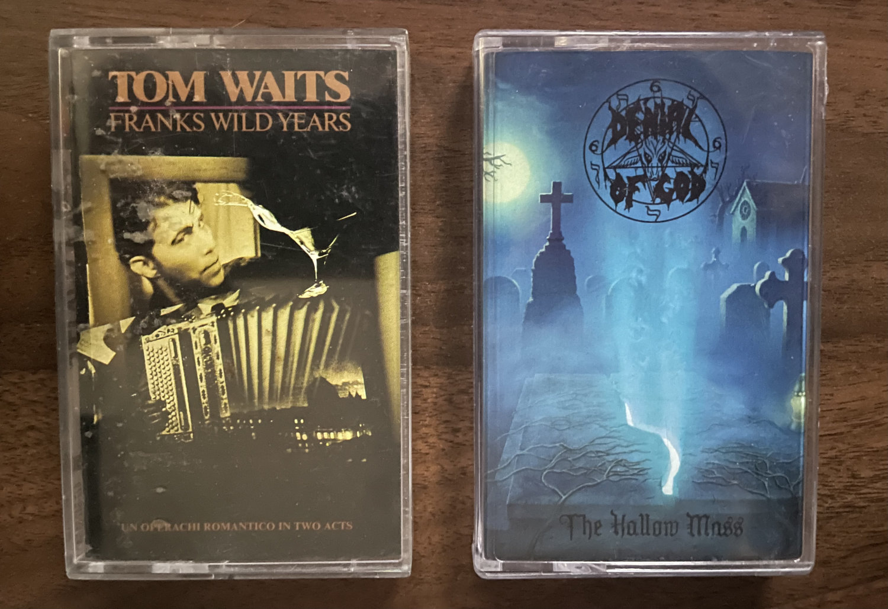
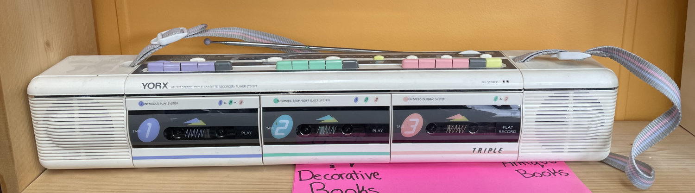

Turned out to be a beautiful day for a ride over lunch.

* * *

Jerry’s had what I was looking for, a Blackwing pencil extender, but I chose not to spend $10 on a proprietary gadget. I’m liking the Blackwings, but maybe not that much? I had recently bought an extender for normal pencils so I decided instead to just chop off the fancy eraser bit once it gets too small. Works perfect.

It felt good to return a stack of books to the library I had actually read instead of another pile of unrealized aspirations. Picked up [Akira vol. 5](https://www.goodreads.com/book/show/93376.Akira_Vol_5) and [6](https://www.goodreads.com/book/show/93375.Akira_Vol_6) as well as [The Revenge of Analog](https://saxdavid.com/therevengeofanalog), [Blacksad](https://www.darkhorse.com/Books/3009-585/Blacksad-They-All-Fall-Down-Part-One-HC), and [Eventually Everything Connects](https://www.graphicmundi.org/books/978-1-63779-068-7.html).

Next stop, Bizarre Bizarre, is a wonderful used books and record store. It’s also the only place in town I know of with a collection of cassettes for sale. They have other analog wonders too, like an old sonar machine from a WWII sub and a working telegraph. It’s not the sort of place you approach with a purchase in mind.

I walked out with another _Tom Waits_ cassette and _The Hollow Mass_ by Denial of God. I’d never heard of Denial of God but have since learned they’re a Dutch black metal band that’s been dropping poorly received EPs since the early 90s.

I did not end up at a local coffee shop.

I’m not sure what to make of [Bandcamp](https://spacebombrecords.bandcamp.com/) yet. For some reason I get it confused with [SoundCloud](https://soundcloud.com/tierrawhack) even though they’re entirely different. I think you can purchase digital albums there, and I get the sense it might be better for artists? I’ve been using it to find new artists attached to the labels of those I already enjoy and to oggle at any available cassettes I find.

[Song Chest Radio Hour](https://www.songchest.org/) is a brilliant 12 episode program that played on [Radio Milwaukee](https://radiomilwaukee.org/) for a year. It’s hosted by [Justin Vernon](https://en.wikipedia.org/wiki/Justin_Vernon) and is “An hour… to spread some love, joy, & inspiration; playing some songs we love and enjoy.” Highly recommended.

It might still be visible if you’re into that sort of thing.

We later found the majority of the ginger bread house in pieces on the basement floor. Turns out he actually ate far less than we had feared. There was some chocolate in the frosting but Fez got very little of it. Apart from being an uncharacteristically bad dog he’s gonna be fine.

Dork butt.

* * *

A couple weeks ago I was chatting with an old friend about pencils on facebook. I was whinging about how the really nice ones tend to only come in packs of a 10 or more and I wasn’t ready to drop $30 on something I couldn’t try first.

A few days later there was a package in the mail with several very premium pencils I couldn’t get locally and some I’d never even heard of. Good friends are hard to find. Keep them if you can. Especially if they move away.

The sketchbook is about half full. Learning via some old [Loomis reprints](https://www.amazon.com/dp/1789095344), online [figure references](https://line-of-action.com/practice-tools/figure-drawing/), and [google images](https://www.google.com/search?q=racoon&sca_esv=d0f66aa95515e8fe&sxsrf=ADLYWIJRDY8ARc9jPrsUTk3SIqhOQhKfTQ:1729105587177&source=hp&biw=1372&bih=1294&ei=sw4QZ7m4CJSekPIPzIqZoQw&iflsig=AL9hbdgAAAAAZxAcw_Y3BKwjlLWv9JgZdd7r5kj_9ieS&oq=rac&gs_lp=EgNpbWciA3JhYyoCCAAyBBAjGCcyCBAAGIAEGLEDMggQABiABBixAzILEAAYgAQYsQMYgwEyCBAAGIAEGLEDMggQABiABBixAzIIEAAYgAQYsQMyCBAAGIAEGLEDMggQABiABBixAzIOEAAYgAQYsQMYgwEYigVIjBBQAFj_AnAAeACQAQCYAUKgAbsBqgEBM7gBA8gBAPgBAYoCC2d3cy13aXotaW1nmAIDoALMAcICBRAAGIAEmAMAkgcBM6AHoBM&sclient=img&udm=2). Progress is slow and the results can be embarrassingly bad. But the overall trajectory tends towards improvement.

There are no large projects on the horizon. Likely just more dispatches from the sketchbook. But then again, every time I think I have a good handle on the state of the world, an earthquake of one sort or another shows up to teach me another lesson.

Thanks for reading. Appreciate the support. See ya next week.

* * *

Hope another view into the sketchbooks isn’t too much of a let down.

I think I’m in a bit of learning phase at the moment - pretending otherwise would be a disservice to the spirit.

There are no large projects on the horizon or plans for anything more cohesive in the near future.

a complete impulse purchase of

A bit peopled out for this basement dweller.

A bit of a sidestep around the algorithms.

Meteors, Music, & Mentors

Never really know what I’m looking for at Bizarre Bizarre.

You don’t go to Bizarre Bizarre knowing what you want.

This triple tape boombox was unfortunately not for sale.

