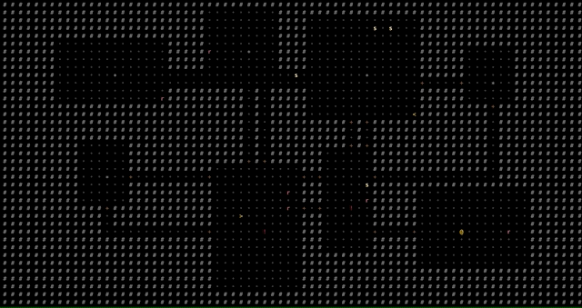
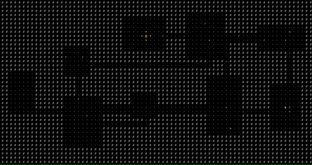

I have made fire!



Squid woke me up at 4:30am yesterday, screaming. No point trying to go back to sleep with that racket. The boy is crazy.

I made a cup of coffee and sat down in front of the computer. Having punted on doors I decided to try something different and potentially easier. A simple fire system.

My first approach was pretty simple. I don't expect the final result to be that much more complicated.

Two new components:

```
  flammable?: {
    ignitionChance: number;
    fuel: {
      max: number;
      current: number;
    };
    maxIntensity: number;
    heatTolerance: number;
  };
  onFire?: {
    intensity: number;
    age: number;
  };
```

The flammable component determines fire behavior and the onFire component is added when a component is actively burning.

The system is pretty simple too:

```
const onFireQuery = world.with("onFire", "flammable", "position");
```
Get all entities that are on fire.

```
  if (actor.onFire && actor.appearance) {
    actor.appearance.tint = 0xfcc203;
```
Change color to <span style="color:#fcc203">FIRE</span>

```
  for (const pos of neighbors) {
    const eap = getEAP(pos);
    if (eap) {
      for (const eid of eap) {
        const entity = registry.get(eid);
        if (entity && entity.flammable && !entity.onFire) {
          if (Math.random() < entity.flammable.ignitionChance) {
            world.addComponent(entity, "onFire", { intensity: 1, age: 0 });
```
For each burning entity, check if any of it's neighbor tiles are both flammable and not currently on fire and if both are true, roll to ignite based on ingnitionChance.

```
  if (actor.flammable.fuel.current > 0) {
    actor.flammable.fuel.current -= actor.onFire.intensity;
```
Reduce fuel as it burns up. Higher intensity fire will burn through the fuel more quickly.

```
  if (actor.flammable.fuel.current <= 0) {
    world.removeComponent(actor, "onFire");
    world.removeComponent(actor, "flammable");
    actor.appearance.tint = 0x111111;
```
Once the fuel is exhausted, put out the fire by removing relevant components and change it's color to <span style="color:#111111">ASH</span>

---

First pass was pretty naive. The neighbors check to manage spread was about as inefficient as possible. Each burning tile checked each of it's four neighboring positions against EVERY tile on the map until it found one at that position. It would then run the checks to determin if the fire should spread. This check got into some level of factorial hell and brought my framerate to it's knees, down to about 2FPS.

I'd been pretty good about avoiding premature optimization but it was definitly time to build a cache layer. I added an eapMap for "Entities At Position". Now instead of checking every entity 4 times for each enity on fire, I can simply look up a position on the eapMap and only check the entities at that position. MUCH faster. So fast in fact that I can burn the ENTIRE map without dropping any frames. Pretty cool!



---

Next up is to add a bit of nuance. Flammability should probably be related to material properties. Fire should cause damage. Enemies should run from it. New terrain like grass to contain it in some way. Fire potions, flaming swords, salamanders?! Ok this is really getting the gears turning. Nothing like a brand new system to play with!


