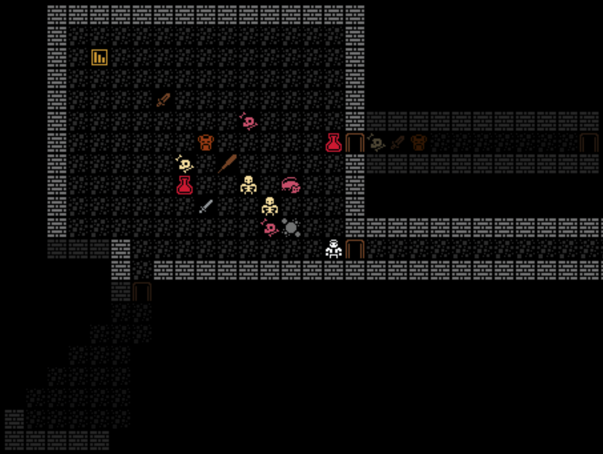

GFX!

Got distracted and added graphics. There are bugs that need to be resolved with fire and a lot of loose threads. Why jump in an introduce graphics? Some new shiny I guess.

I added sprites from the [Kenney 1-bit pack](https://kenney.nl/assets/1-bit-pack). The idea being, that someday in the far future I'll have an idea of what I actually want to render and can make my own completely custom set. We'll see if/when that ever happens.

The update isn't without issues. The appearance component saves the tileset and character info on each entity. So old saves don't work, and new saves on an old branch also don't work. The legend in the sidebar is kind of broken too. The char strings for the kenny tileset are words instead of a single character. So the legend ends up rendering something like "door door" or "club club". 

I'm now faced with the challenge of either combining text (which currently renders on half width tiles) with my tileset and halving the space for content or somehow managing multiple canvas objects in the UI. Not something I'm looking forward to.

Seems like a great time to PUNT! 🏈

