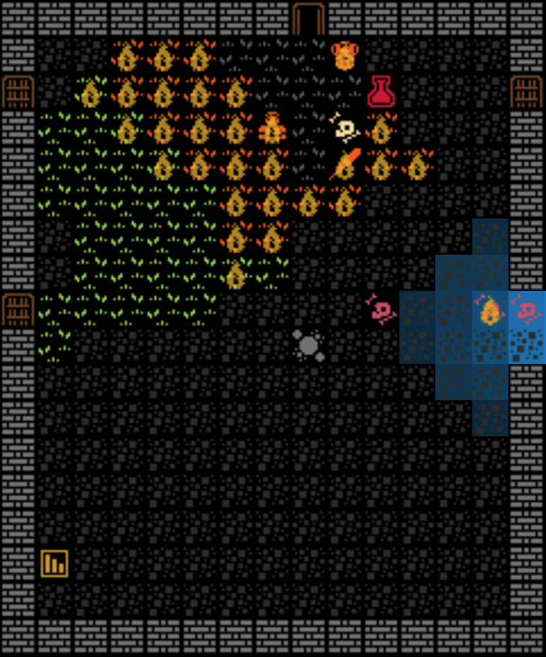

If an entity has material and mass, it has some level of flammability. The flammable component stores entity ignition chance, heat tolerance, and max intensity. It also keep track of fuel, both current and max.

There are 10 base materials:

- Bone
- Cloth
- Flesh
- Glass
- Leather
- Metal
- Oil
- Paper
- Plant
- Stone
- Wood

Rather than real world weights and measures, I use this table to decide the general mass of an object.

| Category      | Mass Range | Example        |
| ------------- | ---------- | -------------- |
| Tiny          | 0.1–0.5    | Paper scrap    |
| Small         | 0.5–2      | Spoon          |
| Medium        | 2–6        | Chair          |
| Creatures     | 6–20       | Human          |
| Large objects | 10–30      | Bookshelf      |
| Huge objects  | 30–60      | Tree           |
| Special cases | 60–80      | Ancient Dragon |

Something like a pair of gloves may end up like this:

```
{
    name: 'Leather Gloves',
    mass: 1.5,
    material: 'leather',
}
```

And after final calculation to determine flammability you get:

```
{
    "ignitionChance": 0.17005660008343879,
    "fuel": {
        "max": 16,
        "current": 16
    },
    "maxIntensity": 2,
    "heatTolerance": 1,
}
```

In this way, a fire can break out across a field of grass, burning through it at a terrifying rate while the leather leavings of a dead goblin might remain unsinged. Doors, upon succesful ignition, having far more fuel than grass will burn much longer providing a different sort of hazard.


