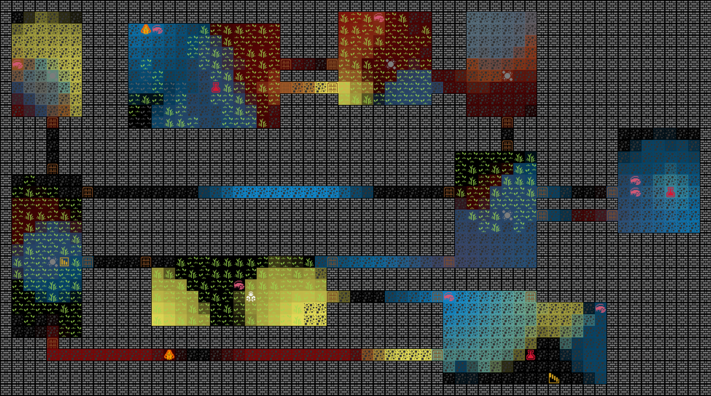
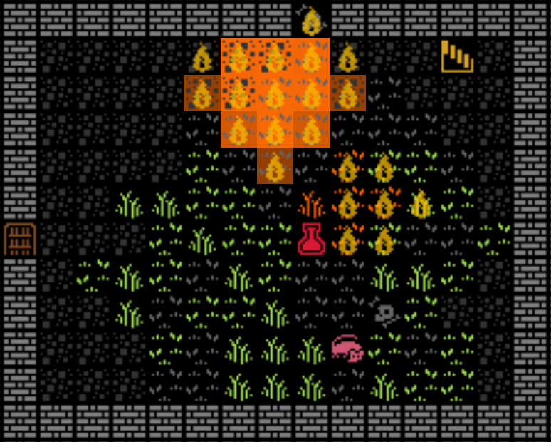
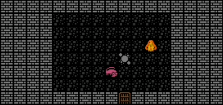
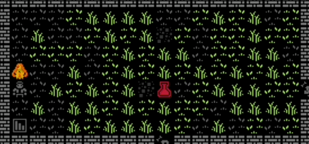

Lots done this week! With the holiday's approaching work-work has slowed down and my enthusiasm for game dev has lined up nicely with the additional freetime.

I rewrote the water system to be a more generic fluid system supporting multiple layered fluids. Currently the game supports lava, water, blood, and oil. Lava is always on fire and will destroy water and blood - steam hasn't been implemented but that's the rationale, and oil is explosive. These layers all interact with each other so in the image below I turned off lava as things get a bit too chaotic with so many fluids in the dungeon.



Fluids are no longer "special". They are materials like anything else which makes interaction with the other systems "just work".



I experimented with mobs made from fluid, welcome Lava Golems! Their attacks deal fire damage and they will spread fire to anything nearby. The player is immune to fire for now (testing purposes) but it's fun seeing the golems interact with skeletons who they don't like and rats who they do like but sadly, shouldn't be allowed to play with :(



I wanted the grass to grow back after it was burnt and assumed it would be a relatively simple add. Boy was I wrong! The naive first attempt of just updating their appearance component and recalculating flammability didn't work as I needed it to occur at a randomized cadence so I implemented a "growth" system to move entites through stages. This "one way" system ran into various problems I tried to solve it through another post-process system that in the end felt more like an events system.

The events system worked but didn't feel "right" within an ECS architecture. Thought about it some more and ended up rewriting the entire thing into something more simple that doesn't "fight the framework".

Introducing the "mutable" system. The mutable component contains mutations which are just a list of components to add and remove with a chance to mutate to another specified mutation. In this way I can attach a "mutateTo" component to mutate to a "burnt" mutation or if grass currently has the "young" mutation it will mutate to "mature" over time. I can easily add flags like "calculateFlammability: true" to trigger another system to calculate the flammability - previously accomplished through my DIY eventing setup.

This is the mutable component for grass. Each mutation has a name, optional next mutation in sequence, change to mutate, and components to add and remove. The current mutation is tracked at the top level.

```typescript
mutable: {
    current: "young",
    mutations: [
      {
        name: "burnt",
        next: "young",
        chanceToMutate: 0.01,
        addComponents: {
          appearance: {
            char: chars.grass,
            tint: colors.ash,
            tileSet: "kenny",
          },
        },
        removeComponents: ["flammable"],
      },
      {
        name: "young",
        next: "mature",
        chanceToMutate: 0.01,
        addComponents: {
          appearance: {
            char: chars.grass,
            tint: colors.plant,
            tileSet: "kenny",
          },
          calculateFlammability: true,
        },
        removeComponents: [],
      },
      {
        name: "mature",
        chanceToMutate: 0.01,
        addComponents: {
          appearance: {
            char: chars.tallGrass,
            tint: colors.plant,
            tileSet: "kenny",
          },
          calculateFlammability: true,
        },
        removeComponents: [],
      },
    ],
  }
```

And here's the mutable system. If the current mutation has a next mutation, it will attempt to evolve the entity by applying the mutation. Alternately, there is a 'mutateTo' component that is used to directly mutate without relying on RNG.

```typescript
export const createMutableSystem = ({ world }: IGameWorld) => {
  const mutableQuery = world.with('mutable')
  const mutateToQuery = world.with('mutateTo')

  return function mutableSystem() {
    for (const entity of mutableQuery) {
      const currentMutation = entity.mutable.mutations.find(
        x => x.name === entity.mutable.current
      )

      if (currentMutation && currentMutation.next) {
        if (Math.random() < currentMutation.chanceToMutate) {
          const nextMutation = entity.mutable.mutations.find(
            x => x.name === currentMutation.next
          )

          if (nextMutation) {
            evolveEntity(world, entity, nextMutation)
            entity.mutable.current = nextMutation.name
          }
        }
      }
    }

    for (const entity of mutateToQuery) {
      if (entity.mutable) {
        const mutation = entity.mutable.mutations.find(
          x => x.name === entity.mutateTo.name
        )
        if (mutation) {
          evolveEntity(world, entity, mutation)
          entity.mutable.current = mutation.name
        }
      }
      world.removeComponent(entity, 'mutateTo')
    }
  }
}
```

Here, a fire golem is lighting and relighting grass on fire. The grass is making heavy use of the mutation system as it burns and regrows.


